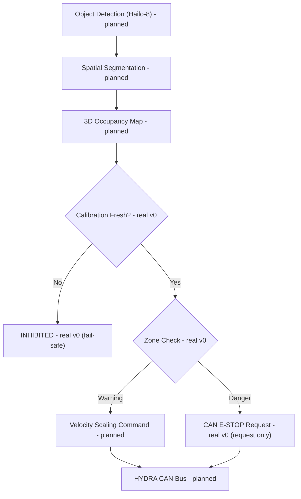

<p align="center">
  
</p>

# 🛡️ HYDRA-UMC-SAFETY-ZONES

<p align="center">🇺🇸 <b>English</b> | <a href="README_spa.md">🇪🇸 Español</a> | <a href="README_fra.md">🇫🇷 Français</a> | <a href="README_ita.md">🇮🇹 Italiano</a> | <a href="README_deu.md">🇩🇪 Deutsch</a> | <a href="README_zho.md">🇨🇳 简体中文</a> | <a href="README_jpn.md">🇯🇵 日本語</a></p>

### 🚨 Real-Time 3D Intrusion Detection & E-STOP Orchestrator

<p align="left">
  
  
  
  
</p>

---

## 1. 🛠️ TECHNICAL OVERVIEW

**HYDRA-UMC-SAFETY-ZONES** is intended to be the critical safety subsystem of the Vision AI Node family. Its job is projecting virtual 3D bounding volumes around the robots and monitoring the workspace for human intrusions or foreign objects, using high-speed spatial segmentation from the Hailo-8 NPU to detect breaches in defined "Warning" and "Danger" zones.

This is one of the 4 children of **[HYDRA-UMC-VISION-NODE](https://github.com/JuanenRac/HYDRA-UMC-VISION-NODE)**, the family's integration parent, and its perception input is built on models compiled by its sibling **[HYDRA-UMC-DETECTION-HEF](https://github.com/JuanenRac/HYDRA-UMC-DETECTION-HEF)**.

### Key Points

* 🚦 **Multi-Level Zones (v0):** real `Zone`/`ZoneLevel` (Warning/Danger) definitions over axis-aligned 3D volumes, and real breach checking (`check_breaches`) between a zone set and a set of detected object positions.
* 🛑 **E-STOP requesting (v0, not asserting):** every object whose worst breach is Danger produces a real `EStopRequest`, handed to an `EStopRequester` - see the design boundary below for why nothing here ever asserts the physical stop itself.
* 🔒 **Calibration-freshness enforcement (v0):** every zone set carries an optional `calibration` (version, source, calibrated-on date, max age in days). `evaluate_safety()` checks it **before** running any breach logic - a zone set with no calibration at all, one older than its own declared `max_age_days`, or one dated in the future, always resolves to `INHIBITED`, never falls through to a silent `READY` just because no detected object happens to be near a zone.
* 🧮 **Finite-coordinate fail-safe (v0):** `config.py` rejects any `NaN`/`Infinity`/`-Infinity` `x`/`y`/`z` in a zones or detections file *before* `evaluate_safety()` ever runs, resolving straight to `INHIBITED` (exit `3`) instead of evaluating a boundary against a coordinate that cannot represent a real point.
* 🌐 **JSON/HTTP API (v0.0.5):** the `serve` subcommand exposes `check`'s exact same `evaluate_safety()`/`check_breaches()`/`request_estop_for()` logic over a plain stdlib `http.server` (`POST /check`, `GET /stats`) for callers that aren't the CLI itself - loopback-only by default, matching the `systemd/hydra-umc-safety-zones.service` unit. See [`docs/CLI_REFERENCE.md`](docs/CLI_REFERENCE.md) for every real command, flag and exit code.
* 📐 **Dynamic Occlusion (planned):** automatically masking the robot's own structure out of safety triggers, so the robot does not "detect itself" as an intrusion.
* 🔍 **Foreign Object Detection (planned):** identifying tools or debris left in the workspace.
* 🎥 **Real 3D occupancy mapping from Hailo-8 (planned):** v0's `check` subcommand takes detected-object positions from a JSON file precisely because the real Hailo-8 spatial segmentation pipeline that would produce them doesn't exist yet in this environment - see "Honesty check" below.
* 🧩 **Why it exists as its own project:** safety logic has a different verification bar than the rest of perception - isolating it in its own service means it can be tested, audited, and eventually certified (see the ISO 13849-1 badge above, aspirational at this stage) independently of camera pipeline or model-compilation changes elsewhere in the family.

**A critical design boundary, already decided and now enforced in code:** this project only ever **detects and requests** an E-STOP - it never asserts the physical stop signal itself. `estop.py`'s only real requester implementation, `NullEStopRequester`, records what it would have sent without transmitting anything anywhere - there is no real CAN transport in this repository yet, on purpose. Actually cutting motor power over CAN is [HYDRA-UMC](https://github.com/JuanenRac/HYDRA-UMC)'s (the firmware's) responsibility, on hardware built for that role. Keeping the boundary there means a bug in this Python service can fail to *request* a stop, but can never *prevent* the firmware from enforcing one independently.

**Honesty check - what actually runs today:** the real entry point (`src/hydra_umc_safety_zones/main.py`) still prints identity/version/role on a bare call, but now also has a real `check --zones PATH --detections PATH` subcommand: it loads a zone set (zones + optional calibration metadata) and detected-object positions from JSON, checks calibration freshness first, then runs real breach checking, requests E-STOPs for every Danger breach, and exits 0 (Ready) / 1 (Warning) / 2 (Danger, E-STOP requested) / 3 (Inhibited - calibration missing or expired) depending on the outcome. What is genuinely not real yet: the Hailo-8 spatial segmentation that would produce those detected-object positions on real hardware, self-occlusion masking, and any real CAN transport for the E-STOP request. See [`CHANGELOG.md`](CHANGELOG.md) for exactly what has shipped so far, and "Current Status & Next Steps" below for what remains open.

---

## 2. 🔄 INTENDED SAFETY LOGIC FLOW

The diagram below is the target data flow this project is being built towards. `CAL` (calibration check), `ZONE` (Zone Check) and the Warning/Danger split after it are real today, driven by `evaluate_safety()` (which wraps `check_breaches()`/`request_estop_for()`), given detected-object positions from a JSON file. Everything upstream of `CAL`/`ZONE` (the real Hailo-8 pipeline) and downstream of `STOP` (the real CAN transport) is still future work.



---

## 3. 🧠 ADVANCED TECHNICAL INFORMATION

### The detect-vs-enforce boundary, and why it matters here specifically

Of everything in this README, this is the one design decision that is not just an implementation detail: this service is meant to *decide* that a stop is needed and *request* it over CAN, but the actual, physical motor-power cut happens on hardware inside [HYDRA-UMC](https://github.com/JuanenRac/HYDRA-UMC) built and certified for that role. This is a deliberate defense-in-depth choice - a software bug here (a crash, a hang, a bad frame) degrades to "no new stop requests get sent", not to "the robot's existing safety hardware stops working".

### Why no `hardware/`, `firmware/`, `os/` or `models/` here

CM5 + Hailo-8 is off-the-shelf hardware with no board of its own to design, so - like the rest of the Vision AI Node family - no `hardware/`/`firmware/` folder exists here. `os/` (the shared HydraOS image) and `models/` (the compiled `.hef` files actually served to the NPU) live only in the integration parent, [HYDRA-UMC-VISION-NODE](https://github.com/JuanenRac/HYDRA-UMC-VISION-NODE), since it owns the CM5 host image and the Hailo-8 device handle.

### Design decisions already made

* **Version read from installed package metadata, not hardcoded** - `main.py` calls `importlib.metadata.version("hydra-umc-safety-zones")` instead of a second `__version__` string, so `bump_version.py` only ever has one place to edit.
* **The odometer bump only ever touches `PATCH`/`MINOR` automatically** - `bump_version.py` carries `PATCH` into `MINOR` past 9 and `MINOR` into `MAJOR` past 9, but never bumps `MAJOR` itself; same convention as `HYDRA-UMC-EDITOR-URDF/bump_version.py` and `HYDRA-UMC-SUITE/bump_version.py`.
* **AABB zones, not meshes or convex hulls** - the simplest volume that still lets `check_breaches()` be exact and fast; a real perimeter is very often close to a box in practice, and a richer shape can be added later behind the same `Zone`/`AABB.contains()` interface without touching `breach.py` or `estop.py`.
* **Zone-boundary containment is inclusive, not exclusive** - `AABB.contains()` treats a point exactly on the edge as inside. For a safety perimeter, that is the conservative direction to be wrong in: it can only cause an earlier breach report, never a missed one.
* **`NullEStopRequester` is the only requester in this repository** - not a placeholder waiting to be swapped out casually, but the honest embodiment of the detect-vs-enforce boundary itself: there is no real CAN transport here, and there should not be one bolted on carelessly later either (see "A critical design boundary" above and `estop.py`'s own module docstring).
* **Zones and detections are plain JSON, not YAML** - `pyproject.toml`'s dependency list is still `[]`; `json` is stdlib, `pyyaml` is real future work once there is an actual zone-authoring tool worth serializing for.
* **Calibration is checked before any breach logic runs, never after** - `evaluate_safety()` returns `INHIBITED` the moment calibration is missing or expired, before `check_breaches()` is even called. This is deliberate: a stale calibration means the zone geometry itself cannot be trusted, so the outcome of running breach checks against it would be meaningless either way - checking calibration first also means an expired calibration always wins over what would otherwise look like a real Danger breach, not the other way around.
* **A missing `"calibration"` key loads successfully, it just means `INHIBITED`** - `load_zone_set()` never raises just because a zones file predates this feature or was hand-written without calibration metadata; it fails safe by design at evaluation time instead of failing to load at all.

---

## 📂 DIRECTORY STRUCTURE

```text
HYDRA-UMC-SAFETY-ZONES/
├── src/hydra_umc_safety_zones/
│   ├── geometry.py       # Real Point3D/AABB primitives
│   ├── zones.py          # Real ZoneLevel/Zone/ZoneSet definitions
│   ├── breach.py         # Real zone-breach checking
│   ├── calibration.py    # Real calibration-freshness tracking
│   ├── safety_state.py   # Real fail-safe decision: READY/WARNING/DANGER/INHIBITED
│   ├── estop.py          # Real E-STOP requesting (never asserting)
│   ├── config.py         # Real JSON loading for zones/detections
│   ├── api.py             # Plain JSON/HTTP surface (stdlib http.server) over the real `check` logic
│   └── main.py            # Entry point + real `check` subcommand
├── tests/                # Real tests: geometry, breach, calibration, safety_state, estop, config, api, CLI
├── docs/                # Documentation and safety standards
├── build/               # Build output (local .venv lives here too)
├── images/              # Media and diagrams
├── systemd/
│   └── hydra-umc-safety-zones.service # Local CM5 zone-breach check API systemd unit
├── pyproject.toml       # Package metadata, dependencies, odometer version
├── bump_version.py      # Odometer-style native version bump (run by build.sh/.bat)
├── bump_manifest_version.py # Syncs hydra-umc.project.json's version to the native one (--sync)
├── build.sh / build.bat # venv + editable install (dev extras) + compile-check + tests
├── build-test.sh / .bat # Non-versioning build check (never touches version or CHANGELOG)
├── tools/
│   ├── build_test.py    # Shared engine both build-test launchers delegate to
│   └── ci_validate.py   # Manifest/CHANGELOG/docs validation used by CI
├── run.sh / run.bat     # Runs the entry point from the local venv (forwards args)
└── CHANGELOG.md         # Version-by-version history (odometer scheme, no dates)
```

No `hardware/`, `firmware/`, `os/` or `models/` folder - see "Advanced Technical Information" above for why. `os/` and `models/` live only in the integration parent, [HYDRA-UMC-VISION-NODE](https://github.com/JuanenRac/HYDRA-UMC-VISION-NODE).

---

## 🏗️ BUILD & RUN GUIDE

### Prerequisites

* **Python 3.10 or newer** on your `PATH` (the scripts try `python3` then fall back to `python`).
* No safety/vision runtime dependency is required yet - **zero third-party runtime dependencies** at this stage (`dependencies = []` in `pyproject.toml`); `pytest` is a dev-only extra used solely for the real test suite.
* A few tens of MB of disk space for a local virtual environment under `.venv/`.

### Step by step

```bash
# Linux / macOS
./build.sh
```

1. **Odometer version bump** - runs `bump_version.py`, incrementing `PATCH` in `pyproject.toml` on every build (carrying into `MINOR`/`MAJOR` per the rule above), then syncs `hydra-umc.project.json` to match.
2. **Virtual environment** - creates `.venv/` if missing; reuses it otherwise.
3. **Editable install (with dev extras)** - `pip install -e ".[dev]"` so `src/` edits take effect immediately, pulls in `pytest`, and registers the `hydra-umc-safety-zones` console entry point.
4. **Compile-check** - `python -m compileall -q src` byte-compiles every file under `src/`, catching syntax errors ecosystem-wide.
5. **Real test suite** - `pytest tests/` runs all 57 tests.

`set -euo pipefail` stops the script at the first failing step; the window stays open (`Press Enter to close...`) if it was double-clicked instead of run from an already-open terminal.

```bash
./run.sh
```

Locates the interpreter inside `.venv` (handling both the POSIX and Windows `.venv` layouts) and runs `python -m hydra_umc_safety_zones.main`, forwarding any arguments.

Bare invocation prints name + version + role:

```text
HYDRA-UMC-SAFETY-ZONES v0.0.5
Real-time 3D intrusion detection and E-STOP orchestration for robotic safe-working areas.
```

The real `check` subcommand needs a zones file and a detections file, both plain JSON. `calibration` is optional in the zones file - see below for what happens without it:

```json
// zones.json
{
  "calibration": {"version": "cal-1", "source": "manual", "calibrated_at": "2024-01-15", "max_age_days": 30},
  "zones": [
    {"id": "warn1", "level": "warning", "min": {"x": 0, "y": 0, "z": 0}, "max": {"x": 5, "y": 5, "z": 5}},
    {"id": "danger1", "level": "danger", "min": {"x": 0, "y": 0, "z": 0}, "max": {"x": 1, "y": 1, "z": 1}}
  ]
}
```

```json
// detections.json
{"objects": [{"id": "op1", "position": {"x": 0.5, "y": 0.5, "z": 0.5}}]}
```

```bash
./run.sh check --zones zones.json --detections detections.json
```

```text
SAFETY STATE: DANGER - object(s) ['op1'] breached a danger zone
BREACH: object 'op1' inside warning zone 'warn1'
BREACH: object 'op1' inside danger zone 'danger1'
E-STOP REQUESTED: object 'op1' breached danger zone 'danger1' (not asserted - see estop.py)
```

Exits `2` (Danger, E-STOP requested), `1` (Warning-only breach), `0` (no breach, calibration valid), or `3` (**Inhibited** - calibration missing or expired, checked before any breach logic runs). Real example of the fail-safe path - the same `detections.json` above, but `zones.json` with no `"calibration"` key at all:

```bash
./run.sh check --zones zones_no_calibration.json --detections detections.json
```

```text
SAFETY STATE: INHIBITED - no calibration metadata present - zone geometry cannot be trusted
```

Exit `3` - note there is no `BREACH`/`E-STOP` output at all, even though `op1` is inside both zones: an untrusted zone set never reaches the breach-checking step.

```bat
:: Windows - identical steps, batch syntax
build.bat
run.bat
run.bat check --zones zones.json --detections detections.json
```

The same `check` logic is also reachable over HTTP, for callers that
aren't the CLI itself - `zones`/`detections` travel in the JSON body
instead of a file path:

```bash
./run.sh serve --addr 127.0.0.1 --port 8108
# in another terminal:
curl -s -X POST http://127.0.0.1:8108/check -d '{"zones": {...}, "detections": {...}}'
```

See [`docs/CLI_REFERENCE.md`](docs/CLI_REFERENCE.md) for the full command/flag/exit-code reference, including every real state (`READY`/`WARNING`/`DANGER`/`INHIBITED`) captured from an actual run.

### Troubleshooting

* **`python`/`python3` not found** - install Python 3.10+ and ensure it is on `PATH`.
* **`compileall` fails** - a real syntax error was introduced under `src/`; the build stops without touching the install, on purpose.
* **"No `.venv` found" from `run.sh`/`run.bat`** - run `build.sh`/`build.bat` at least once first.
* **Stale editable install** - delete `.venv/` and rebuild; rarely needed.
* **`check` exits non-zero** - that is real, working behavior, not a failure: `1` means a Warning-only breach was found, `2` means a Danger breach requested an E-STOP, `3` means the zone set's calibration is missing or expired (fail-safe, checked before breach logic ever runs). Only a Python traceback or a malformed-JSON error is an actual bug.

---

## 🚀 Current Status & Next Steps

**What works today:** real Warning/Danger zone definitions and breach checking (`geometry.py`/`zones.py`/`breach.py`), real calibration-freshness enforcement that fails safe to `INHIBITED` before any breach logic runs (`calibration.py`/`safety_state.py`), a real E-STOP *requesting* pipeline that respects the detect-vs-enforce boundary by construction (`estop.py`), a real `check` CLI subcommand over JSON zone/detection files, and 57 passing tests - see [`CHANGELOG.md`](CHANGELOG.md) for the full real build/run output.

**What is still open, in no particular order and with no committed timeline:**

* Real 3D occupancy mapping from Hailo-8 spatial segmentation, to actually produce the detected-object positions `check` currently expects as a JSON input.
* Dynamic self-occlusion masking of the robot's own structure.
* A real CAN transport implementing `EStopRequester` towards [HYDRA-UMC](https://github.com/JuanenRac/HYDRA-UMC) - `estop.py` already defines the interface a real implementation would need to satisfy.
* Any real safety certification work (the ISO 13849-1 badge above states an aspiration, not a completed certification).

---

## 🔗 Related Projects

This project is part of the HYDRA-UMC robotics ecosystem by the same author (JuanenRac / Electro Hobby 3D). Worth knowing about, since a request might actually be about one of these rather than this repository.

**Parent Project**
- **[HYDRA-UMC-VISION-NODE](https://github.com/JuanenRac/HYDRA-UMC-VISION-NODE)** — integration hub for the Hailo-8 vision pipeline, with a real per-stage hardware-readiness check; the parent this repo is one specific stage or consumer of, within its own perception pipeline.

**Sibling Projects** — the other stages/consumers of HYDRA-UMC-VISION-NODE's own Hailo-8 perception pipeline
- **[HYDRA-UMC-VISION-STREAMER](https://github.com/JuanenRac/HYDRA-UMC-VISION-STREAMER)** — real GStreamer pipeline + MediaMTX config generator with a real HailoRT integration boundary.
- **[HYDRA-UMC-DETECTION-HEF](https://github.com/JuanenRac/HYDRA-UMC-DETECTION-HEF)** — real compiled-model registry with Hailo-architecture/checksum safe-load verification.
- **[HYDRA-UMC-VISUAL-SERVOING-API](https://github.com/JuanenRac/HYDRA-UMC-VISUAL-SERVOING-API)** — real Position-Based Visual Servoing correction law, safety-gated on upstream zone state.

**Directly Related**
- **[HYDRA-UMC](https://github.com/JuanenRac/HYDRA-UMC)** — the physical robot-arm motherboard: CM5 host + dual-core STM32H745, orchestrating up to 8 tool arms over CAN-OTA/SPI-OTA; this project requests this firmware's E-STOP, and the firmware is what actually enforces it.

**Also Part of the Ecosystem**

*Core Hardware & Platform*
- **[HYDRA-UMC-OS](https://github.com/JuanenRac/HYDRA-UMC-OS)** — reproducible Raspberry Pi OS product layer for the CM5: read-only agent, validated config/profiles, WiFi first-contact provisioning.
- **[HYDRA-UMC-SDK](https://github.com/JuanenRac/HYDRA-UMC-SDK)** — the shared JSON-Schema contract and safety-gate boundary every bridge validates its commands against.

*Core Backend & Clients*
- **[HYDRA-UMC-SERVER](https://github.com/JuanenRac/HYDRA-UMC-SERVER)** — the real headless backend (REST/WebSocket) every control client actually talks to.
- **[HYDRA-UMC-STUDIO](https://github.com/JuanenRac/HYDRA-UMC-STUDIO)** — web control dashboard with real-time multi-robot 3D visualization.
- **[HYDRA-UMC-SUITE](https://github.com/JuanenRac/HYDRA-UMC-SUITE)** — desktop (PySide6) swarm command center for multiple servers at once, packaged as a standalone executable.
- **[HYDRA-UMC-ANDROID-CONTROL](https://github.com/JuanenRac/HYDRA-UMC-ANDROID-CONTROL)** — native Android control app with biometric login and a paired Wear OS companion.
- **[HYDRA-UMC-IOS-CONTROL](https://github.com/JuanenRac/HYDRA-UMC-IOS-CONTROL)** — iOS/iPadOS control app (Flutter) with real-time WebSocket sync.
- **[HYDRA-UMC-DSI](https://github.com/JuanenRac/HYDRA-UMC-DSI)** — native touch UI for the onboard 7" DSI touchscreen, embedded on the CM5 itself.
- **[HYDRA-UMC-EDITOR-URDF](https://github.com/JuanenRac/HYDRA-UMC-EDITOR-URDF)** — desktop graphical URDF creator/editor that pushes finished models into STUDIO's own catalog.
- **[HYDRA-UMC-BRIDGE-AMR](https://github.com/JuanenRac/HYDRA-UMC-BRIDGE-AMR)** — coordination boundary for AGV/AMR fleets via a real VDA 5050 MQTT publisher.
- **[HYDRA-UMC-BRIDGE-CNC](https://github.com/JuanenRac/HYDRA-UMC-BRIDGE-CNC)** — high-level CNC-cell coordinator with real GRBL status/control-byte access.
- **[HYDRA-UMC-BRIDGE-DROIDS](https://github.com/JuanenRac/HYDRA-UMC-BRIDGE-DROIDS)** — coordination boundary for legged/humanoid droids, with a real Boston Dynamics Spot command sender.
- **[HYDRA-UMC-BRIDGE-LASER](https://github.com/JuanenRac/HYDRA-UMC-BRIDGE-LASER)** — laser-cell safety coordinator reading 3 real key/enclosure/interlock GPIO safeguards.
- **[HYDRA-UMC-BRIDGE-OPENPNP](https://github.com/JuanenRac/HYDRA-UMC-BRIDGE-OPENPNP)** — safe high-level board-flow coordinator for OpenPnP pick-and-place.
- **[HYDRA-UMC-BRIDGE-PRINTER3D](https://github.com/JuanenRac/HYDRA-UMC-BRIDGE-PRINTER3D)** — safe coordination boundary for Moonraker/Klipper 3D printers, with real gated job commands.
- **[HYDRA-UMC-BRIDGE-ROS2](https://github.com/JuanenRac/HYDRA-UMC-BRIDGE-ROS2)** — safety coordinator with a real, lazily-imported rclpy ROS 2 transport.
- **[HYDRA-UMC-BRIDGE-UAV](https://github.com/JuanenRac/HYDRA-UMC-BRIDGE-UAV)** — coordination boundary for camera-equipped UAVs, with a real MAVLink command sender.

*URTC Tool Platform*
- **[URTC](https://github.com/JuanenRac/URTC)** — firmware for the physical Universal Robot Tool Controller PCB, 25+ tool profiles over CAN bus.
- **[URTC-FLASHER](https://github.com/JuanenRac/URTC-FLASHER)** — desktop GUI flashing tool for URTC boards, CAN-OTA plus full-chip SWD/JTAG.
- **[URTC-TESTER](https://github.com/JuanenRac/URTC-TESTER)** — desktop live CAN-bus diagnostic tool for URTC boards, one panel per tool profile.
- **[URTC-WEB-STUDIO](https://github.com/JuanenRac/URTC-WEB-STUDIO)** — browser-based alternative to URTC-TESTER via the Web Serial API, no local install needed.

*Cognitive AI Node (Hailo-10)*
- **[HYDRA-UMC-COGNITIVE-NODE](https://github.com/JuanenRac/HYDRA-UMC-COGNITIVE-NODE)** — integration hub for the Hailo-10 cognitive pipeline (LLM/VLA/voice orchestration).
- **[HYDRA-UMC-VLA-ENGINE](https://github.com/JuanenRac/HYDRA-UMC-VLA-ENGINE)** — real action-token encoding/decoding and trajectory generation for a Vision-Language-Action model.
- **[HYDRA-UMC-VOICE-UI](https://github.com/JuanenRac/HYDRA-UMC-VOICE-UI)** — real voice front-end (VAD + intent parser) with a bounded, confirmation-gated Watch relay.
- **[HYDRA-UMC-SEMANTIC-PLANNER](https://github.com/JuanenRac/HYDRA-UMC-SEMANTIC-PLANNER)** — real rule-based task decomposition and semantic error recovery over MCU error codes.
- **[HYDRA-UMC-DOCS-QA](https://github.com/JuanenRac/HYDRA-UMC-DOCS-QA)** — real stdlib-only TF-IDF document search over this ecosystem's own Markdown docs.

*Orchestration & Swarm*
- **[HYDRA-UMC-ORCHESTRATOR](https://github.com/JuanenRac/HYDRA-UMC-ORCHESTRATOR)** — integration hub with a real gRPC/Protobuf health-report contract and mission state machine.
- **[HYDRA-UMC-JOB-DISPATCHER](https://github.com/JuanenRac/HYDRA-UMC-JOB-DISPATCHER)** — real priority-based job queue with deduplication, over a real HTTP API.
- **[HYDRA-UMC-NODE-HEALING](https://github.com/JuanenRac/HYDRA-UMC-NODE-HEALING)** — real gRPC-based fleet health watchdog with retry/backoff and identity-mismatch detection.
- **[HYDRA-UMC-PATH-PLANNER-3D](https://github.com/JuanenRac/HYDRA-UMC-PATH-PLANNER-3D)** — real RRT-based 3D path planner with real obstacle/workspace collision validation.
- **[HYDRA-UMC-SWARM-SYNC](https://github.com/JuanenRac/HYDRA-UMC-SWARM-SYNC)** — real CRDT LWW-Element-Map state sync, property-tested for multi-cell convergence.

*Digital Twin & Simulation*
- **[HYDRA-UMC-TWIN](https://github.com/JuanenRac/HYDRA-UMC-TWIN)** — integration hub for the digital-twin engine, with a real version-compatibility sync contract.
- **[HYDRA-UMC-HIL-BRIDGE](https://github.com/JuanenRac/HYDRA-UMC-HIL-BRIDGE)** — real hardware-in-the-loop safety interlock routing commands between simulation and real hardware.
- **[HYDRA-UMC-PHYSICS-REPLICA](https://github.com/JuanenRac/HYDRA-UMC-PHYSICS-REPLICA)** — real forward kinematics and joint-limit validation over a real URDF subset.
- **[HYDRA-UMC-SYNTHETIC-DATA-GEN](https://github.com/JuanenRac/HYDRA-UMC-SYNTHETIC-DATA-GEN)** — real procedural 2D scene generator with YOLO/COCO annotation export.

*Data & Analytics*
- **[HYDRA-UMC-DATALAKE](https://github.com/JuanenRac/HYDRA-UMC-DATALAKE)** — real sqlite3-backed time-series store with a real ingest/query HTTP API.
- **[HYDRA-UMC-ANOMALY-DETECTOR](https://github.com/JuanenRac/HYDRA-UMC-ANOMALY-DETECTOR)** — real FFT + statistical baseline anomaly detector with drift monitoring.
- **[HYDRA-UMC-PRODUCTION-REPORTS](https://github.com/JuanenRac/HYDRA-UMC-PRODUCTION-REPORTS)** — real OEE/availability calculation over DATALAKE history, with reproducible CSV export.
- **[HYDRA-UMC-TELEMETRY-COLLECTOR](https://github.com/JuanenRac/HYDRA-UMC-TELEMETRY-COLLECTOR)** — real CAN/WebSocket ingestion pipeline into DATALAKE, with sequence deduplication.

*Industrial Gateway*
- **[HYDRA-UMC-GATEWAY-INDUSTRIAL](https://github.com/JuanenRac/HYDRA-UMC-GATEWAY-INDUSTRIAL)** — integration hub relaying to industrial protocols, with a real command allowlist/backpressure layer.
- **[HYDRA-UMC-OPCUA-SERVER](https://github.com/JuanenRac/HYDRA-UMC-OPCUA-SERVER)** — real OPC-UA address space, verified with a real binary-protocol client session.
- **[HYDRA-UMC-MQTT-BROKER](https://github.com/JuanenRac/HYDRA-UMC-MQTT-BROKER)** — real MQTT broker with optional per-client authentication and topic ACLs.
- **[HYDRA-UMC-MTCONNECT-ADAPTER](https://github.com/JuanenRac/HYDRA-UMC-MTCONNECT-ADAPTER)** — real MTConnect `/probe` and `/current` XML endpoints with degraded-mode output.

*Complementary Tools & Ecosystem Operations*
- **[HYDRA-UMC-DASHBOARD-AI](https://github.com/JuanenRac/HYDRA-UMC-DASHBOARD-AI)** — Smart Summaries and Anomaly Highlighting panels over DATALAKE/ANOMALY-DETECTOR, with an honest statistical fallback.
- **[HYDRA-UMC-TOOL-CLI](https://github.com/JuanenRac/HYDRA-UMC-TOOL-CLI)** — fleet CLI with a real, stable exit-code contract, a genuine live client of HYDRA-UMC-SERVER's own API.
- **[HYDRA-UMC-WATCH](https://github.com/JuanenRac/HYDRA-UMC-WATCH)** — WearOS companion app with real haptic alerts and a paired-phone voice relay.
- **[URTC-SMART-RACK](https://github.com/JuanenRac/URTC-SMART-RACK)** — firmware for a board-mounting rack with real tool-ID decoding and Smart Idle pre-heating logic.
- **[URTC-VISION-TOOL](https://github.com/JuanenRac/URTC-VISION-TOOL)** — firmware plus a real Python vision companion for a thermal/RGB inspection tool head.
- **[HYDRA-UMC-UPDATER](https://github.com/JuanenRac/HYDRA-UMC-UPDATER)** — administrative desktop tool that discovers, clones and updates every repo in this ecosystem.
- **[HYDRA-UMC-OS-REBUILDER](https://github.com/JuanenRac/HYDRA-UMC-OS-REBUILDER)** — Windows/Linux desktop tool that builds a ready-to-flash CM5 image pre-loaded with the ecosystem's most current versions, with Raspberry-Pi-Imager-style first-boot Wi-Fi/user/SSH configuration.

---

## 📚 Documentation & Community

- **[CONTRIBUTING.md](CONTRIBUTING.md)** — tech stack and coding guidelines for a pull request.
- **[CODE_OF_CONDUCT.md](CODE_OF_CONDUCT.md)** — the standards of behavior expected in this community.
- **[SECURITY.md](SECURITY.md)** — how to report a vulnerability, and this project's own real security focus areas.
- **[SUPPORT.md](SUPPORT.md)** — where to ask questions and report bugs.
- **[LICENSE.md](LICENSE.md)** — this project's own license.

## 👤 AUTHOR
**JuanenRac** (Electro Hobby 3D)
📧 electrohobby3d@gmail.com
📺 [youtube.com/@electrohobby3d](https://youtube.com/@electrohobby3d)

## 📜 LICENSE
GPL-3.0 - See LICENSE for details.
