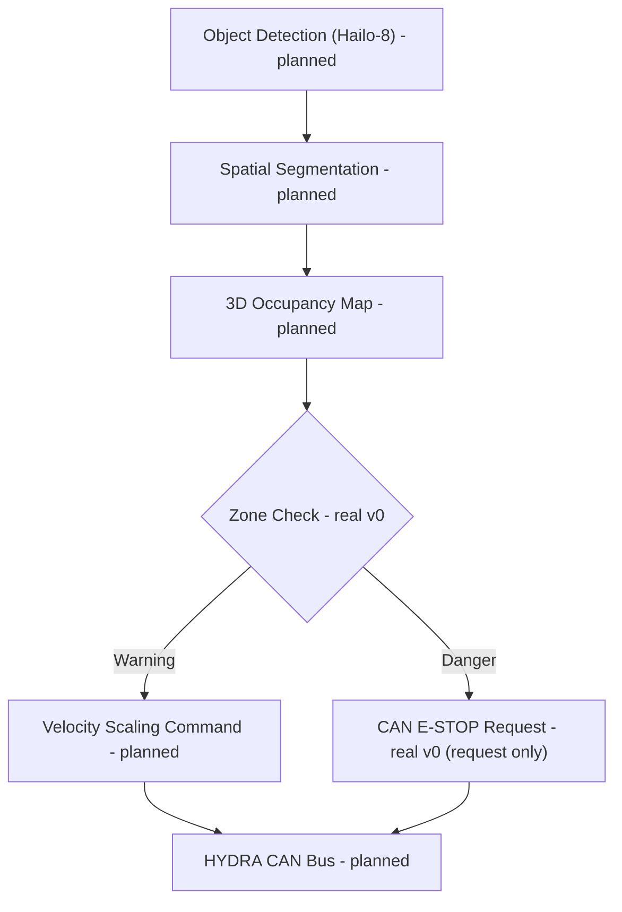

<p align="center">
  
</p>

# 🛡️ HYDRA-UMC-SAFETY-ZONES

<p align="center">🇺🇸 <b>English</b> | <a href="README_spa.md">🇪🇸 Español</a> | <a href="README_fra.md">🇫🇷 Français</a> | <a href="README_ita.md">🇮🇹 Italiano</a> | <a href="README_deu.md">🇩🇪 Deutsch</a> | <a href="README_zho.md">🇨🇳 简体中文</a> | <a href="README_jpn.md">🇯🇵 日本語</a></p>

### 🚨 Real-Time 3D Intrusion Detection & E-STOP Orchestrator

<p align="left">
  
  
  
  
</p>

---

## 1. 🛠️ TECHNICAL OVERVIEW

**HYDRA-UMC-SAFETY-ZONES** is intended to be the critical safety subsystem of the Vision AI Node family. Its job is projecting virtual 3D bounding volumes around the robots and monitoring the workspace for human intrusions or foreign objects, using high-speed spatial segmentation from the Hailo-8 NPU to detect breaches in defined "Warning" and "Danger" zones.

This is one of the 4 children of **[HYDRA-UMC-VISION-NODE](https://github.com/JuanenRac/HYDRA-UMC-VISION-NODE)**, the family's integration parent, and its perception input is built on models compiled by its sibling **[HYDRA-UMC-DETECTION-HEF](https://github.com/JuanenRac/HYDRA-UMC-DETECTION-HEF)**.

### Key Points

* 🚦 **Multi-Level Zones (v0):** real `Zone`/`ZoneLevel` (Warning/Danger) definitions over axis-aligned 3D volumes, and real breach checking (`check_breaches`) between a zone set and a set of detected object positions.
* 🛑 **E-STOP requesting (v0, not asserting):** every object whose worst breach is Danger produces a real `EStopRequest`, handed to an `EStopRequester` - see the design boundary below for why nothing here ever asserts the physical stop itself.
* 📐 **Dynamic Occlusion (planned):** automatically masking the robot's own structure out of safety triggers, so the robot does not "detect itself" as an intrusion.
* 🔍 **Foreign Object Detection (planned):** identifying tools or debris left in the workspace.
* 🎥 **Real 3D occupancy mapping from Hailo-8 (planned):** v0's `check` subcommand takes detected-object positions from a JSON file precisely because the real Hailo-8 spatial segmentation pipeline that would produce them doesn't exist yet in this environment - see "Honesty check" below.
* 🧩 **Why it exists as its own project:** safety logic has a different verification bar than the rest of perception - isolating it in its own service means it can be tested, audited, and eventually certified (see the ISO 13849-1 badge above, aspirational at this stage) independently of camera pipeline or model-compilation changes elsewhere in the family.

**A critical design boundary, already decided and now enforced in code:** this project only ever **detects and requests** an E-STOP - it never asserts the physical stop signal itself. `estop.py`'s only real requester implementation, `NullEStopRequester`, records what it would have sent without transmitting anything anywhere - there is no real CAN transport in this repository yet, on purpose. Actually cutting motor power over CAN is [HYDRA-UMC](https://github.com/JuanenRac/HYDRA-UMC)'s (the firmware's) responsibility, on hardware built for that role. Keeping the boundary there means a bug in this Python service can fail to *request* a stop, but can never *prevent* the firmware from enforcing one independently.

**Honesty check - what actually runs today:** the real entry point (`src/hydra_umc_safety_zones/main.py`) still prints identity/version/role on a bare call, but now also has a real `check --zones PATH --detections PATH` subcommand: it loads zones and detected-object positions from JSON, runs real breach checking, requests E-STOPs for every Danger breach, and exits 0/1/2 depending on the worst outcome found. What is genuinely not real yet: the Hailo-8 spatial segmentation that would produce those detected-object positions on real hardware, self-occlusion masking, and any real CAN transport for the E-STOP request. See [`CHANGELOG.md`](CHANGELOG.md) for exactly what has shipped so far, and "Current Status & Next Steps" below for what remains open.

---

## 2. 🔄 INTENDED SAFETY LOGIC FLOW

The diagram below is the target data flow this project is being built towards. `ZONE` (Zone Check) and the Warning/Danger split after it are real today, driven by `check_breaches()`/`request_estop_for()`, given detected-object positions from a JSON file. Everything upstream of `ZONE` (the real Hailo-8 pipeline) and downstream of `STOP` (the real CAN transport) is still future work.



---

## 3. 🧠 ADVANCED TECHNICAL INFORMATION

### The detect-vs-enforce boundary, and why it matters here specifically

Of everything in this README, this is the one design decision that is not just an implementation detail: this service is meant to *decide* that a stop is needed and *request* it over CAN, but the actual, physical motor-power cut happens on hardware inside [HYDRA-UMC](https://github.com/JuanenRac/HYDRA-UMC) built and certified for that role. This is a deliberate defense-in-depth choice - a software bug here (a crash, a hang, a bad frame) degrades to "no new stop requests get sent", not to "the robot's existing safety hardware stops working".

### Why no `hardware/`, `firmware/`, `os/` or `models/` here

CM5 + Hailo-8 is off-the-shelf hardware with no board of its own to design, so - like the rest of the Vision AI Node family - no `hardware/`/`firmware/` folder exists here. `os/` (the shared HydraOS image) and `models/` (the compiled `.hef` files actually served to the NPU) live only in the integration parent, [HYDRA-UMC-VISION-NODE](https://github.com/JuanenRac/HYDRA-UMC-VISION-NODE), since it owns the CM5 host image and the Hailo-8 device handle.

### Design decisions already made

* **Version read from installed package metadata, not hardcoded** - `main.py` calls `importlib.metadata.version("hydra-umc-safety-zones")` instead of a second `__version__` string, so `bump_version.py` only ever has one place to edit.
* **The odometer bump only ever touches `PATCH`/`MINOR` automatically** - `bump_version.py` carries `PATCH` into `MINOR` past 9 and `MINOR` into `MAJOR` past 9, but never bumps `MAJOR` itself; same convention as `HYDRA-UMC-EDITOR-URDF/bump_version.py` and `HYDRA-UMC-SUITE/bump_version.py`.
* **AABB zones, not meshes or convex hulls** - the simplest volume that still lets `check_breaches()` be exact and fast; a real perimeter is very often close to a box in practice, and a richer shape can be added later behind the same `Zone`/`AABB.contains()` interface without touching `breach.py` or `estop.py`.
* **Zone-boundary containment is inclusive, not exclusive** - `AABB.contains()` treats a point exactly on the edge as inside. For a safety perimeter, that is the conservative direction to be wrong in: it can only cause an earlier breach report, never a missed one.
* **`NullEStopRequester` is the only requester in this repository** - not a placeholder waiting to be swapped out casually, but the honest embodiment of the detect-vs-enforce boundary itself: there is no real CAN transport here, and there should not be one bolted on carelessly later either (see "A critical design boundary" above and `estop.py`'s own module docstring).
* **Zones and detections are plain JSON, not YAML** - `pyproject.toml`'s dependency list is still `[]`; `json` is stdlib, `pyyaml` is real future work once there is an actual zone-authoring tool worth serializing for.

---

## 📂 DIRECTORY STRUCTURE

```text
HYDRA-UMC-SAFETY-ZONES/
├── src/hydra_umc_safety_zones/
│   ├── geometry.py       # Real Point3D/AABB primitives
│   ├── zones.py          # Real ZoneLevel/Zone definitions
│   ├── breach.py         # Real zone-breach checking
│   ├── estop.py          # Real E-STOP requesting (never asserting)
│   ├── config.py         # Real JSON loading for zones/detections
│   └── main.py            # Entry point + real `check` subcommand
├── tests/                # Real tests: geometry, breach, E-STOP, config, CLI
├── docs/                # Documentation and safety standards
├── build/               # Build output (local .venv lives here too)
├── images/              # Media and diagrams
├── scripts/             # Utility scripts
├── pyproject.toml       # Package metadata, dependencies, odometer version
├── bump_version.py      # Odometer-style version bump (run by build.sh/.bat)
├── build.sh / build.bat # venv + editable install (dev extras) + compile-check + tests
├── run.sh / run.bat     # Runs the entry point from the local venv (forwards args)
└── CHANGELOG.md         # Version-by-version history (odometer scheme, no dates)
```

No `hardware/`, `firmware/`, `os/` or `models/` folder - see "Advanced Technical Information" above for why. `os/` and `models/` live only in the integration parent, [HYDRA-UMC-VISION-NODE](https://github.com/JuanenRac/HYDRA-UMC-VISION-NODE).

---

## 🏗️ BUILD & RUN

### Prerequisites

* **Python 3.10 or newer** on your `PATH` (the scripts try `python3` then fall back to `python`).
* No safety/vision runtime dependency is required yet - **zero third-party runtime dependencies** at this stage (`dependencies = []` in `pyproject.toml`); `pytest` is a dev-only extra used solely for the real test suite.
* A few tens of MB of disk space for a local virtual environment under `.venv/`.

### Step by step

```bash
# Linux / macOS
./build.sh
```

1. **Odometer version bump** - runs `bump_version.py`, incrementing `PATCH` in `pyproject.toml` on every build (carrying into `MINOR`/`MAJOR` per the rule above), then syncs `hydra-umc.project.json` to match.
2. **Virtual environment** - creates `.venv/` if missing; reuses it otherwise.
3. **Editable install (with dev extras)** - `pip install -e ".[dev]"` so `src/` edits take effect immediately, pulls in `pytest`, and registers the `hydra-umc-safety-zones` console entry point.
4. **Compile-check** - `python -m compileall -q src` byte-compiles every file under `src/`, catching syntax errors ecosystem-wide.
5. **Real test suite** - `pytest tests/` runs all 21 tests.

`set -euo pipefail` stops the script at the first failing step; the window stays open (`Press Enter to close...`) if it was double-clicked instead of run from an already-open terminal.

```bash
./run.sh
```

Locates the interpreter inside `.venv` (handling both the POSIX and Windows `.venv` layouts) and runs `python -m hydra_umc_safety_zones.main`, forwarding any arguments.

Bare invocation prints name + version + role:

```text
HYDRA-UMC-SAFETY-ZONES v0.0.3
Real-time 3D intrusion detection and E-STOP orchestration for robotic safe-working areas.
```

The real `check` subcommand needs a zones file and a detections file, both plain JSON:

```json
// zones.json
{"zones": [
  {"id": "warn1", "level": "warning", "min": {"x": 0, "y": 0, "z": 0}, "max": {"x": 5, "y": 5, "z": 5}},
  {"id": "danger1", "level": "danger", "min": {"x": 0, "y": 0, "z": 0}, "max": {"x": 1, "y": 1, "z": 1}}
]}
```

```json
// detections.json
{"objects": [{"id": "op1", "position": {"x": 0.5, "y": 0.5, "z": 0.5}}]}
```

```bash
./run.sh check --zones zones.json --detections detections.json
```

```text
BREACH: object 'op1' inside warning zone 'warn1'
BREACH: object 'op1' inside danger zone 'danger1'
E-STOP REQUESTED: object 'op1' breached danger zone 'danger1' (not asserted - see estop.py)
```

Exits `2` (Danger, E-STOP requested), `1` (Warning-only breach), or `0` (no breach).

```bat
:: Windows - identical steps, batch syntax
build.bat
run.bat
run.bat check --zones zones.json --detections detections.json
```

### Troubleshooting

* **`python`/`python3` not found** - install Python 3.10+ and ensure it is on `PATH`.
* **`compileall` fails** - a real syntax error was introduced under `src/`; the build stops without touching the install, on purpose.
* **"No `.venv` found" from `run.sh`/`run.bat`** - run `build.sh`/`build.bat` at least once first.
* **Stale editable install** - delete `.venv/` and rebuild; rarely needed.
* **`check` exits non-zero** - that is real, working behavior, not a failure: `1` means a Warning-only breach was found, `2` means a Danger breach requested an E-STOP. Only a Python traceback or a malformed-JSON error is an actual bug.

---

## 🚀 Current Status & Next Steps

**What works today:** real Warning/Danger zone definitions and breach checking (`geometry.py`/`zones.py`/`breach.py`), a real E-STOP *requesting* pipeline that respects the detect-vs-enforce boundary by construction (`estop.py`), a real `check` CLI subcommand over JSON zone/detection files, and 21 passing tests - see [`CHANGELOG.md`](CHANGELOG.md) for the full real build/run output.

**What is still open, in no particular order and with no committed timeline:**

* Real 3D occupancy mapping from Hailo-8 spatial segmentation, to actually produce the detected-object positions `check` currently expects as a JSON input.
* Dynamic self-occlusion masking of the robot's own structure.
* A real CAN transport implementing `EStopRequester` towards [HYDRA-UMC](https://github.com/JuanenRac/HYDRA-UMC) - `estop.py` already defines the interface a real implementation would need to satisfy.
* Any real safety certification work (the ISO 13849-1 badge above states an aspiration, not a completed certification).

---

## 🔗 Related Projects

This project is part of a larger robotics ecosystem by the same author (JuanenRac / Electro Hobby 3D), spanning firmware, control software, AI nodes, and fleet tooling. Worth knowing about, since a request might actually be about one of these rather than this repository.

### Family

**Parent:** **[HYDRA-UMC-VISION-NODE](https://github.com/JuanenRac/HYDRA-UMC-VISION-NODE)** — the integration parent this safety layer protects.

**Siblings:**
- **[HYDRA-UMC-VISION-STREAMER](https://github.com/JuanenRac/HYDRA-UMC-VISION-STREAMER)** — captures and pre-processes the camera feeds the parent consumes.
- **[HYDRA-UMC-DETECTION-HEF](https://github.com/JuanenRac/HYDRA-UMC-DETECTION-HEF)** — compiles the `.hef` models this project's detection is built on.
- **[HYDRA-UMC-VISUAL-SERVOING-API](https://github.com/JuanenRac/HYDRA-UMC-VISUAL-SERVOING-API)** — turns the parent's perception into kinematic pose corrections.

### Directly Related (outside the family)

- **[HYDRA-UMC](https://github.com/JuanenRac/HYDRA-UMC)** — this project requests this firmware's E-STOP; the firmware is what actually enforces it.

### Rest of the Ecosystem

**HYDRA-UMC platform** — the multi-robot micro-factory cell
- **[HYDRA-UMC-SERVER](https://github.com/JuanenRac/HYDRA-UMC-SERVER)** — the Express/WebSocket backend every control client talks to.
- **[HYDRA-UMC-STUDIO](https://github.com/JuanenRac/HYDRA-UMC-STUDIO)** — web-based control dashboard, multi-robot 3D visualization.
- **[HYDRA-UMC-ANDROID-CONTROL](https://github.com/JuanenRac/HYDRA-UMC-ANDROID-CONTROL)** — Android control app over Wi-Fi/Bluetooth.
- **[HYDRA-UMC-IOS-CONTROL](https://github.com/JuanenRac/HYDRA-UMC-IOS-CONTROL)** — iOS/iPadOS control app built in Flutter.
- **[HYDRA-UMC-SUITE](https://github.com/JuanenRac/HYDRA-UMC-SUITE)** — desktop swarm command center (Python/PySide6).
- **[HYDRA-UMC-EDITOR-URDF](https://github.com/JuanenRac/HYDRA-UMC-EDITOR-URDF)** — desktop URDF model editor for the robot catalog.
- **[HYDRA-UMC-DSI](https://github.com/JuanenRac/HYDRA-UMC-DSI)** — native touch UI for the onboard DSI touchscreen.

**URTC platform** — the tool head controller every HYDRA-UMC robot arm carries
- **[URTC](https://github.com/JuanenRac/URTC)** — CAN bus tool head controller, 25 tool profiles.
- **[URTC-FLASHER](https://github.com/JuanenRac/URTC-FLASHER)** — desktop CAN-OTA + SWD/JTAG flashing tool.
- **[URTC-TESTER](https://github.com/JuanenRac/URTC-TESTER)** — desktop live CAN-bus diagnostic tool.
- **[URTC-WEB-STUDIO](https://github.com/JuanenRac/URTC-WEB-STUDIO)** — browser-based alternative via Web Serial API.

**🧠 Cognitive AI Node (Hailo-10)**
- [HYDRA-UMC-COGNITIVE-NODE](https://github.com/JuanenRac/HYDRA-UMC-COGNITIVE-NODE)
- [HYDRA-UMC-VLA-ENGINE](https://github.com/JuanenRac/HYDRA-UMC-VLA-ENGINE)
- [HYDRA-UMC-VOICE-UI](https://github.com/JuanenRac/HYDRA-UMC-VOICE-UI)
- [HYDRA-UMC-SEMANTIC-PLANNER](https://github.com/JuanenRac/HYDRA-UMC-SEMANTIC-PLANNER)
- [HYDRA-UMC-DOCS-QA](https://github.com/JuanenRac/HYDRA-UMC-DOCS-QA)

**🐝 Orchestration & Swarm**
- [HYDRA-UMC-ORCHESTRATOR](https://github.com/JuanenRac/HYDRA-UMC-ORCHESTRATOR)
- [HYDRA-UMC-SWARM-SYNC](https://github.com/JuanenRac/HYDRA-UMC-SWARM-SYNC)
- [HYDRA-UMC-PATH-PLANNER-3D](https://github.com/JuanenRac/HYDRA-UMC-PATH-PLANNER-3D)
- [HYDRA-UMC-JOB-DISPATCHER](https://github.com/JuanenRac/HYDRA-UMC-JOB-DISPATCHER)
- [HYDRA-UMC-NODE-HEALING](https://github.com/JuanenRac/HYDRA-UMC-NODE-HEALING)

**🎮 Digital Twin & Simulation**
- [HYDRA-UMC-TWIN](https://github.com/JuanenRac/HYDRA-UMC-TWIN)
- [HYDRA-UMC-PHYSICS-REPLICA](https://github.com/JuanenRac/HYDRA-UMC-PHYSICS-REPLICA)
- [HYDRA-UMC-HIL-BRIDGE](https://github.com/JuanenRac/HYDRA-UMC-HIL-BRIDGE)
- [HYDRA-UMC-SYNTHETIC-DATA-GEN](https://github.com/JuanenRac/HYDRA-UMC-SYNTHETIC-DATA-GEN)

**📊 Data & Analytics**
- [HYDRA-UMC-DATALAKE](https://github.com/JuanenRac/HYDRA-UMC-DATALAKE)
- [HYDRA-UMC-TELEMETRY-COLLECTOR](https://github.com/JuanenRac/HYDRA-UMC-TELEMETRY-COLLECTOR)
- [HYDRA-UMC-ANOMALY-DETECTOR](https://github.com/JuanenRac/HYDRA-UMC-ANOMALY-DETECTOR)
- [HYDRA-UMC-PRODUCTION-REPORTS](https://github.com/JuanenRac/HYDRA-UMC-PRODUCTION-REPORTS)

**🏭 Industrial Gateway**
- [HYDRA-UMC-GATEWAY-INDUSTRIAL](https://github.com/JuanenRac/HYDRA-UMC-GATEWAY-INDUSTRIAL)
- [HYDRA-UMC-OPCUA-SERVER](https://github.com/JuanenRac/HYDRA-UMC-OPCUA-SERVER)
- [HYDRA-UMC-MQTT-BROKER](https://github.com/JuanenRac/HYDRA-UMC-MQTT-BROKER)
- [HYDRA-UMC-MTCONNECT-ADAPTER](https://github.com/JuanenRac/HYDRA-UMC-MTCONNECT-ADAPTER)

**🛠️ Complementary Tools**
- [URTC-SMART-RACK](https://github.com/JuanenRac/URTC-SMART-RACK)
- [URTC-VISION-TOOL](https://github.com/JuanenRac/URTC-VISION-TOOL)
- [HYDRA-UMC-WATCH](https://github.com/JuanenRac/HYDRA-UMC-WATCH)
- [HYDRA-UMC-TOOL-CLI](https://github.com/JuanenRac/HYDRA-UMC-TOOL-CLI)
- [HYDRA-UMC-DASHBOARD-AI](https://github.com/JuanenRac/HYDRA-UMC-DASHBOARD-AI)

---

## 👤 AUTHOR
**JuanenRac** (Electro Hobby 3D)
📧 electrohobby3d@gmail.com

## 📜 LICENSE
GPL-3.0 - See LICENSE for details.

## 🛠️ BUILD & RUN

Use the non-versioning build check before a release build:

| Action | Windows | Linux / macOS |
|---|---|---|
| Build check (no version or CHANGELOG change) | `build-test.bat` | `./build-test.sh` |
| Run / development (when provided) | `run*.bat` or `dev*.bat` | `./run*.sh` or `./dev*.sh` |

`build-test.bat` and `build-test.sh` compile or validate the project stack without incrementing `hydra-umc.project.json` or modifying `CHANGELOG.md`. They may create normal compiler output only. Existing `build*.bat`, `build*.sh`, `run*` and `dev*` scripts retain their project-specific, versioned or runtime behavior; use them when that behavior is required.