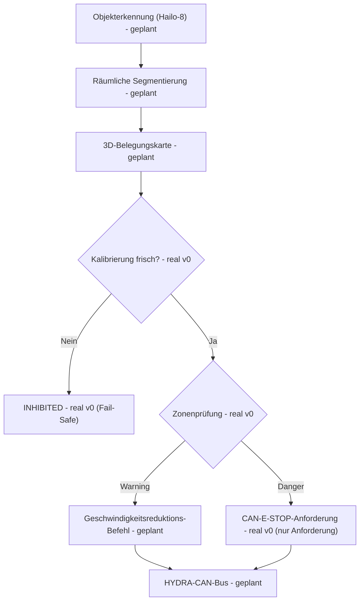

<p align="center">
  
</p>

# 🛡️ HYDRA-UMC-SAFETY-ZONES

<p align="center"><a href="README.md">🇺🇸 English</a> | <a href="README_spa.md">🇪🇸 Español</a> | <a href="README_fra.md">🇫🇷 Français</a> | <a href="README_ita.md">🇮🇹 Italiano</a> | 🇩🇪 <b>Deutsch</b> | <a href="README_zho.md">🇨🇳 简体中文</a> | <a href="README_jpn.md">🇯🇵 日本語</a></p>

### 🚨 Echtzeit-3D-Eindringlingserkennung & E-STOP-Orchestrator

<p align="left">
  
  
  
  
</p>

---

## 1. 🛠️ TECHNISCHER ÜBERBLICK

**HYDRA-UMC-SAFETY-ZONES** soll das kritische Sicherheitssubsystem der Vision-AI-Node-Familie werden. Seine Aufgabe ist es, virtuelle 3D-Begrenzungsvolumen um die Roboter zu projizieren und den Arbeitsbereich auf menschliches Eindringen oder Fremdobjekte zu überwachen, unter Nutzung der hochschnellen räumlichen Segmentierung der Hailo-8-NPU, um Verletzungen definierter "Warning"- und "Danger"-Zonen zu erkennen.

Dies ist eines der 4 Kind-Projekte von **[HYDRA-UMC-VISION-NODE](https://github.com/JuanenRac/HYDRA-UMC-VISION-NODE)**, dem Integrations-Elternteil der Familie, und seine Wahrnehmungseingabe baut auf Modellen auf, die von seinem Geschwister **[HYDRA-UMC-DETECTION-HEF](https://github.com/JuanenRac/HYDRA-UMC-DETECTION-HEF)** kompiliert werden.

### Kernpunkte

* 🚦 **Mehrstufige Zonen (v0):** echte `Zone`/`ZoneLevel`-Definitionen (Warning/Danger) über achsenparallele 3D-Volumen, und echte Verletzungsprüfung (`check_breaches`) zwischen einer Zonenmenge und einer Menge erkannter Objektpositionen.
* 🛑 **E-STOP-Anforderung (v0, keine Auslösung):** jedes Objekt, dessen schlimmste Verletzung Danger ist, erzeugt eine echte `EStopRequest`, übergeben an einen `EStopRequester` - siehe die Design-Grenze unten für das Warum, dass hier nichts jemals selbst den physischen Stopp auslöst.
* 🔒 **Durchsetzung der Kalibrierungsfrische (v0):** jede Zonenmenge trägt eine optionale `calibration` (Version, Quelle, Kalibrierungsdatum, maximales Alter in Tagen). `evaluate_safety()` prüft sie **bevor** irgendeine Verletzungslogik ausgeführt wird - eine Zonenmenge ohne jegliche Kalibrierung, eine, die älter als ihr eigenes deklariertes `max_age_days` ist, oder eine mit einem Datum in der Zukunft, löst sich immer zu `INHIBITED` auf, fällt nie stillschweigend auf `READY` zurück, nur weil kein erkanntes Objekt in der Nähe einer Zone ist.
* 📐 **Dynamische Verdeckung (geplant):** automatisches Ausblenden der eigenen Struktur des Roboters aus Sicherheitsauslösern, damit der Roboter sich nicht selbst als Eindringling "erkennt".
* 🔍 **Fremdobjekterkennung (geplant):** Identifizierung von im Arbeitsbereich zurückgelassenen Werkzeugen oder Trümmern.
* 🎥 **Echte 3D-Belegungskartierung von Hailo-8 (geplant):** der `check`-Subbefehl von v0 nimmt erkannte Objektpositionen aus einer JSON-Datei, gerade weil die echte Hailo-8-Segmentierungs-Pipeline, die sie erzeugen würde, in dieser Umgebung noch nicht existiert - siehe "Ehrlichkeitscheck" unten.
* 🧩 **Warum als eigenes Projekt:** Sicherheitslogik hat eine andere Verifikationsschwelle als der Rest der Wahrnehmung - sie in einem eigenen Dienst zu isolieren erlaubt es, sie unabhängig von Änderungen an der Kamera-Pipeline oder der Modellkompilierung anderswo in der Familie zu testen, zu prüfen und letztlich zu zertifizieren (siehe das ISO-13849-1-Badge oben, in dieser Phase noch angestrebt).

**Eine kritische, bereits getroffene und nun im Code durchgesetzte Design-Grenze:** Dieses Projekt **erkennt und fordert** einen E-STOP nur **an** - es löst nie selbst das physische Stoppsignal aus. Der einzige echte Requester in `estop.py`, `NullEStopRequester`, zeichnet auf, was er gesendet hätte, ohne irgendetwas irgendwohin zu übertragen - es gibt absichtlich noch keinen echten CAN-Transport in diesem Repository. Das tatsächliche Kappen der Motorleistung über CAN ist Aufgabe von [HYDRA-UMC](https://github.com/JuanenRac/HYDRA-UMC) (der Firmware), auf für diese Rolle gebauter Hardware. Diese Grenze dort zu halten bedeutet, dass ein Fehler in diesem Python-Dienst dazu führen kann, dass ein Stopp nicht *angefordert* wird, aber nie *verhindern* kann, dass die Firmware ihn unabhängig durchsetzt.

**Ehrlichkeitscheck - was heute wirklich läuft:** Der reale Einstiegspunkt (`src/hydra_umc_safety_zones/main.py`) gibt bei einem argumentlosen Aufruf weiterhin Identität/Version/Rolle aus, hat jetzt aber auch einen echten `check --zones PFAD --detections PFAD`-Subbefehl: Er lädt eine Zonenmenge (Zonen + optionale Kalibrierungsmetadaten) und erkannte Objektpositionen aus JSON, prüft zuerst die Kalibrierungsfrische, führt dann eine echte Verletzungsprüfung durch, fordert E-STOPs für jede Danger-Verletzung an und beendet sich mit 0 (Ready) / 1 (Warning) / 2 (Danger, E-STOP angefordert) / 3 (Inhibited - Kalibrierung fehlt oder abgelaufen) je nach Ergebnis. Was wirklich noch nicht real ist: die Hailo-8-Segmentierung, die diese erkannten Objektpositionen auf echter Hardware erzeugen würde, die Selbstverdeckungsmaskierung und jeglicher echter CAN-Transport für die E-STOP-Anforderung. Siehe [`CHANGELOG.md`](CHANGELOG.md) für genau das, was bisher geliefert wurde, und "Aktueller Status & Nächste Schritte" unten für das, was noch offen ist.

---

## 2. 🔄 GEPLANTER SICHERHEITSLOGIK-ABLAUF

Das Diagramm unten ist der Ziel-Datenfluss, auf den dieses Projekt hinarbeitet. `CAL` (Kalibrierungsprüfung), `ZONE` (Zonenprüfung) und die anschließende Warning/Danger-Aufteilung sind heute real, angetrieben von `evaluate_safety()` (das `check_breaches()`/`request_estop_for()` umschließt), ausgehend von erkannten Objektpositionen aus einer JSON-Datei. Alles vor `CAL`/`ZONE` (die echte Hailo-8-Pipeline) und nach `STOP` (der echte CAN-Transport) bleibt zukünftige Arbeit.



---

## 3. 🧠 ERWEITERTE TECHNISCHE INFORMATIONEN

### Die Grenze zwischen Erkennen und Durchsetzen, und warum sie hier besonders wichtig ist

Von allem in diesem README ist dies die einzige Designentscheidung, die nicht nur ein Implementierungsdetail ist: Dieser Dienst soll *entscheiden*, dass ein Stopp nötig ist, und ihn über CAN *anfordern*, aber das tatsächliche, physische Kappen der Motorleistung geschieht auf Hardware innerhalb von [HYDRA-UMC](https://github.com/JuanenRac/HYDRA-UMC), die für diese Rolle gebaut und zertifiziert ist. Dies ist eine bewusste Defense-in-Depth-Entscheidung - ein Softwarefehler hier (ein Absturz, ein Hänger, ein schlechter Frame) degradiert zu "es werden keine neuen Stopp-Anfragen gesendet", nicht zu "die vorhandene Sicherheitshardware des Roboters funktioniert nicht mehr".

### Warum es hier kein `hardware/`, `firmware/`, `os/` oder `models/` gibt

CM5 + Hailo-8 ist handelsübliche Hardware ohne eigenes zu entwerfendes Board, daher existiert - wie im Rest der Vision-AI-Node-Familie - hier kein `hardware/`/`firmware/`-Ordner. `os/` (das gemeinsame HydraOS-Abbild) und `models/` (die zur Laufzeit tatsächlich an die NPU ausgelieferten kompilierten `.hef`-Dateien) leben nur im Integrations-Elternteil, [HYDRA-UMC-VISION-NODE](https://github.com/JuanenRac/HYDRA-UMC-VISION-NODE), da diesem das CM5-Host-Abbild und das Hailo-8-Gerätehandle gehören.

### Bereits getroffene Designentscheidungen

* **Die Version wird aus den Metadaten des installierten Pakets gelesen, nicht fest codiert** - `main.py` ruft `importlib.metadata.version("hydra-umc-safety-zones")` statt einer zweiten `__version__`-Zeichenkette auf, sodass `bump_version.py` nur eine Stelle zu bearbeiten hat.
* **Der "Kilometerzähler"-Bump berührt automatisch nur `PATCH`/`MINOR`** - `bump_version.py` überträgt `PATCH` auf `MINOR` über 9 hinaus und `MINOR` auf `MAJOR` über 9 hinaus, erhöht aber nie `MAJOR` selbst; dieselbe Konvention wie `HYDRA-UMC-EDITOR-URDF/bump_version.py` und `HYDRA-UMC-SUITE/bump_version.py`.
* **AABB-Zonen, keine Meshes oder konvexen Hüllen** - das einfachste Volumen, das `check_breaches()` trotzdem exakt und schnell bleiben lässt; ein echter Perimeter ähnelt in der Praxis sehr oft einer Box, und eine reichhaltigere Form kann später hinter derselben `Zone`/`AABB.contains()`-Schnittstelle ergänzt werden, ohne `breach.py` oder `estop.py` anzufassen.
* **Die Zonengrenzen-Eingrenzung ist inklusiv, nicht exklusiv** - `AABB.contains()` behandelt einen Punkt genau am Rand als innen liegend. Für einen Sicherheitsperimeter ist das die konservative Richtung, in die man sich irren sollte: es kann nur zu einer früheren Verletzungsmeldung führen, nie zu einer verpassten.
* **`NullEStopRequester` ist der einzige Requester in diesem Repository** - kein Platzhalter, der leichtfertig ausgetauscht werden soll, sondern die ehrliche Verkörperung der Erkennen-vs-Durchsetzen-Grenze selbst: es gibt hier keinen echten CAN-Transport, und später sollte auch keiner unbedacht hinzugefügt werden (siehe "Eine kritische Design-Grenze" oben und den eigenen Docstring des `estop.py`-Moduls).
* **Zonen und Erkennungen sind einfaches JSON, kein YAML** - die Abhängigkeitsliste von `pyproject.toml` bleibt `[]`; `json` gehört zur Standardbibliothek, `pyyaml` ist echte zukünftige Arbeit, sobald es ein echtes Zonen-Autorenwerkzeug gibt, das eine Serialisierung wert ist.
* **Die Kalibrierung wird vor jeglicher Verletzungslogik geprüft, nie danach** - `evaluate_safety()` gibt `INHIBITED` zurück, sobald die Kalibrierung fehlt oder abgelaufen ist, noch bevor `check_breaches()` überhaupt aufgerufen wird. Das ist beabsichtigt: eine abgelaufene Kalibrierung bedeutet, dass der Zonengeometrie selbst nicht zu trauen ist, also wäre das Ergebnis einer Verletzungsprüfung dagegen ohnehin bedeutungslos - die Kalibrierung zuerst zu prüfen bedeutet auch, dass eine abgelaufene Kalibrierung immer über das gewinnt, was sonst wie eine echte Danger-Verletzung aussähe, nicht umgekehrt.
* **Eine fehlende `"calibration"`-Schlüssel lädt erfolgreich, es bedeutet nur `INHIBITED`** - `load_zone_set()` löst nie einen Fehler aus, nur weil eine Zonendatei älter als dieses Feature ist oder von Hand ohne Kalibrierungsmetadaten geschrieben wurde; sie schlägt per Design zum Zeitpunkt der Auswertung sicher fehl, nicht beim Laden.

---

## 📂 VERZEICHNISSTRUKTUR

```text
HYDRA-UMC-SAFETY-ZONES/
├── src/hydra_umc_safety_zones/
│   ├── geometry.py       # Echte Point3D/AABB-Primitive
│   ├── zones.py          # Echte ZoneLevel/Zone/ZoneSet-Definitionen
│   ├── breach.py         # Echte Zonenverletzungsprüfung
│   ├── calibration.py    # Echte Verfolgung der Kalibrierungsfrische
│   ├── safety_state.py   # Echte Fail-Safe-Entscheidung: READY/WARNING/DANGER/INHIBITED
│   ├── estop.py          # Echte E-STOP-Anforderung (nie Auslösung)
│   ├── config.py         # Echtes JSON-Laden für Zonen/Erkennungen
│   ├── api.py             # Einfache JSON/HTTP-Oberfläche (stdlib http.server) über die echte `check`-Logik
│   └── main.py            # Einstiegspunkt + echter `check`-Subbefehl
├── tests/                # Echte Tests: Geometrie, Verletzungen, Kalibrierung, safety_state, estop, Config, api, CLI
├── docs/                # Dokumentation und Sicherheitsnormen
├── build/               # Build-Ausgabe (hier lebt auch das lokale .venv)
├── images/              # Medien und Diagramme
├── systemd/
│   └── hydra-umc-safety-zones.service # systemd-Unit der lokalen CM5-Zonenverletzungs-API
├── pyproject.toml       # Paketmetadaten, Abhängigkeiten, Kilometerzähler-Version
├── bump_version.py      # Native Kilometerzähler-artige Versions-Bump (build.sh/.bat)
├── bump_manifest_version.py # Synchronisiert die Version von hydra-umc.project.json mit der nativen (--sync)
├── build.sh / build.bat # venv + editierbare Installation (Dev-Extras) + Compile-Check + Tests
├── build-test.sh / .bat # Nicht-versionierender Build-Check (rührt Version/CHANGELOG nie an)
├── tools/
│   ├── build_test.py    # Gemeinsame Engine, an die beide build-test-Starter delegieren
│   └── ci_validate.py   # Manifest/CHANGELOG/Docs-Validierung, von CI genutzt
├── run.sh / run.bat     # Führt den Einstiegspunkt aus dem lokalen venv aus (leitet Argumente weiter)
└── CHANGELOG.md         # Versions-für-Versions-Historie (Kilometerzähler-Schema, ohne Daten)
```

Kein `hardware/`-, `firmware/`-, `os/`- oder `models/`-Ordner - siehe "Erweiterte technische Informationen" oben für das Warum. `os/` und `models/` leben nur im Integrations-Elternteil, [HYDRA-UMC-VISION-NODE](https://github.com/JuanenRac/HYDRA-UMC-VISION-NODE).

---

## 🏗️ BUILD UND AUSFÜHRUNG

### Voraussetzungen

* **Python 3.10 oder neuer** im `PATH` (die Skripte probieren `python3`, dann `python`).
* Keine Sicherheits-/Vision-Laufzeitabhängigkeit ist bisher erforderlich - **null Drittanbieter-Laufzeitabhängigkeiten** in dieser Phase (`dependencies = []` in `pyproject.toml`); `pytest` ist ein reines Dev-Extra, das ausschließlich für die echte Testsuite verwendet wird.
* Einige Dutzend MB Festplattenplatz für eine lokale virtuelle Umgebung unter `.venv/`.

### Schritt für Schritt

```bash
# Linux / macOS
./build.sh
```

1. **Kilometerzähler-Versions-Bump** - führt `bump_version.py` aus, das `PATCH` in `pyproject.toml` bei jedem Build erhöht, und synchronisiert anschließend `hydra-umc.project.json` entsprechend.
2. **Virtuelle Umgebung** - erstellt `.venv/`, falls nicht vorhanden; verwendet es sonst weiter.
3. **Editierbare Installation (mit Dev-Extras)** - `pip install -e ".[dev]"`, sodass Änderungen unter `src/` sofort wirken, installiert `pytest` und registriert den Konsolen-Einstiegspunkt `hydra-umc-safety-zones`.
4. **Compile-Check** - `python -m compileall -q src` kompiliert jede Datei unter `src/` zu Bytecode.
5. **Echte Testsuite** - `pytest tests/` führt alle 57 Tests aus.

`set -euo pipefail` stoppt das Skript beim ersten fehlschlagenden Schritt; das Fenster bleibt geöffnet (`Press Enter to close...`), wenn es per Doppelklick statt aus einem bereits geöffneten Terminal gestartet wurde.

```bash
./run.sh
```

Sucht den Interpreter innerhalb von `.venv` und führt `python -m hydra_umc_safety_zones.main` aus, wobei alle Argumente weitergeleitet werden.

Der argumentlose Aufruf gibt Name + Version + Rolle aus:

```text
HYDRA-UMC-SAFETY-ZONES v0.0.5
Real-time 3D intrusion detection and E-STOP orchestration for robotic safe-working areas.
```

Der echte `check`-Subbefehl braucht eine Zonen- und eine Erkennungsdatei, beide einfaches JSON. `calibration` ist in der Zonendatei optional - siehe unten, was ohne sie passiert:

```json
// zones.json
{
  "calibration": {"version": "cal-1", "source": "manual", "calibrated_at": "2026-08-27", "max_age_days": 30},
  "zones": [
    {"id": "warn1", "level": "warning", "min": {"x": 0, "y": 0, "z": 0}, "max": {"x": 5, "y": 5, "z": 5}},
    {"id": "danger1", "level": "danger", "min": {"x": 0, "y": 0, "z": 0}, "max": {"x": 1, "y": 1, "z": 1}}
  ]
}
```

```json
// detections.json
{"objects": [{"id": "op1", "position": {"x": 0.5, "y": 0.5, "z": 0.5}}]}
```

```bash
./run.sh check --zones zones.json --detections detections.json
```

```text
SAFETY STATE: DANGER - object(s) ['op1'] breached a danger zone
BREACH: object 'op1' inside warning zone 'warn1'
BREACH: object 'op1' inside danger zone 'danger1'
E-STOP REQUESTED: object 'op1' breached danger zone 'danger1' (not asserted - see estop.py)
```

Beendet sich mit `2` (Danger, E-STOP angefordert), `1` (nur Warning-Verletzung), `0` (keine Verletzung, Kalibrierung gültig) oder `3` (**Inhibited** - Kalibrierung fehlt oder abgelaufen, geprüft vor jeglicher Verletzungslogik). Echtes Beispiel des Fail-Safe-Pfads - dieselbe `detections.json` von oben, aber `zones.json` ohne jeglichen `"calibration"`-Schlüssel:

```bash
./run.sh check --zones zones_no_calibration.json --detections detections.json
```

```text
SAFETY STATE: INHIBITED - no calibration metadata present - zone geometry cannot be trusted
```

Beendet sich mit `3` - beachte, dass es überhaupt keine `BREACH`/`E-STOP`-Ausgabe gibt, obwohl `op1` innerhalb beider Zonen liegt: eine nicht vertrauenswürdige Zonenmenge erreicht den Verletzungsprüfungsschritt nie.

```bat
:: Windows - gleiche Schritte, Batch-Syntax
build.bat
run.bat
run.bat check --zones zones.json --detections detections.json
```

### Fehlerbehebung

* **`python`/`python3` nicht gefunden** - Python 3.10+ installieren und sicherstellen, dass es im `PATH` liegt.
* **`compileall` schlägt fehl** - ein echter Syntaxfehler wurde unter `src/` eingeführt; der Build stoppt absichtlich, ohne die Installation anzufassen.
* **"No `.venv` found" von `run.sh`/`run.bat`** - `build.sh`/`build.bat` vorher mindestens einmal ausführen.
* **Veraltete editierbare Installation** - `.venv/` löschen und neu bauen; selten nötig.
* **`check` beendet sich mit einem Code ungleich null** - das ist echtes, korrektes Verhalten, kein Fehlschlag: `1` bedeutet, dass eine reine Warning-Verletzung gefunden wurde, `2` bedeutet, dass eine Danger-Verletzung einen E-STOP angefordert hat, `3` bedeutet, dass die Kalibrierung der Zonenmenge fehlt oder abgelaufen ist (Fail-Safe, geprüft bevor jegliche Verletzungslogik ausgeführt wird). Nur ein Python-Traceback oder ein Fehler durch fehlerhaftes JSON ist ein echter Bug.

---

## 🚀 Aktueller Status & Nächste Schritte

**Was heute funktioniert:** echte Warning-/Danger-Zonendefinitionen und echte Verletzungsprüfung (`geometry.py`/`zones.py`/`breach.py`), echte Durchsetzung der Kalibrierungsfrische, die vor jeglicher Verletzungslogik sicher zu `INHIBITED` fehlschlägt (`calibration.py`/`safety_state.py`), eine echte E-STOP-*Anforderungs*-Pipeline, die die Erkennen-vs-Durchsetzen-Grenze konstruktionsbedingt respektiert (`estop.py`), ein echter CLI-Subbefehl `check` über JSON-Zonen-/Erkennungsdateien und 57 bestandene Tests - siehe [`CHANGELOG.md`](CHANGELOG.md) für die vollständige echte Build-/Run-Ausgabe.

**Was noch offen ist, ohne bestimmte Reihenfolge und ohne verbindlichen Zeitplan:**

* Die echte 3D-Belegungskartierung aus der räumlichen Segmentierung von Hailo-8, um die erkannten Objektpositionen, die `check` heute als JSON-Eingabe erwartet, tatsächlich zu erzeugen.
* Die dynamische Selbstverdeckungsmaskierung der eigenen Roboterstruktur.
* Ein echter CAN-Transport, der `EStopRequester` implementiert, an [HYDRA-UMC](https://github.com/JuanenRac/HYDRA-UMC) - `estop.py` definiert bereits die Schnittstelle, die eine echte Implementierung erfüllen müsste.
* Jegliche echte Sicherheitszertifizierungsarbeit (das ISO-13849-1-Badge oben drückt eine Absicht aus, keine abgeschlossene Zertifizierung).

---

## 🔗 Verwandte Projekte

Dieses Projekt ist Teil eines größeren Robotik-Ökosystems desselben Autors (JuanenRac / Electro Hobby 3D), das Firmware, Steuerungssoftware, KI-Knoten und Flottenwerkzeuge umfasst. Gut zu wissen, denn eine Anfrage könnte sich eigentlich auf eines dieser Projekte statt auf dieses Repository beziehen.

### Familie

**Elternteil:** **[HYDRA-UMC-VISION-NODE](https://github.com/JuanenRac/HYDRA-UMC-VISION-NODE)** — der Integrations-Elternteil, den diese Sicherheitsschicht schützt.

**Geschwister:**
- **[HYDRA-UMC-VISION-STREAMER](https://github.com/JuanenRac/HYDRA-UMC-VISION-STREAMER)** — erfasst und verarbeitet die vom Elternteil konsumierten Kameraströme vor.
- **[HYDRA-UMC-DETECTION-HEF](https://github.com/JuanenRac/HYDRA-UMC-DETECTION-HEF)** — kompiliert die `.hef`-Modelle, auf denen die Erkennung dieses Projekts basiert.
- **[HYDRA-UMC-VISUAL-SERVOING-API](https://github.com/JuanenRac/HYDRA-UMC-VISUAL-SERVOING-API)** — wandelt die Wahrnehmung des Elternteils in kinematische Posenkorrekturen um.

### Direkte Beziehung (außerhalb der Familie)

- **[HYDRA-UMC](https://github.com/JuanenRac/HYDRA-UMC)** — dieses Projekt fordert den E-STOP dieser Firmware an; die Firmware ist es, die ihn tatsächlich durchsetzt.

### Restliches Ökosystem

**HYDRA-UMC-Plattform** — die Multi-Roboter-Mikrofabrikzelle
- **[HYDRA-UMC-SERVER](https://github.com/JuanenRac/HYDRA-UMC-SERVER)** — das Express/WebSocket-Backend, mit dem jeder Steuerungsclient spricht.
- **[HYDRA-UMC-STUDIO](https://github.com/JuanenRac/HYDRA-UMC-STUDIO)** — webbasiertes Steuerungs-Dashboard, Multi-Roboter-3D-Visualisierung.
- **[HYDRA-UMC-ANDROID-CONTROL](https://github.com/JuanenRac/HYDRA-UMC-ANDROID-CONTROL)** — Android-Steuerungs-App über Wi-Fi/Bluetooth.
- **[HYDRA-UMC-IOS-CONTROL](https://github.com/JuanenRac/HYDRA-UMC-IOS-CONTROL)** — iOS/iPadOS-Steuerungs-App, gebaut in Flutter.
- **[HYDRA-UMC-SUITE](https://github.com/JuanenRac/HYDRA-UMC-SUITE)** — Desktop-Schwarm-Kommandozentrale (Python/PySide6).
- **[HYDRA-UMC-EDITOR-URDF](https://github.com/JuanenRac/HYDRA-UMC-EDITOR-URDF)** — Desktop-URDF-Modelleditor für den Roboterkatalog.
- **[HYDRA-UMC-DSI](https://github.com/JuanenRac/HYDRA-UMC-DSI)** — native Touch-UI für den eingebauten DSI-Touchscreen.

**URTC-Plattform** — der Werkzeugkopf-Controller, den jeder HYDRA-UMC-Roboterarm trägt
- **[URTC](https://github.com/JuanenRac/URTC)** — CAN-Bus-Werkzeugkopf-Controller, 25 Werkzeugprofile.
- **[URTC-FLASHER](https://github.com/JuanenRac/URTC-FLASHER)** — Desktop-Tool für CAN-OTA + SWD/JTAG-Flashing.
- **[URTC-TESTER](https://github.com/JuanenRac/URTC-TESTER)** — Desktop-Tool für Live-CAN-Bus-Diagnose.
- **[URTC-WEB-STUDIO](https://github.com/JuanenRac/URTC-WEB-STUDIO)** — browserbasierte Alternative über die Web-Serial-API.

**🧠 Kognitiver KI-Knoten (Hailo-10)**
- [HYDRA-UMC-COGNITIVE-NODE](https://github.com/JuanenRac/HYDRA-UMC-COGNITIVE-NODE)
- [HYDRA-UMC-VLA-ENGINE](https://github.com/JuanenRac/HYDRA-UMC-VLA-ENGINE)
- [HYDRA-UMC-VOICE-UI](https://github.com/JuanenRac/HYDRA-UMC-VOICE-UI)
- [HYDRA-UMC-SEMANTIC-PLANNER](https://github.com/JuanenRac/HYDRA-UMC-SEMANTIC-PLANNER)
- [HYDRA-UMC-DOCS-QA](https://github.com/JuanenRac/HYDRA-UMC-DOCS-QA)

**🐝 Orchestrierung & Schwarm**
- [HYDRA-UMC-ORCHESTRATOR](https://github.com/JuanenRac/HYDRA-UMC-ORCHESTRATOR)
- [HYDRA-UMC-SWARM-SYNC](https://github.com/JuanenRac/HYDRA-UMC-SWARM-SYNC)
- [HYDRA-UMC-PATH-PLANNER-3D](https://github.com/JuanenRac/HYDRA-UMC-PATH-PLANNER-3D)
- [HYDRA-UMC-JOB-DISPATCHER](https://github.com/JuanenRac/HYDRA-UMC-JOB-DISPATCHER)
- [HYDRA-UMC-NODE-HEALING](https://github.com/JuanenRac/HYDRA-UMC-NODE-HEALING)

**🎮 Digitaler Zwilling & Simulation**
- [HYDRA-UMC-TWIN](https://github.com/JuanenRac/HYDRA-UMC-TWIN)
- [HYDRA-UMC-PHYSICS-REPLICA](https://github.com/JuanenRac/HYDRA-UMC-PHYSICS-REPLICA)
- [HYDRA-UMC-HIL-BRIDGE](https://github.com/JuanenRac/HYDRA-UMC-HIL-BRIDGE)
- [HYDRA-UMC-SYNTHETIC-DATA-GEN](https://github.com/JuanenRac/HYDRA-UMC-SYNTHETIC-DATA-GEN)

**📊 Daten & Analytik**
- [HYDRA-UMC-DATALAKE](https://github.com/JuanenRac/HYDRA-UMC-DATALAKE)
- [HYDRA-UMC-TELEMETRY-COLLECTOR](https://github.com/JuanenRac/HYDRA-UMC-TELEMETRY-COLLECTOR)
- [HYDRA-UMC-ANOMALY-DETECTOR](https://github.com/JuanenRac/HYDRA-UMC-ANOMALY-DETECTOR)
- [HYDRA-UMC-PRODUCTION-REPORTS](https://github.com/JuanenRac/HYDRA-UMC-PRODUCTION-REPORTS)

**🏭 Industrielles Gateway**
- [HYDRA-UMC-GATEWAY-INDUSTRIAL](https://github.com/JuanenRac/HYDRA-UMC-GATEWAY-INDUSTRIAL)
- [HYDRA-UMC-OPCUA-SERVER](https://github.com/JuanenRac/HYDRA-UMC-OPCUA-SERVER)
- [HYDRA-UMC-MQTT-BROKER](https://github.com/JuanenRac/HYDRA-UMC-MQTT-BROKER)
- [HYDRA-UMC-MTCONNECT-ADAPTER](https://github.com/JuanenRac/HYDRA-UMC-MTCONNECT-ADAPTER)

**🛠️ Ergänzende Werkzeuge**
- [URTC-SMART-RACK](https://github.com/JuanenRac/URTC-SMART-RACK)
- [URTC-VISION-TOOL](https://github.com/JuanenRac/URTC-VISION-TOOL)
- [HYDRA-UMC-WATCH](https://github.com/JuanenRac/HYDRA-UMC-WATCH)
- [HYDRA-UMC-TOOL-CLI](https://github.com/JuanenRac/HYDRA-UMC-TOOL-CLI)
- [HYDRA-UMC-DASHBOARD-AI](https://github.com/JuanenRac/HYDRA-UMC-DASHBOARD-AI)

---

## 👤 AUTOR
**JuanenRac** (Electro Hobby 3D)
📧 electrohobby3d@gmail.com
📺 [youtube.com/@electrohobby3d](https://youtube.com/@electrohobby3d)

## 📜 LIZENZ
GPL-3.0 - Siehe LICENSE-Datei für Details.
