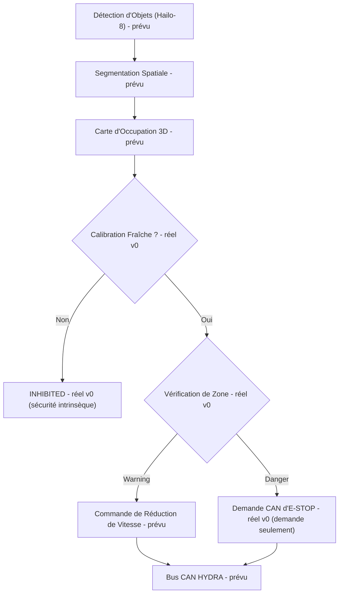

<p align="center">
  
</p>

# 🛡️ HYDRA-UMC-SAFETY-ZONES

<p align="center"><a href="README.md">🇺🇸 English</a> | <a href="README_spa.md">🇪🇸 Español</a> | 🇫🇷 <b>Français</b> | <a href="README_ita.md">🇮🇹 Italiano</a> | <a href="README_deu.md">🇩🇪 Deutsch</a> | <a href="README_zho.md">🇨🇳 简体中文</a> | <a href="README_jpn.md">🇯🇵 日本語</a></p>

### 🚨 Détection d'Intrusion 3D en Temps Réel & Orchestrateur d'E-STOP

<p align="left">
  
  
  
  
</p>

---

## 1. 🛠️ VUE D'ENSEMBLE TECHNIQUE

**HYDRA-UMC-SAFETY-ZONES** est destiné à être le sous-système de sécurité critique de la famille Vision AI Node. Son rôle est de projeter des volumes 3D virtuels autour des robots et de surveiller l'espace de travail pour détecter les intrusions humaines ou objets étrangers, en utilisant la segmentation spatiale haute vitesse du NPU Hailo-8 pour détecter les franchissements de zones « Warning » et « Danger » définies.

C'est l'un des 4 enfants de **[HYDRA-UMC-VISION-NODE](https://github.com/JuanenRac/HYDRA-UMC-VISION-NODE)**, le parent d'intégration de la famille, et son entrée de perception est construite sur des modèles compilés par son frère **[HYDRA-UMC-DETECTION-HEF](https://github.com/JuanenRac/HYDRA-UMC-DETECTION-HEF)**.

### Points Clés

* 🚦 **Zones multi-niveaux (v0) :** de vraies définitions `Zone`/`ZoneLevel` (Warning/Danger) sur des volumes 3D alignés sur les axes, et une vraie vérification des franchissements (`check_breaches`) entre un ensemble de zones et un ensemble de positions d'objets détectés.
* 🛑 **Demande d'E-STOP (v0, sans déclenchement) :** tout objet dont le pire franchissement est Danger produit un vrai `EStopRequest`, remis à un `EStopRequester` - voir la frontière de conception ci-dessous pour le pourquoi de ce que rien ici ne déclenche jamais l'arrêt physique lui-même.
* 🔒 **Application de la fraîcheur de calibration (v0) :** chaque ensemble de zones porte une `calibration` optionnelle (version, source, date de calibration, âge maximal en jours). `evaluate_safety()` la vérifie **avant** d'exécuter la moindre logique de franchissement - un ensemble de zones sans calibration du tout, plus ancien que son propre `max_age_days` déclaré, ou daté dans le futur, se résout toujours en `INHIBITED`, sans jamais retomber silencieusement sur `READY` simplement parce qu'aucun objet détecté n'est proche d'une zone.
* 📐 **Occlusion dynamique (prévu) :** masquer automatiquement la propre structure du robot des déclenchements de sécurité, pour que le robot ne se « détecte » pas lui-même comme une intrusion.
* 🔍 **Détection d'objets étrangers (prévu) :** identifier les outils ou débris laissés dans l'espace de travail.
* 🎥 **Cartographie réelle d'occupation 3D depuis Hailo-8 (prévu) :** le sous-commande `check` de v0 prend les positions d'objets détectés depuis un fichier JSON précisément parce que le vrai pipeline de segmentation spatiale Hailo-8 qui les produirait n'existe pas encore dans cet environnement - voir « Vérification d'honnêteté » ci-dessous.
* 🧩 **Pourquoi c'est un projet séparé :** la logique de sécurité a une barre de vérification différente du reste de la perception - l'isoler dans son propre service permet de la tester, l'auditer et éventuellement la certifier (voir le badge ISO 13849-1 ci-dessus, aspirationnel à ce stade) indépendamment des changements du pipeline caméra ou de la compilation de modèles ailleurs dans la famille.

**Une frontière de conception critique, déjà décidée et désormais renforcée dans le code :** ce projet ne fait que **détecter et demander** un E-STOP - il ne déclenche jamais lui-même le signal d'arrêt physique. Le seul requester réel d'`estop.py`, `NullEStopRequester`, enregistre ce qu'il aurait envoyé sans rien transmettre nulle part - il n'y a pas encore de vrai transport CAN dans ce dépôt, volontairement. Couper réellement l'alimentation moteur via CAN est la responsabilité de [HYDRA-UMC](https://github.com/JuanenRac/HYDRA-UMC) (le firmware), sur du matériel construit pour ce rôle. Garder cette frontière là signifie qu'un bug dans ce service Python peut échouer à *demander* un arrêt, mais ne peut jamais *empêcher* le firmware de l'appliquer indépendamment.

**Vérification d'honnêteté - ce qui fonctionne réellement aujourd'hui :** le point d'entrée réel (`src/hydra_umc_safety_zones/main.py`) affiche toujours identité/version/rôle sur un appel sans argument, mais dispose désormais aussi d'un vrai sous-commande `check --zones CHEMIN --detections CHEMIN` : il charge un ensemble de zones (zones + métadonnées de calibration optionnelles) et positions d'objets détectés depuis JSON, vérifie d'abord la fraîcheur de la calibration, puis exécute une vraie vérification des franchissements, demande des E-STOP pour chaque franchissement Danger, et se termine avec 0 (Ready) / 1 (Warning) / 2 (Danger, E-STOP demandé) / 3 (Inhibited - calibration absente ou expirée) selon le résultat. Ce qui n'est vraiment pas encore réel : la segmentation spatiale Hailo-8 qui produirait ces positions d'objets détectés sur du matériel réel, le masquage d'auto-occlusion, et tout transport CAN réel pour la demande d'E-STOP. Voir [`CHANGELOG.md`](CHANGELOG.md) pour ce qui a été livré exactement jusqu'à présent, et « État Actuel et Prochaines Étapes » ci-dessous pour ce qui reste ouvert.

---

## 2. 🔄 FLUX DE LOGIQUE DE SÉCURITÉ PRÉVU

Le diagramme ci-dessous est le flux de données cible vers lequel ce projet est construit. `CAL` (vérification de calibration), `ZONE` (Vérification de Zone) et la répartition Warning/Danger qui suit sont réels aujourd'hui, pilotés par `evaluate_safety()` (qui enveloppe `check_breaches()`/`request_estop_for()`), à partir de positions d'objets détectés lues depuis un fichier JSON. Tout ce qui précède `CAL`/`ZONE` (le vrai pipeline Hailo-8) et suit `STOP` (le vrai transport CAN) reste du travail futur.



---

## 3. 🧠 INFORMATIONS TECHNIQUES AVANCÉES

### La frontière détecter-vs-appliquer, et pourquoi elle compte particulièrement ici

De tout ce qui figure dans ce README, c'est la seule décision de conception qui n'est pas qu'un détail d'implémentation : ce service est censé *décider* qu'un arrêt est nécessaire et le *demander* via CAN, mais la coupure physique réelle de l'alimentation moteur se produit sur du matériel à l'intérieur de [HYDRA-UMC](https://github.com/JuanenRac/HYDRA-UMC) construit et certifié pour ce rôle. C'est un choix délibéré de défense en profondeur - un bug logiciel ici (un crash, un blocage, une mauvaise image) dégrade vers « plus aucune nouvelle demande d'arrêt n'est envoyée », pas vers « le matériel de sécurité existant du robot cesse de fonctionner ».

### Pourquoi il n'y a pas de `hardware/`, `firmware/`, `os/` ni `models/` ici

CM5 + Hailo-8 est du matériel existant sur étagère sans carte propre à concevoir, donc - comme le reste de la famille Vision AI Node - aucun dossier `hardware/`/`firmware/` n'existe ici. `os/` (l'image HydraOS partagée) et `models/` (les `.hef` compilés réellement servis au NPU) ne vivent que dans le parent d'intégration, [HYDRA-UMC-VISION-NODE](https://github.com/JuanenRac/HYDRA-UMC-VISION-NODE), car c'est lui qui possède l'image de l'hôte CM5 et le handle du périphérique Hailo-8.

### Décisions de conception déjà prises

* **La version est lue depuis les métadonnées du paquet installé, pas codée en dur** - `main.py` appelle `importlib.metadata.version("hydra-umc-safety-zones")` plutôt qu'une seconde chaîne `__version__`, donc `bump_version.py` n'a qu'un seul endroit à modifier.
* **L'incrément « compteur kilométrique » ne touche automatiquement que `PATCH`/`MINOR`** - `bump_version.py` reporte `PATCH` vers `MINOR` au-delà de 9 et `MINOR` vers `MAJOR` au-delà de 9, mais n'incrémente jamais `MAJOR` lui-même ; même convention que `HYDRA-UMC-EDITOR-URDF/bump_version.py` et `HYDRA-UMC-SUITE/bump_version.py`.
* **Zones AABB, pas des maillages ni des enveloppes convexes** - le volume le plus simple qui permette encore à `check_breaches()` d'être exact et rapide ; un vrai périmètre ressemble très souvent à une boîte en pratique, et une forme plus riche peut être ajoutée plus tard derrière la même interface `Zone`/`AABB.contains()` sans toucher `breach.py` ni `estop.py`.
* **Le confinement de frontière de zone est inclusif, pas exclusif** - `AABB.contains()` traite un point exactement sur le bord comme étant à l'intérieur. Pour un périmètre de sécurité, c'est la direction conservatrice où se tromper : cela ne peut causer qu'un rapport de franchissement plus précoce, jamais un raté.
* **`NullEStopRequester` est le seul requester de ce dépôt** - pas un placeholder en attente d'être remplacé à la légère, mais l'incarnation honnête de la frontière détecter-vs-appliquer elle-même : il n'y a pas de vrai transport CAN ici, et il ne devrait pas non plus y en avoir un ajouté négligemment plus tard (voir « Une frontière de conception critique » ci-dessus et le docstring propre du module `estop.py`).
* **Zones et détections sont du JSON simple, pas du YAML** - la liste de dépendances de `pyproject.toml` reste `[]` ; `json` fait partie de la bibliothèque standard, `pyyaml` est un vrai travail futur une fois qu'il existera un outil d'édition de zones digne d'être sérialisé.
* **La calibration est vérifiée avant toute logique de franchissement, jamais après** - `evaluate_safety()` renvoie `INHIBITED` dès que la calibration est absente ou expirée, avant même d'appeler `check_breaches()`. C'est délibéré : une calibration périmée signifie que la géométrie de zone elle-même n'est pas fiable, donc le résultat d'une vérification de franchissement contre elle serait tout aussi dénué de sens - vérifier la calibration en premier signifie aussi qu'une calibration expirée l'emporte toujours sur ce qui ressemblerait sinon à un vrai franchissement Danger, et non l'inverse.
* **Une clé `"calibration"` absente se charge avec succès, cela signifie juste `INHIBITED`** - `load_zone_set()` ne lève jamais d'erreur simplement parce qu'un fichier de zones est antérieur à cette fonctionnalité ou a été écrit à la main sans métadonnées de calibration ; il échoue de façon sûre par conception au moment de l'évaluation, pas au chargement.

---

## 📂 STRUCTURE DES RÉPERTOIRES

```text
HYDRA-UMC-SAFETY-ZONES/
├── src/hydra_umc_safety_zones/
│   ├── geometry.py       # Vraies primitives Point3D/AABB
│   ├── zones.py          # Vraies définitions ZoneLevel/Zone/ZoneSet
│   ├── breach.py         # Vraie vérification des franchissements de zone
│   ├── calibration.py    # Vrai suivi de la fraîcheur de calibration
│   ├── safety_state.py   # Vraie décision de sécurité intrinsèque : READY/WARNING/DANGER/INHIBITED
│   ├── estop.py          # Vraie demande d'E-STOP (jamais de déclenchement)
│   ├── config.py         # Vrai chargement JSON pour zones/détections
│   └── main.py            # Point d'entrée + vrai sous-commande `check`
├── tests/                # Vrais tests : géométrie, franchissements, E-STOP, config, CLI
├── docs/                # Documentation et normes de sécurité
├── build/               # Sortie de build (le .venv local y vit aussi)
├── images/              # Médias et diagrammes
├── scripts/             # Scripts utilitaires
├── pyproject.toml       # Métadonnées du paquet, dépendances, version compteur kilométrique
├── bump_version.py      # Incrément de version type compteur kilométrique (build.sh/.bat)
├── build.sh / build.bat # venv + installation éditable (extras dev) + compile-check + tests
├── build-test.sh / .bat # Vérification de build sans versionnage (ne touche jamais version ni CHANGELOG)
├── tools/build_test.py  # Moteur partagé auquel délèguent les deux lanceurs build-test
├── run.sh / run.bat     # Exécute le point d'entrée depuis le venv local (relaie les arguments)
└── CHANGELOG.md         # Historique version par version (schéma compteur kilométrique, sans dates)
```

Aucun dossier `hardware/`, `firmware/`, `os/` ni `models/` - voir « Informations Techniques Avancées » ci-dessus pour le pourquoi. `os/` et `models/` ne vivent que dans le parent d'intégration, [HYDRA-UMC-VISION-NODE](https://github.com/JuanenRac/HYDRA-UMC-VISION-NODE).

---

## 🏗️ BUILD ET EXÉCUTION

### Prérequis

* **Python 3.10 ou plus récent** sur le `PATH` (les scripts essaient `python3` puis se replient sur `python`).
* Aucune dépendance runtime de sécurité/vision n'est requise pour l'instant - **zéro dépendance tierce à l'exécution** à ce stade (`dependencies = []` dans `pyproject.toml`) ; `pytest` est un extra de développement uniquement, utilisé exclusivement pour la vraie suite de tests.
* Quelques dizaines de Mo d'espace disque pour un environnement virtuel local sous `.venv/`.

### Étape par étape

```bash
# Linux / macOS
./build.sh
```

1. **Incrément de version compteur kilométrique** - exécute `bump_version.py`, incrémentant `PATCH` dans `pyproject.toml` à chaque build, puis synchronise `hydra-umc.project.json` en conséquence.
2. **Environnement virtuel** - crée `.venv/` s'il manque ; le réutilise sinon.
3. **Installation éditable (avec extras dev)** - `pip install -e ".[dev]"` pour que les modifications sous `src/` prennent effet immédiatement, installe `pytest`, et enregistre le point d'entrée console `hydra-umc-safety-zones`.
4. **Compile-check** - `python -m compileall -q src` compile en bytecode chaque fichier sous `src/`.
5. **Vraie suite de tests** - `pytest tests/` exécute les 21 tests.

`set -euo pipefail` arrête le script à la première étape en échec ; la fenêtre reste ouverte (`Press Enter to close...`) si elle a été lancée par double-clic plutôt que depuis un terminal déjà ouvert.

```bash
./run.sh
```

Localise l'interpréteur dans `.venv` et exécute `python -m hydra_umc_safety_zones.main`, en relayant tout argument.

L'appel sans argument affiche nom + version + rôle :

```text
HYDRA-UMC-SAFETY-ZONES v0.0.4
Real-time 3D intrusion detection and E-STOP orchestration for robotic safe-working areas.
```

Le vrai sous-commande `check` a besoin d'un fichier de zones et d'un fichier de détections, tous deux en JSON simple. `calibration` est optionnel dans le fichier de zones - voir ci-dessous ce qui se passe sans elle :

```json
// zones.json
{
  "calibration": {"version": "cal-1", "source": "manual", "calibrated_at": "2026-08-27", "max_age_days": 30},
  "zones": [
    {"id": "warn1", "level": "warning", "min": {"x": 0, "y": 0, "z": 0}, "max": {"x": 5, "y": 5, "z": 5}},
    {"id": "danger1", "level": "danger", "min": {"x": 0, "y": 0, "z": 0}, "max": {"x": 1, "y": 1, "z": 1}}
  ]
}
```

```json
// detections.json
{"objects": [{"id": "op1", "position": {"x": 0.5, "y": 0.5, "z": 0.5}}]}
```

```bash
./run.sh check --zones zones.json --detections detections.json
```

```text
SAFETY STATE: DANGER - object(s) ['op1'] breached a danger zone
BREACH: object 'op1' inside warning zone 'warn1'
BREACH: object 'op1' inside danger zone 'danger1'
E-STOP REQUESTED: object 'op1' breached danger zone 'danger1' (not asserted - see estop.py)
```

Se termine avec `2` (Danger, E-STOP demandé), `1` (franchissement Warning seulement), `0` (aucun franchissement, calibration valide), ou `3` (**Inhibited** - calibration absente ou expirée, vérifiée avant toute logique de franchissement). Exemple réel du chemin de sécurité intrinsèque - les mêmes `detections.json` ci-dessus, mais `zones.json` sans aucune clé `"calibration"` :

```bash
./run.sh check --zones zones_no_calibration.json --detections detections.json
```

```text
SAFETY STATE: INHIBITED - no calibration metadata present - zone geometry cannot be trusted
```

Sortie `3` - notez qu'il n'y a aucune sortie `BREACH`/`E-STOP` du tout, même si `op1` se trouve à l'intérieur des deux zones : un ensemble de zones non fiable n'atteint jamais l'étape de vérification des franchissements.

```bat
:: Windows - mêmes étapes, syntaxe batch
build.bat
run.bat
run.bat check --zones zones.json --detections detections.json
```

### Dépannage

* **`python`/`python3` introuvable** - installez Python 3.10+ et assurez-vous qu'il est sur le `PATH`.
* **`compileall` échoue** - une vraie erreur de syntaxe a été introduite sous `src/` ; le build s'arrête sans toucher à l'installation, volontairement.
* **« No `.venv` found » depuis `run.sh`/`run.bat`** - exécutez `build.sh`/`build.bat` au moins une fois avant.
* **Installation éditable obsolète** - supprimez `.venv/` et reconstruisez ; rarement nécessaire.
* **`check` se termine avec un code non nul** - c'est un comportement réel et correct, pas un échec : `1` signifie qu'un franchissement Warning seulement a été trouvé, `2` signifie qu'un franchissement Danger a demandé un E-STOP, `3` signifie que la calibration de l'ensemble de zones est absente ou expirée (sécurité intrinsèque, vérifiée avant que toute logique de franchissement ne s'exécute). Seul un traceback Python ou une erreur de JSON malformé est un vrai bug.

---

## 🚀 État Actuel et Prochaines Étapes

**Ce qui fonctionne aujourd'hui :** de vraies définitions de zones Warning/Danger et une vraie vérification des franchissements (`geometry.py`/`zones.py`/`breach.py`), une vraie application de la fraîcheur de calibration qui échoue de façon sûre vers `INHIBITED` avant toute logique de franchissement (`calibration.py`/`safety_state.py`), un vrai pipeline de *demande* d'E-STOP qui respecte la frontière détecter-vs-appliquer par construction (`estop.py`), un vrai sous-commande CLI `check` sur des fichiers JSON de zones/détections, et 44 tests qui passent - voir [`CHANGELOG.md`](CHANGELOG.md) pour la sortie complète réelle de build/run.

**Ce qui reste ouvert, sans ordre particulier et sans calendrier engagé :**

* La vraie cartographie d'occupation 3D à partir de la segmentation spatiale de Hailo-8, pour réellement produire les positions d'objets détectés que `check` attend aujourd'hui en entrée JSON.
* Le masquage dynamique d'auto-occlusion de la propre structure du robot.
* Un vrai transport CAN implémentant `EStopRequester` vers [HYDRA-UMC](https://github.com/JuanenRac/HYDRA-UMC) - `estop.py` définit déjà l'interface qu'une implémentation réelle devrait satisfaire.
* Tout travail réel de certification de sécurité (le badge ISO 13849-1 ci-dessus exprime une aspiration, pas une certification achevée).

---

## 🔗 Projets Liés

Ce projet fait partie d'un écosystème robotique plus large du même auteur (JuanenRac / Electro Hobby 3D), couvrant firmware, logiciel de contrôle, nœuds d'IA et outillage de flotte. Bon à savoir, car une demande pourrait en réalité concerner l'un de ces projets plutôt que ce dépôt.

### Famille

**Parent :** **[HYDRA-UMC-VISION-NODE](https://github.com/JuanenRac/HYDRA-UMC-VISION-NODE)** — le parent d'intégration que cette couche de sécurité protège.

**Frères et sœurs :**
- **[HYDRA-UMC-VISION-STREAMER](https://github.com/JuanenRac/HYDRA-UMC-VISION-STREAMER)** — capture et pré-traite les flux caméra consommés par le parent.
- **[HYDRA-UMC-DETECTION-HEF](https://github.com/JuanenRac/HYDRA-UMC-DETECTION-HEF)** — compile les modèles `.hef` sur lesquels la détection de ce projet est construite.
- **[HYDRA-UMC-VISUAL-SERVOING-API](https://github.com/JuanenRac/HYDRA-UMC-VISUAL-SERVOING-API)** — transforme la perception du parent en corrections cinématiques de pose.

### Relation Directe (hors de la famille)

- **[HYDRA-UMC](https://github.com/JuanenRac/HYDRA-UMC)** — ce projet demande l'E-STOP de ce firmware ; le firmware est ce qui l'applique réellement.

### Reste de l'Écosystème

**Plateforme HYDRA-UMC** — la cellule de micro-usine multi-robot
- **[HYDRA-UMC-SERVER](https://github.com/JuanenRac/HYDRA-UMC-SERVER)** — le backend Express/WebSocket auquel parle chaque client de contrôle.
- **[HYDRA-UMC-STUDIO](https://github.com/JuanenRac/HYDRA-UMC-STUDIO)** — tableau de bord de contrôle web, visualisation 3D multi-robot.
- **[HYDRA-UMC-ANDROID-CONTROL](https://github.com/JuanenRac/HYDRA-UMC-ANDROID-CONTROL)** — application de contrôle Android via Wi-Fi/Bluetooth.
- **[HYDRA-UMC-IOS-CONTROL](https://github.com/JuanenRac/HYDRA-UMC-IOS-CONTROL)** — application de contrôle iOS/iPadOS construite en Flutter.
- **[HYDRA-UMC-SUITE](https://github.com/JuanenRac/HYDRA-UMC-SUITE)** — centre de commande d'essaim de bureau (Python/PySide6).
- **[HYDRA-UMC-EDITOR-URDF](https://github.com/JuanenRac/HYDRA-UMC-EDITOR-URDF)** — éditeur de modèles URDF de bureau pour le catalogue de robots.
- **[HYDRA-UMC-DSI](https://github.com/JuanenRac/HYDRA-UMC-DSI)** — interface tactile native pour l'écran DSI embarqué.

**Plateforme URTC** — le contrôleur de tête d'outil que porte chaque bras HYDRA-UMC
- **[URTC](https://github.com/JuanenRac/URTC)** — contrôleur de tête d'outil sur bus CAN, 25 profils d'outil.
- **[URTC-FLASHER](https://github.com/JuanenRac/URTC-FLASHER)** — outil de bureau de flashage CAN-OTA + SWD/JTAG.
- **[URTC-TESTER](https://github.com/JuanenRac/URTC-TESTER)** — outil de bureau de diagnostic CAN en direct.
- **[URTC-WEB-STUDIO](https://github.com/JuanenRac/URTC-WEB-STUDIO)** — alternative basée navigateur via l'API Web Serial.

**🧠 Nœud Cognitif IA (Hailo-10)**
- [HYDRA-UMC-COGNITIVE-NODE](https://github.com/JuanenRac/HYDRA-UMC-COGNITIVE-NODE)
- [HYDRA-UMC-VLA-ENGINE](https://github.com/JuanenRac/HYDRA-UMC-VLA-ENGINE)
- [HYDRA-UMC-VOICE-UI](https://github.com/JuanenRac/HYDRA-UMC-VOICE-UI)
- [HYDRA-UMC-SEMANTIC-PLANNER](https://github.com/JuanenRac/HYDRA-UMC-SEMANTIC-PLANNER)
- [HYDRA-UMC-DOCS-QA](https://github.com/JuanenRac/HYDRA-UMC-DOCS-QA)

**🐝 Orchestration et Essaim**
- [HYDRA-UMC-ORCHESTRATOR](https://github.com/JuanenRac/HYDRA-UMC-ORCHESTRATOR)
- [HYDRA-UMC-SWARM-SYNC](https://github.com/JuanenRac/HYDRA-UMC-SWARM-SYNC)
- [HYDRA-UMC-PATH-PLANNER-3D](https://github.com/JuanenRac/HYDRA-UMC-PATH-PLANNER-3D)
- [HYDRA-UMC-JOB-DISPATCHER](https://github.com/JuanenRac/HYDRA-UMC-JOB-DISPATCHER)
- [HYDRA-UMC-NODE-HEALING](https://github.com/JuanenRac/HYDRA-UMC-NODE-HEALING)

**🎮 Jumeau Numérique et Simulation**
- [HYDRA-UMC-TWIN](https://github.com/JuanenRac/HYDRA-UMC-TWIN)
- [HYDRA-UMC-PHYSICS-REPLICA](https://github.com/JuanenRac/HYDRA-UMC-PHYSICS-REPLICA)
- [HYDRA-UMC-HIL-BRIDGE](https://github.com/JuanenRac/HYDRA-UMC-HIL-BRIDGE)
- [HYDRA-UMC-SYNTHETIC-DATA-GEN](https://github.com/JuanenRac/HYDRA-UMC-SYNTHETIC-DATA-GEN)

**📊 Données et Analytique**
- [HYDRA-UMC-DATALAKE](https://github.com/JuanenRac/HYDRA-UMC-DATALAKE)
- [HYDRA-UMC-TELEMETRY-COLLECTOR](https://github.com/JuanenRac/HYDRA-UMC-TELEMETRY-COLLECTOR)
- [HYDRA-UMC-ANOMALY-DETECTOR](https://github.com/JuanenRac/HYDRA-UMC-ANOMALY-DETECTOR)
- [HYDRA-UMC-PRODUCTION-REPORTS](https://github.com/JuanenRac/HYDRA-UMC-PRODUCTION-REPORTS)

**🏭 Passerelle Industrielle**
- [HYDRA-UMC-GATEWAY-INDUSTRIAL](https://github.com/JuanenRac/HYDRA-UMC-GATEWAY-INDUSTRIAL)
- [HYDRA-UMC-OPCUA-SERVER](https://github.com/JuanenRac/HYDRA-UMC-OPCUA-SERVER)
- [HYDRA-UMC-MQTT-BROKER](https://github.com/JuanenRac/HYDRA-UMC-MQTT-BROKER)
- [HYDRA-UMC-MTCONNECT-ADAPTER](https://github.com/JuanenRac/HYDRA-UMC-MTCONNECT-ADAPTER)

**🛠️ Outils Complémentaires**
- [URTC-SMART-RACK](https://github.com/JuanenRac/URTC-SMART-RACK)
- [URTC-VISION-TOOL](https://github.com/JuanenRac/URTC-VISION-TOOL)
- [HYDRA-UMC-WATCH](https://github.com/JuanenRac/HYDRA-UMC-WATCH)
- [HYDRA-UMC-TOOL-CLI](https://github.com/JuanenRac/HYDRA-UMC-TOOL-CLI)
- [HYDRA-UMC-DASHBOARD-AI](https://github.com/JuanenRac/HYDRA-UMC-DASHBOARD-AI)

---

## 👤 AUTEUR
**JuanenRac** (Electro Hobby 3D)
📧 electrohobby3d@gmail.com

## 📜 LICENCE
GPL-3.0 - Voir le fichier LICENSE pour les détails.
