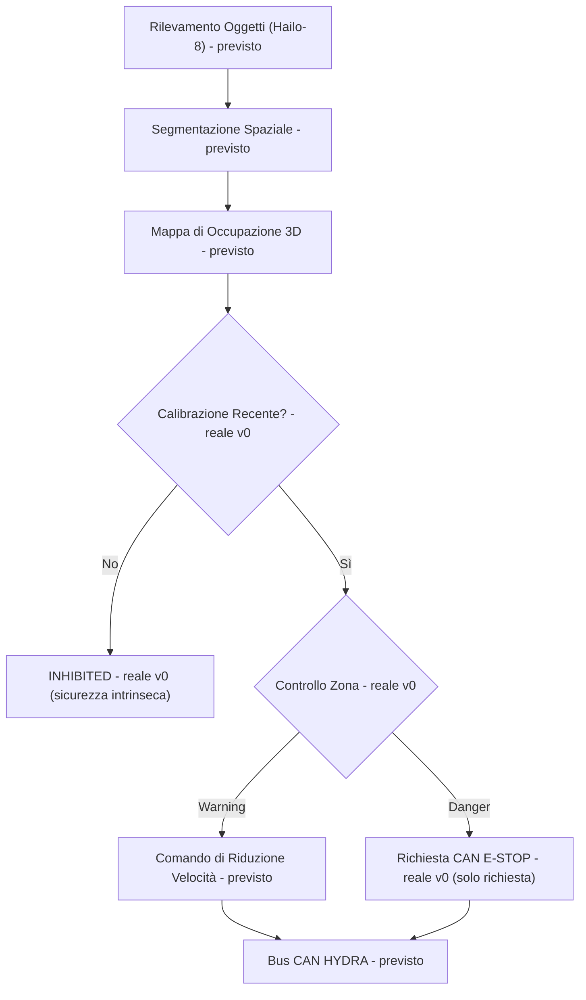

<p align="center">
  
</p>

# 🛡️ HYDRA-UMC-SAFETY-ZONES

<p align="center"><a href="README.md">🇺🇸 English</a> | <a href="README_spa.md">🇪🇸 Español</a> | <a href="README_fra.md">🇫🇷 Français</a> | 🇮🇹 <b>Italiano</b> | <a href="README_deu.md">🇩🇪 Deutsch</a> | <a href="README_zho.md">🇨🇳 简体中文</a> | <a href="README_jpn.md">🇯🇵 日本語</a></p>

### 🚨 Rilevamento Intrusioni 3D in Tempo Reale e Orchestratore E-STOP

<p align="left">
  
  
  
  
</p>

---

## 1. 🛠️ PANORAMICA TECNICA

**HYDRA-UMC-SAFETY-ZONES** è pensato per essere il sottosistema di sicurezza critico della famiglia Vision AI Node. Il suo compito è proiettare volumi 3D virtuali attorno ai robot e monitorare l'area di lavoro per intrusioni umane o oggetti estranei, usando la segmentazione spaziale ad alta velocità della NPU Hailo-8 per rilevare violazioni in zone "Warning" e "Danger" definite.

Questo è uno dei 4 figli di **[HYDRA-UMC-VISION-NODE](https://github.com/JuanenRac/HYDRA-UMC-VISION-NODE)**, il genitore di integrazione della famiglia, e il suo input di percezione è costruito su modelli compilati dal fratello **[HYDRA-UMC-DETECTION-HEF](https://github.com/JuanenRac/HYDRA-UMC-DETECTION-HEF)**.

### Punti Chiave

* 🚦 **Zone Multilivello (v0):** vere definizioni `Zone`/`ZoneLevel` (Warning/Danger) su volumi 3D allineati agli assi, e vero controllo delle violazioni (`check_breaches`) tra un set di zone e un set di posizioni di oggetti rilevati.
* 🛑 **Richiesta E-STOP (v0, non attivazione):** ogni oggetto la cui violazione peggiore è Danger produce un vero `EStopRequest`, consegnato a un `EStopRequester` - vedi il confine di design sotto per il perché nulla qui attiva mai da solo l'arresto fisico.
* 🔒 **Applicazione della freschezza di calibrazione (v0):** ogni set di zone porta una `calibration` opzionale (versione, fonte, data di calibrazione, età massima in giorni). `evaluate_safety()` la controlla **prima** di eseguire qualsiasi logica di violazione - un set di zone senza alcuna calibrazione, più vecchio del proprio `max_age_days` dichiarato, o datato nel futuro, si risolve sempre in `INHIBITED`, senza mai ricadere silenziosamente su `READY` solo perché nessun oggetto rilevato è vicino a una zona.
* 🧮 **Salvaguardia delle coordinate finite (v0):** `config.py` rifiuta qualsiasi `x`/`y`/`z` `NaN`/`Infinity`/`-Infinity` in un file di zone o rilevamenti *prima* che `evaluate_safety()` venga eseguito, risolvendo direttamente in `INHIBITED` (uscita `3`) invece di valutare un confine con una coordinata che non può rappresentare un punto reale.
* 🌐 **API JSON/HTTP (v0.0.5):** il sottocomando `serve` espone la stessa identica logica di `check` (`evaluate_safety()`/`check_breaches()`/`request_estop_for()`) su un `http.server` della stdlib (`POST /check`, `GET /stats`) per chi non usa la CLI - solo loopback di default, come l'unità `systemd/hydra-umc-safety-zones.service`. Vedi [`docs/CLI_REFERENCE.md`](docs/CLI_REFERENCE.md) per ogni comando, flag e codice di uscita reale.
* 📐 **Occlusione Dinamica (previsto):** mascherare automaticamente la struttura del robot stesso dai trigger di sicurezza, così che il robot non "rilevi se stesso" come intrusione.
* 🔍 **Rilevamento Oggetti Estranei (previsto):** identificare utensili o detriti lasciati nell'area di lavoro.
* 🎥 **Vera mappatura di occupazione 3D da Hailo-8 (previsto):** il sottocomando `check` di v0 prende le posizioni degli oggetti rilevati da un file JSON proprio perché la vera pipeline di segmentazione spaziale Hailo-8 che le produrrebbe non esiste ancora in questo ambiente - vedi "Verifica di onestà" sotto.
* 🧩 **Perché esiste come progetto separato:** la logica di sicurezza ha una soglia di verifica diversa dal resto della percezione - isolarla nel proprio servizio permette di testarla, verificarla ed eventualmente certificarla (vedi il badge ISO 13849-1 sopra, aspirazionale in questa fase) indipendentemente da modifiche alla pipeline camera o alla compilazione modelli altrove nella famiglia.

**Un confine di design critico, già deciso e ora applicato nel codice:** questo progetto solo **rileva e richiede** un E-STOP - non attiva mai il segnale fisico di arresto da solo. L'unico requester reale di `estop.py`, `NullEStopRequester`, registra ciò che avrebbe inviato senza trasmettere nulla a nessuno - non esiste ancora un vero trasporto CAN in questo repository, di proposito. Tagliare realmente l'alimentazione del motore via CAN è responsabilità di [HYDRA-UMC](https://github.com/JuanenRac/HYDRA-UMC) (il firmware), su hardware costruito per quel ruolo. Mantenere il confine lì significa che un bug in questo servizio Python può fallire nel *richiedere* un arresto, ma non può mai *impedire* che il firmware lo applichi indipendentemente.

**Verifica di onestà - cosa funziona davvero oggi:** l'entry point reale (`src/hydra_umc_safety_zones/main.py`) continua a stampare identità/versione/ruolo con una chiamata senza argomenti, ma ora ha anche un vero sottocomando `check --zones PERCORSO --detections PERCORSO`: carica un set di zone (zone + metadati di calibrazione opzionali) e posizioni di oggetti rilevati da JSON, controlla prima la freschezza della calibrazione, poi esegue un vero controllo delle violazioni, richiede E-STOP per ogni violazione Danger, ed esce con 0 (Ready) / 1 (Warning) / 2 (Danger, E-STOP richiesto) / 3 (Inhibited - calibrazione assente o scaduta) a seconda del risultato. Ciò che davvero non è ancora reale: la segmentazione spaziale Hailo-8 che produrrebbe quelle posizioni di oggetti rilevati su hardware reale, il mascheramento di auto-occlusione, e qualsiasi vero trasporto CAN per la richiesta E-STOP. Vedi [`CHANGELOG.md`](CHANGELOG.md) per ciò che è stato consegnato esattamente finora, e "Stato Attuale e Prossimi Passi" più sotto per ciò che resta aperto.

---

## 2. 🔄 FLUSSO DI LOGICA DI SICUREZZA PREVISTO

Il diagramma sotto è il flusso dati obiettivo verso cui viene costruito questo progetto. `CAL` (controllo calibrazione), `ZONE` (Controllo Zona) e la ripartizione Warning/Danger successiva sono reali oggi, guidati da `evaluate_safety()` (che avvolge `check_breaches()`/`request_estop_for()`), date posizioni di oggetti rilevati da un file JSON. Tutto ciò che precede `CAL`/`ZONE` (la vera pipeline Hailo-8) e segue `STOP` (il vero trasporto CAN) resta lavoro futuro.



---

## 3. 🧠 INFORMAZIONI TECNICHE AVANZATE

### Il confine rileva-vs-applica, e perché conta particolarmente qui

Di tutto ciò che c'è in questo README, questa è l'unica decisione di design che non è solo un dettaglio implementativo: questo servizio è pensato per *decidere* che serve un arresto e *richiederlo* via CAN, ma il taglio fisico reale dell'alimentazione del motore avviene su hardware dentro [HYDRA-UMC](https://github.com/JuanenRac/HYDRA-UMC) costruito e certificato per quel ruolo. È una scelta deliberata di difesa in profondità - un bug software qui (un crash, un blocco, un fotogramma errato) degrada a "non vengono inviate nuove richieste di arresto", non a "l'hardware di sicurezza esistente del robot smette di funzionare".

### Perché non ci sono `hardware/`, `firmware/`, `os/` né `models/` qui

CM5 + Hailo-8 è hardware già esistente senza una scheda propria da progettare, quindi - come il resto della famiglia Vision AI Node - non esiste cartella `hardware/`/`firmware/` qui. `os/` (l'immagine HydraOS condivisa) e `models/` (i `.hef` compilati realmente serviti alla NPU) vivono solo nel genitore di integrazione, [HYDRA-UMC-VISION-NODE](https://github.com/JuanenRac/HYDRA-UMC-VISION-NODE), perché è lui a possedere l'immagine dell'host CM5 e l'handle del dispositivo Hailo-8.

### Decisioni di design già prese

* **La versione viene letta dai metadati del pacchetto installato, non è hardcoded** - `main.py` chiama `importlib.metadata.version("hydra-umc-safety-zones")` invece di una seconda stringa `__version__`, così `bump_version.py` ha un solo posto da modificare.
* **L'incremento "contachilometri" tocca automaticamente solo `PATCH`/`MINOR`** - `bump_version.py` riporta `PATCH` a `MINOR` oltre il 9 e da `MINOR` a `MAJOR` oltre il 9, ma non incrementa mai `MAJOR` da solo; stessa convenzione di `HYDRA-UMC-EDITOR-URDF/bump_version.py` e `HYDRA-UMC-SUITE/bump_version.py`.
* **Zone AABB, non mesh né inviluppi convessi** - il volume più semplice che permette comunque a `check_breaches()` di essere esatto e veloce; un vero perimetro nella pratica assomiglia molto spesso a una scatola, e una forma più ricca può essere aggiunta in seguito dietro la stessa interfaccia `Zone`/`AABB.contains()` senza toccare `breach.py` né `estop.py`.
* **Il contenimento del confine di zona è inclusivo, non esclusivo** - `AABB.contains()` tratta un punto esattamente sul bordo come interno. Per un perimetro di sicurezza, questa è la direzione conservativa in cui sbagliare: può solo causare un report di violazione più anticipato, mai uno mancato.
* **`NullEStopRequester` è l'unico requester in questo repository** - non un placeholder in attesa di essere sostituito con leggerezza, ma l'incarnazione onesta del confine rileva-vs-applica stesso: non c'è un vero trasporto CAN qui, e non dovrebbe essercene uno aggiunto con noncuranza più avanti (vedi "Un confine di design critico" sopra e il docstring proprio del modulo `estop.py`).
* **Zone e rilevamenti sono JSON semplice, non YAML** - la lista di dipendenze di `pyproject.toml` resta `[]`; `json` è della libreria standard, `pyyaml` è vero lavoro futuro una volta che esisterà un vero strumento di creazione zone che valga la pena serializzare.
* **La calibrazione viene controllata prima di qualsiasi logica di violazione, mai dopo** - `evaluate_safety()` restituisce `INHIBITED` nel momento in cui la calibrazione è assente o scaduta, prima ancora di chiamare `check_breaches()`. Questo è deliberato: una calibrazione scaduta significa che la geometria di zona stessa non è affidabile, quindi il risultato dell'esecuzione dei controlli di violazione contro di essa sarebbe comunque privo di senso - controllare prima la calibrazione significa anche che una calibrazione scaduta vince sempre su ciò che altrimenti sembrerebbe una vera violazione Danger, non il contrario.
* **Una chiave `"calibration"` assente si carica con successo, significa solo `INHIBITED`** - `load_zone_set()` non solleva mai un errore solo perché un file di zone precede questa funzionalità o è stato scritto a mano senza metadati di calibrazione; fallisce in modo sicuro per design al momento della valutazione, non al caricamento.

---

## 📂 STRUTTURA DELLE DIRECTORY

```text
HYDRA-UMC-SAFETY-ZONES/
├── src/hydra_umc_safety_zones/
│   ├── geometry.py       # Vere primitive Point3D/AABB
│   ├── zones.py          # Vere definizioni ZoneLevel/Zone/ZoneSet
│   ├── breach.py         # Vero controllo delle violazioni di zona
│   ├── calibration.py    # Vero tracciamento della freschezza di calibrazione
│   ├── safety_state.py   # Vera decisione di sicurezza intrinseca: READY/WARNING/DANGER/INHIBITED
│   ├── estop.py          # Vera richiesta E-STOP (mai attivazione)
│   ├── config.py         # Vero caricamento JSON per zone/rilevamenti
│   ├── api.py             # Superficie JSON/HTTP semplice (http.server di stdlib) sulla vera logica `check`
│   └── main.py            # Entry point + vero sottocomando `check`
├── tests/                # Test veri: geometria, violazioni, calibrazione, safety_state, estop, config, api, CLI
├── docs/                # Documentazione e standard di sicurezza
├── build/               # Output di build (qui vive anche il .venv locale)
├── images/              # Media e diagrammi
├── systemd/
│   └── hydra-umc-safety-zones.service # Unità systemd della API locale di controllo violazioni sulla CM5
├── pyproject.toml       # Metadati pacchetto, dipendenze, versione contachilometri
├── bump_version.py      # Incremento versione nativa tipo contachilometri (build.sh/.bat)
├── bump_manifest_version.py # Sincronizza la versione di hydra-umc.project.json con quella nativa (--sync)
├── build.sh / build.bat # venv + installazione editabile (extra dev) + compile-check + test
├── build-test.sh / .bat # Verifica di build senza versionamento (non tocca mai version o CHANGELOG)
├── tools/
│   ├── build_test.py    # Motore condiviso a cui delegano entrambi i lanciatori build-test
│   └── ci_validate.py   # Validazione manifest/CHANGELOG/docs usata dalla CI
├── run.sh / run.bat     # Esegue l'entry point dal venv locale (inoltra gli argomenti)
└── CHANGELOG.md         # Storico versione per versione (schema contachilometri, senza date)
```

Nessuna cartella `hardware/`, `firmware/`, `os/` o `models/` - vedi "Informazioni Tecniche Avanzate" sopra per il perché. `os/` e `models/` vivono solo nel genitore di integrazione, [HYDRA-UMC-VISION-NODE](https://github.com/JuanenRac/HYDRA-UMC-VISION-NODE).

---

## 🏗️ BUILD ED ESECUZIONE

### Prerequisiti

* **Python 3.10 o superiore** nel `PATH` (gli script provano `python3` poi ripiegano su `python`).
* Non serve ancora alcuna dipendenza runtime di sicurezza/visione - **zero dipendenze di terze parti a runtime** in questa fase (`dependencies = []` in `pyproject.toml`); `pytest` è un extra solo di sviluppo usato esclusivamente per la vera suite di test.
* Poche decine di MB di spazio su disco per un ambiente virtuale locale sotto `.venv/`.

### Passo dopo passo

```bash
# Linux / macOS
./build.sh
```

1. **Incremento versione contachilometri** - esegue `bump_version.py`, incrementando `PATCH` in `pyproject.toml` a ogni build, poi sincronizza `hydra-umc.project.json` di conseguenza.
2. **Ambiente virtuale** - crea `.venv/` se manca; lo riutilizza altrimenti.
3. **Installazione editabile (con extra dev)** - `pip install -e ".[dev]"` così le modifiche sotto `src/` hanno effetto immediato, installa `pytest`, e registra l'entry point da console `hydra-umc-safety-zones`.
4. **Compile-check** - `python -m compileall -q src` compila in bytecode ogni file sotto `src/`.
5. **Vera suite di test** - `pytest tests/` esegue tutti i 57 test.

`set -euo pipefail` ferma lo script al primo passo che fallisce; la finestra resta aperta (`Press Enter to close...`) se è stata avviata con doppio clic invece che da un terminale già aperto.

```bash
./run.sh
```

Individua l'interprete dentro `.venv` ed esegue `python -m hydra_umc_safety_zones.main`, inoltrando ogni argomento.

L'invocazione senza argomenti stampa nome + versione + ruolo:

```text
HYDRA-UMC-SAFETY-ZONES v0.0.5
Real-time 3D intrusion detection and E-STOP orchestration for robotic safe-working areas.
```

Il vero sottocomando `check` necessita di un file di zone e uno di rilevamenti, entrambi JSON semplice. `calibration` è opzionale nel file di zone - vedi sotto cosa succede senza:

```json
// zones.json
{
  "calibration": {"version": "cal-1", "source": "manual", "calibrated_at": "2026-08-27", "max_age_days": 30},
  "zones": [
    {"id": "warn1", "level": "warning", "min": {"x": 0, "y": 0, "z": 0}, "max": {"x": 5, "y": 5, "z": 5}},
    {"id": "danger1", "level": "danger", "min": {"x": 0, "y": 0, "z": 0}, "max": {"x": 1, "y": 1, "z": 1}}
  ]
}
```

```json
// detections.json
{"objects": [{"id": "op1", "position": {"x": 0.5, "y": 0.5, "z": 0.5}}]}
```

```bash
./run.sh check --zones zones.json --detections detections.json
```

```text
SAFETY STATE: DANGER - object(s) ['op1'] breached a danger zone
BREACH: object 'op1' inside warning zone 'warn1'
BREACH: object 'op1' inside danger zone 'danger1'
E-STOP REQUESTED: object 'op1' breached danger zone 'danger1' (not asserted - see estop.py)
```

Esce con `2` (Danger, E-STOP richiesto), `1` (violazione solo Warning), `0` (nessuna violazione, calibrazione valida), o `3` (**Inhibited** - calibrazione assente o scaduta, controllata prima di qualsiasi logica di violazione). Esempio reale del percorso di sicurezza intrinseca - le stesse `detections.json` sopra, ma `zones.json` senza alcuna chiave `"calibration"`:

```bash
./run.sh check --zones zones_no_calibration.json --detections detections.json
```

```text
SAFETY STATE: INHIBITED - no calibration metadata present - zone geometry cannot be trusted
```

Esce con `3` - nota che non c'è alcun output `BREACH`/`E-STOP`, anche se `op1` si trova dentro entrambe le zone: un set di zone non affidabile non raggiunge mai il passaggio di controllo delle violazioni.

```bat
:: Windows - stessi passi, sintassi batch
build.bat
run.bat
run.bat check --zones zones.json --detections detections.json
```

La stessa logica di `check` è raggiungibile anche via HTTP, per chi non usa la CLI - `zones`/`detections` viaggiano nel corpo JSON invece che come percorso di file:

```bash
./run.sh serve --addr 127.0.0.1 --port 8108
# in un altro terminale:
curl -s -X POST http://127.0.0.1:8108/check -d '{"zones": {...}, "detections": {...}}'
```

Vedi [`docs/CLI_REFERENCE.md`](docs/CLI_REFERENCE.md) per il riferimento completo di comandi, flag e codici di uscita, incluso ogni stato reale (`READY`/`WARNING`/`DANGER`/`INHIBITED`) catturato da un'esecuzione reale.

### Risoluzione dei problemi

* **`python`/`python3` non trovato** - installa Python 3.10+ e assicurati che sia nel `PATH`.
* **`compileall` fallisce** - è stato introdotto un vero errore di sintassi sotto `src/`; il build si ferma senza toccare l'installazione, di proposito.
* **"No `.venv` found" da `run.sh`/`run.bat`** - esegui `build.sh`/`build.bat` almeno una volta prima.
* **Installazione editabile obsoleta** - elimina `.venv/` e ricostruisci; raramente necessario.
* **`check` esce con codice diverso da zero** - è comportamento reale e corretto, non un fallimento: `1` significa che è stata trovata una violazione solo Warning, `2` significa che una violazione Danger ha richiesto un E-STOP, `3` significa che la calibrazione del set di zone è assente o scaduta (sicurezza intrinseca, controllata prima che venga eseguita qualsiasi logica di violazione). Solo un traceback Python o un errore di JSON malformato è un vero bug.

---

## 🚀 Stato Attuale e Prossimi Passi

**Cosa funziona oggi:** vere definizioni di zone Warning/Danger e vero controllo delle violazioni (`geometry.py`/`zones.py`/`breach.py`), una vera applicazione della freschezza di calibrazione che fallisce in modo sicuro verso `INHIBITED` prima di qualsiasi logica di violazione (`calibration.py`/`safety_state.py`), una vera pipeline di *richiesta* E-STOP che rispetta il confine rileva-vs-applica per costruzione (`estop.py`), un vero sottocomando CLI `check` su file JSON di zone/rilevamenti, e 57 test superati - vedi [`CHANGELOG.md`](CHANGELOG.md) per l'output completo reale di build/run.

**Cosa resta aperto, senza ordine particolare e senza calendario impegnato:**

* La vera mappatura di occupazione 3D dalla segmentazione spaziale di Hailo-8, per produrre davvero le posizioni di oggetti rilevati che `check` oggi si aspetta come input JSON.
* Il mascheramento dinamico di auto-occlusione della struttura del robot.
* Un vero trasporto CAN che implementi `EStopRequester` verso [HYDRA-UMC](https://github.com/JuanenRac/HYDRA-UMC) - `estop.py` già definisce l'interfaccia che un'implementazione reale dovrebbe soddisfare.
* Qualsiasi vero lavoro di certificazione di sicurezza (il badge ISO 13849-1 sopra esprime un'aspirazione, non una certificazione completata).

---

## 🔗 Progetti Correlati

Questo progetto fa parte dell'ecosistema robotico HYDRA-UMC dello stesso autore (JuanenRac / Electro Hobby 3D). Vale la pena conoscerlo, poiché una richiesta potrebbe in realtà riguardare uno di questi invece di questo repository.

**Progetto Padre**
- **[HYDRA-UMC-VISION-NODE](https://github.com/JuanenRac/HYDRA-UMC-VISION-NODE)** — hub di integrazione per la pipeline di visione Hailo-8, con un vero controllo di prontezza hardware per fase; il genitore di cui questo repository è una fase o un consumatore specifico, all'interno della propria pipeline di percezione.

**Progetti Fratelli** — le altre fasi/consumatori della pipeline di percezione Hailo-8 propria di HYDRA-UMC-VISION-NODE
- **[HYDRA-UMC-VISION-STREAMER](https://github.com/JuanenRac/HYDRA-UMC-VISION-STREAMER)** — generatore reale di pipeline GStreamer + config MediaMTX, con una vera barriera di integrazione HailoRT.
- **[HYDRA-UMC-DETECTION-HEF](https://github.com/JuanenRac/HYDRA-UMC-DETECTION-HEF)** — registro reale di modelli compilati con verifica di caricamento sicuro per architettura Hailo/checksum.
- **[HYDRA-UMC-VISUAL-SERVOING-API](https://github.com/JuanenRac/HYDRA-UMC-VISUAL-SERVOING-API)** — vera legge di correzione Position-Based Visual Servoing, con cancello di sicurezza sullo stato di zona a monte.

**Direttamente Correlati**
- **[HYDRA-UMC](https://github.com/JuanenRac/HYDRA-UMC)** — la scheda madre fisica del braccio robotico: host CM5 + coprocessore STM32H745 dual-core, che coordina fino a 8 bracci utensile via CAN-OTA/SPI-OTA; questo progetto richiede l'E-STOP di questo firmware, ed è il firmware a farlo effettivamente rispettare.

**Fa Anche Parte dell'Ecosistema**

*Hardware e Piattaforma di Base*
- **[HYDRA-UMC-OS](https://github.com/JuanenRac/HYDRA-UMC-OS)** — livello prodotto riproducibile su Raspberry Pi OS per il CM5: agente in sola lettura, config/profili validati, provisioning WiFi al primo contatto.
- **[HYDRA-UMC-SDK](https://github.com/JuanenRac/HYDRA-UMC-SDK)** — il contratto JSON-Schema condiviso e la barriera di sicurezza contro cui ogni bridge valida i propri comandi.

*Backend Centrale e Client*
- **[HYDRA-UMC-SERVER](https://github.com/JuanenRac/HYDRA-UMC-SERVER)** — il vero backend headless (REST/WebSocket) con cui parla davvero ogni client di controllo.
- **[HYDRA-UMC-STUDIO](https://github.com/JuanenRac/HYDRA-UMC-STUDIO)** — dashboard di controllo web con visualizzazione 3D multi-robot in tempo reale.
- **[HYDRA-UMC-SUITE](https://github.com/JuanenRac/HYDRA-UMC-SUITE)** — centro di comando sciame desktop (PySide6) per più server contemporaneamente, pacchettizzato come eseguibile standalone.
- **[HYDRA-UMC-ANDROID-CONTROL](https://github.com/JuanenRac/HYDRA-UMC-ANDROID-CONTROL)** — app di controllo nativa per Android con login biometrico e un companion Wear OS abbinato.
- **[HYDRA-UMC-IOS-CONTROL](https://github.com/JuanenRac/HYDRA-UMC-IOS-CONTROL)** — app di controllo per iOS/iPadOS (Flutter) con sincronizzazione WebSocket in tempo reale.
- **[HYDRA-UMC-DSI](https://github.com/JuanenRac/HYDRA-UMC-DSI)** — interfaccia touch nativa per il touchscreen DSI da 7" a bordo, incorporata direttamente nel CM5.
- **[HYDRA-UMC-EDITOR-URDF](https://github.com/JuanenRac/HYDRA-UMC-EDITOR-URDF)** — creatore/editor grafico desktop di URDF che invia i modelli finiti al catalogo di STUDIO.
- **[HYDRA-UMC-BRIDGE-AMR](https://github.com/JuanenRac/HYDRA-UMC-BRIDGE-AMR)** — barriera di coordinamento per flotte AGV/AMR tramite un publisher MQTT VDA 5050 reale.
- **[HYDRA-UMC-BRIDGE-CNC](https://github.com/JuanenRac/HYDRA-UMC-BRIDGE-CNC)** — coordinatore ad alto livello per celle CNC con accesso reale a stato/byte di controllo GRBL.
- **[HYDRA-UMC-BRIDGE-DROIDS](https://github.com/JuanenRac/HYDRA-UMC-BRIDGE-DROIDS)** — barriera di coordinamento per droidi con zampe/umanoidi, con un vero mittente di comandi per Boston Dynamics Spot.
- **[HYDRA-UMC-BRIDGE-LASER](https://github.com/JuanenRac/HYDRA-UMC-BRIDGE-LASER)** — coordinatore di sicurezza per celle laser che legge 3 salvaguardie GPIO reali di chiave/involucro/interblocco.
- **[HYDRA-UMC-BRIDGE-OPENPNP](https://github.com/JuanenRac/HYDRA-UMC-BRIDGE-OPENPNP)** — coordinatore ad alto livello sicuro per il flusso schede del pick-and-place OpenPnP.
- **[HYDRA-UMC-BRIDGE-PRINTER3D](https://github.com/JuanenRac/HYDRA-UMC-BRIDGE-PRINTER3D)** — barriera di coordinamento sicura per stampanti 3D Moonraker/Klipper, con comandi di lavoro reali e controllati.
- **[HYDRA-UMC-BRIDGE-ROS2](https://github.com/JuanenRac/HYDRA-UMC-BRIDGE-ROS2)** — coordinatore di sicurezza con un vero trasporto ROS 2 rclpy, importato in modo lazy.
- **[HYDRA-UMC-BRIDGE-UAV](https://github.com/JuanenRac/HYDRA-UMC-BRIDGE-UAV)** — barriera di coordinamento per UAV dotati di fotocamera, con un vero mittente di comandi MAVLink.

*Piattaforma Strumenti URTC*
- **[URTC](https://github.com/JuanenRac/URTC)** — firmware per la scheda fisica dell'Universal Robot Tool Controller, oltre 25 profili utensile su bus CAN.
- **[URTC-FLASHER](https://github.com/JuanenRac/URTC-FLASHER)** — strumento desktop con GUI per il flashing delle schede URTC, CAN-OTA più SWD/JTAG a chip intero.
- **[URTC-TESTER](https://github.com/JuanenRac/URTC-TESTER)** — strumento desktop di diagnostica CAN-bus dal vivo per schede URTC, un pannello per profilo utensile.
- **[URTC-WEB-STUDIO](https://github.com/JuanenRac/URTC-WEB-STUDIO)** — alternativa basata su browser a URTC-TESTER tramite la Web Serial API, senza installazione locale.

*Nodo IA Cognitivo (Hailo-10)*
- **[HYDRA-UMC-COGNITIVE-NODE](https://github.com/JuanenRac/HYDRA-UMC-COGNITIVE-NODE)** — hub di integrazione per la pipeline cognitiva Hailo-10 (orchestrazione LLM/VLA/voce).
- **[HYDRA-UMC-VLA-ENGINE](https://github.com/JuanenRac/HYDRA-UMC-VLA-ENGINE)** — vera codifica/decodifica di token d'azione e generazione di traiettoria per un modello Vision-Language-Action.
- **[HYDRA-UMC-VOICE-UI](https://github.com/JuanenRac/HYDRA-UMC-VOICE-UI)** — vero front-end vocale (VAD + parser di intenti) con un relay verso Watch limitato e soggetto a conferma.
- **[HYDRA-UMC-SEMANTIC-PLANNER](https://github.com/JuanenRac/HYDRA-UMC-SEMANTIC-PLANNER)** — vera scomposizione dei task basata su regole e recupero semantico degli errori sui codici errore MCU.
- **[HYDRA-UMC-DOCS-QA](https://github.com/JuanenRac/HYDRA-UMC-DOCS-QA)** — vera ricerca documentale TF-IDF (solo libreria standard) sui documenti Markdown di questo ecosistema.

*Orchestrazione e Sciame*
- **[HYDRA-UMC-ORCHESTRATOR](https://github.com/JuanenRac/HYDRA-UMC-ORCHESTRATOR)** — hub di integrazione con un vero contratto di health-report gRPC/Protobuf e una macchina a stati di missione.
- **[HYDRA-UMC-JOB-DISPATCHER](https://github.com/JuanenRac/HYDRA-UMC-JOB-DISPATCHER)** — vera coda di lavori basata su priorità con deduplicazione, su una vera API HTTP.
- **[HYDRA-UMC-NODE-HEALING](https://github.com/JuanenRac/HYDRA-UMC-NODE-HEALING)** — vero watchdog di salute della flotta basato su gRPC, con retry/backoff e rilevamento di discrepanza d'identità.
- **[HYDRA-UMC-PATH-PLANNER-3D](https://github.com/JuanenRac/HYDRA-UMC-PATH-PLANNER-3D)** — vero pianificatore di percorsi 3D basato su RRT, con vera validazione delle collisioni ostacolo/spazio di lavoro.
- **[HYDRA-UMC-SWARM-SYNC](https://github.com/JuanenRac/HYDRA-UMC-SWARM-SYNC)** — vera sincronizzazione di stato CRDT LWW-Element-Map, con property test per la convergenza multi-cella.

*Gemello Digitale e Simulazione*
- **[HYDRA-UMC-TWIN](https://github.com/JuanenRac/HYDRA-UMC-TWIN)** — hub di integrazione per il motore di gemello digitale, con un vero contratto di sincronizzazione per compatibilità di versione.
- **[HYDRA-UMC-HIL-BRIDGE](https://github.com/JuanenRac/HYDRA-UMC-HIL-BRIDGE)** — vero interblocco di sicurezza hardware-in-the-loop che instrada i comandi tra simulazione e hardware reale.
- **[HYDRA-UMC-PHYSICS-REPLICA](https://github.com/JuanenRac/HYDRA-UMC-PHYSICS-REPLICA)** — vera cinematica diretta e validazione dei limiti articolari su un vero sottoinsieme URDF.
- **[HYDRA-UMC-SYNTHETIC-DATA-GEN](https://github.com/JuanenRac/HYDRA-UMC-SYNTHETIC-DATA-GEN)** — vero generatore procedurale di scene 2D con esportazione di annotazioni YOLO/COCO.

*Dati e Analisi*
- **[HYDRA-UMC-DATALAKE](https://github.com/JuanenRac/HYDRA-UMC-DATALAKE)** — vero archivio di serie temporali basato su sqlite3, con una vera API HTTP di ingestione/query.
- **[HYDRA-UMC-ANOMALY-DETECTOR](https://github.com/JuanenRac/HYDRA-UMC-ANOMALY-DETECTOR)** — vero rilevatore di anomalie FFT + baseline statistica, con monitoraggio della deriva.
- **[HYDRA-UMC-PRODUCTION-REPORTS](https://github.com/JuanenRac/HYDRA-UMC-PRODUCTION-REPORTS)** — vero calcolo OEE/disponibilità sullo storico di DATALAKE, con esportazione CSV riproducibile.
- **[HYDRA-UMC-TELEMETRY-COLLECTOR](https://github.com/JuanenRac/HYDRA-UMC-TELEMETRY-COLLECTOR)** — vera pipeline di ingestione CAN/WebSocket verso DATALAKE, con deduplicazione per sequenza.

*Gateway Industriale*
- **[HYDRA-UMC-GATEWAY-INDUSTRIAL](https://github.com/JuanenRac/HYDRA-UMC-GATEWAY-INDUSTRIAL)** — hub di integrazione che inoltra ai protocolli industriali, con un vero livello di allowlist dei comandi/backpressure.
- **[HYDRA-UMC-OPCUA-SERVER](https://github.com/JuanenRac/HYDRA-UMC-OPCUA-SERVER)** — vero spazio di indirizzi OPC-UA, verificato con una vera sessione client del protocollo binario.
- **[HYDRA-UMC-MQTT-BROKER](https://github.com/JuanenRac/HYDRA-UMC-MQTT-BROKER)** — vero broker MQTT con autenticazione opzionale per client e ACL sui topic.
- **[HYDRA-UMC-MTCONNECT-ADAPTER](https://github.com/JuanenRac/HYDRA-UMC-MTCONNECT-ADAPTER)** — veri endpoint XML `/probe` e `/current` di MTConnect, con output in modalità degradata.

*Strumenti Complementari e Operazioni dell'Ecosistema*
- **[HYDRA-UMC-DASHBOARD-AI](https://github.com/JuanenRac/HYDRA-UMC-DASHBOARD-AI)** — pannelli Smart Summaries e Anomaly Highlighting su DATALAKE/ANOMALY-DETECTOR, con un fallback statistico onesto.
- **[HYDRA-UMC-TOOL-CLI](https://github.com/JuanenRac/HYDRA-UMC-TOOL-CLI)** — CLI di flotta con un vero e stabile contratto di exit-code, un client live reale della stessa API di HYDRA-UMC-SERVER.
- **[HYDRA-UMC-WATCH](https://github.com/JuanenRac/HYDRA-UMC-WATCH)** — app companion WearOS con avvisi aptici reali e un relay vocale verso il telefono abbinato.
- **[URTC-SMART-RACK](https://github.com/JuanenRac/URTC-SMART-RACK)** — firmware per un rack di montaggio schede con decodifica reale dell'ID utensile e logica di preriscaldamento Smart Idle.
- **[URTC-VISION-TOOL](https://github.com/JuanenRac/URTC-VISION-TOOL)** — firmware più un vero companion di visione Python per una testa utensile di ispezione termica/RGB.
- **[HYDRA-UMC-UPDATER](https://github.com/JuanenRac/HYDRA-UMC-UPDATER)** — strumento amministrativo desktop che scopre, clona e aggiorna ogni repository di questo ecosistema.
- **[HYDRA-UMC-OS-REBUILDER](https://github.com/JuanenRac/HYDRA-UMC-OS-REBUILDER)** — strumento desktop Windows/Linux che costruisce un'immagine della CM5 pronta da scrivere, precaricata con le versioni più aggiornate dell'ecosistema, con configurazione di primo avvio Wi-Fi/utente/SSH in stile Raspberry Pi Imager.

---

## 📚 Documentazione e Comunità

- **[CONTRIBUTING.md](CONTRIBUTING.md)** — stack tecnologico e linee guida di codifica per una pull request.
- **[CODE_OF_CONDUCT.md](CODE_OF_CONDUCT.md)** — gli standard di comportamento attesi in questa comunità.
- **[SECURITY.md](SECURITY.md)** — come segnalare una vulnerabilità, e le reali aree di attenzione sulla sicurezza di questo progetto.
- **[SUPPORT.md](SUPPORT.md)** — dove porre domande e segnalare bug.
- **[LICENSE.md](LICENSE.md)** — la licenza propria di questo progetto.

## 👤 AUTORE
**JuanenRac** (Electro Hobby 3D)
📧 electrohobby3d@gmail.com
📺 [youtube.com/@electrohobby3d](https://youtube.com/@electrohobby3d)

## 📜 LICENZA
GPL-3.0 - Vedi il file LICENSE per i dettagli.
