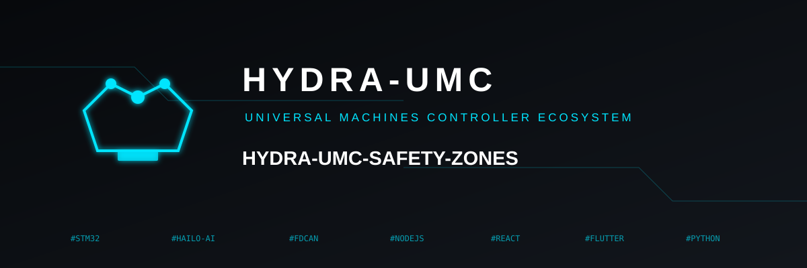
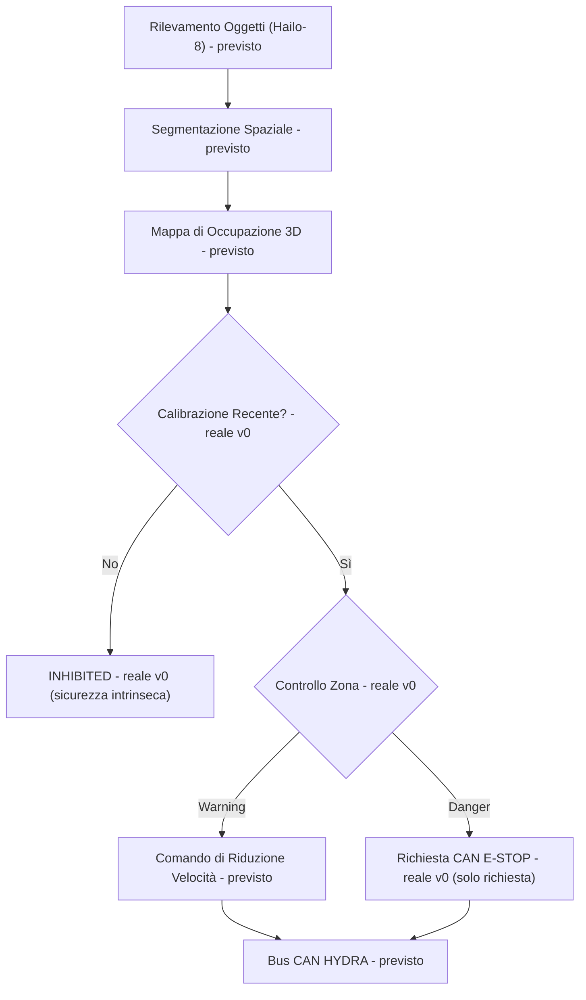

<p align="center">
  
</p>

# 🛡️ HYDRA-UMC-SAFETY-ZONES

<p align="center"><a href="README.md">🇺🇸 English</a> | <a href="README_spa.md">🇪🇸 Español</a> | <a href="README_fra.md">🇫🇷 Français</a> | 🇮🇹 <b>Italiano</b> | <a href="README_deu.md">🇩🇪 Deutsch</a> | <a href="README_zho.md">🇨🇳 简体中文</a> | <a href="README_jpn.md">🇯🇵 日本語</a></p>

### 🚨 Rilevamento Intrusioni 3D in Tempo Reale e Orchestratore E-STOP

<p align="left">
  
  
  
  
</p>

---

## 1. 🛠️ PANORAMICA TECNICA

**HYDRA-UMC-SAFETY-ZONES** è pensato per essere il sottosistema di sicurezza critico della famiglia Vision AI Node. Il suo compito è proiettare volumi 3D virtuali attorno ai robot e monitorare l'area di lavoro per intrusioni umane o oggetti estranei, usando la segmentazione spaziale ad alta velocità della NPU Hailo-8 per rilevare violazioni in zone "Warning" e "Danger" definite.

Questo è uno dei 4 figli di **[HYDRA-UMC-VISION-NODE](https://github.com/JuanenRac/HYDRA-UMC-VISION-NODE)**, il genitore di integrazione della famiglia, e il suo input di percezione è costruito su modelli compilati dal fratello **[HYDRA-UMC-DETECTION-HEF](https://github.com/JuanenRac/HYDRA-UMC-DETECTION-HEF)**.

### Punti Chiave

* 🚦 **Zone Multilivello (v0):** vere definizioni `Zone`/`ZoneLevel` (Warning/Danger) su volumi 3D allineati agli assi, e vero controllo delle violazioni (`check_breaches`) tra un set di zone e un set di posizioni di oggetti rilevati.
* 🛑 **Richiesta E-STOP (v0, non attivazione):** ogni oggetto la cui violazione peggiore è Danger produce un vero `EStopRequest`, consegnato a un `EStopRequester` - vedi il confine di design sotto per il perché nulla qui attiva mai da solo l'arresto fisico.
* 🔒 **Applicazione della freschezza di calibrazione (v0):** ogni set di zone porta una `calibration` opzionale (versione, fonte, data di calibrazione, età massima in giorni). `evaluate_safety()` la controlla **prima** di eseguire qualsiasi logica di violazione - un set di zone senza alcuna calibrazione, più vecchio del proprio `max_age_days` dichiarato, o datato nel futuro, si risolve sempre in `INHIBITED`, senza mai ricadere silenziosamente su `READY` solo perché nessun oggetto rilevato è vicino a una zona.
* 📐 **Occlusione Dinamica (previsto):** mascherare automaticamente la struttura del robot stesso dai trigger di sicurezza, così che il robot non "rilevi se stesso" come intrusione.
* 🔍 **Rilevamento Oggetti Estranei (previsto):** identificare utensili o detriti lasciati nell'area di lavoro.
* 🎥 **Vera mappatura di occupazione 3D da Hailo-8 (previsto):** il sottocomando `check` di v0 prende le posizioni degli oggetti rilevati da un file JSON proprio perché la vera pipeline di segmentazione spaziale Hailo-8 che le produrrebbe non esiste ancora in questo ambiente - vedi "Verifica di onestà" sotto.
* 🧩 **Perché esiste come progetto separato:** la logica di sicurezza ha una soglia di verifica diversa dal resto della percezione - isolarla nel proprio servizio permette di testarla, verificarla ed eventualmente certificarla (vedi il badge ISO 13849-1 sopra, aspirazionale in questa fase) indipendentemente da modifiche alla pipeline camera o alla compilazione modelli altrove nella famiglia.

**Un confine di design critico, già deciso e ora applicato nel codice:** questo progetto solo **rileva e richiede** un E-STOP - non attiva mai il segnale fisico di arresto da solo. L'unico requester reale di `estop.py`, `NullEStopRequester`, registra ciò che avrebbe inviato senza trasmettere nulla a nessuno - non esiste ancora un vero trasporto CAN in questo repository, di proposito. Tagliare realmente l'alimentazione del motore via CAN è responsabilità di [HYDRA-UMC](https://github.com/JuanenRac/HYDRA-UMC) (il firmware), su hardware costruito per quel ruolo. Mantenere il confine lì significa che un bug in questo servizio Python può fallire nel *richiedere* un arresto, ma non può mai *impedire* che il firmware lo applichi indipendentemente.

**Verifica di onestà - cosa funziona davvero oggi:** l'entry point reale (`src/hydra_umc_safety_zones/main.py`) continua a stampare identità/versione/ruolo con una chiamata senza argomenti, ma ora ha anche un vero sottocomando `check --zones PERCORSO --detections PERCORSO`: carica un set di zone (zone + metadati di calibrazione opzionali) e posizioni di oggetti rilevati da JSON, controlla prima la freschezza della calibrazione, poi esegue un vero controllo delle violazioni, richiede E-STOP per ogni violazione Danger, ed esce con 0 (Ready) / 1 (Warning) / 2 (Danger, E-STOP richiesto) / 3 (Inhibited - calibrazione assente o scaduta) a seconda del risultato. Ciò che davvero non è ancora reale: la segmentazione spaziale Hailo-8 che produrrebbe quelle posizioni di oggetti rilevati su hardware reale, il mascheramento di auto-occlusione, e qualsiasi vero trasporto CAN per la richiesta E-STOP. Vedi [`CHANGELOG.md`](CHANGELOG.md) per ciò che è stato consegnato esattamente finora, e "Stato Attuale e Prossimi Passi" più sotto per ciò che resta aperto.

---

## 2. 🔄 FLUSSO DI LOGICA DI SICUREZZA PREVISTO

Il diagramma sotto è il flusso dati obiettivo verso cui viene costruito questo progetto. `CAL` (controllo calibrazione), `ZONE` (Controllo Zona) e la ripartizione Warning/Danger successiva sono reali oggi, guidati da `evaluate_safety()` (che avvolge `check_breaches()`/`request_estop_for()`), date posizioni di oggetti rilevati da un file JSON. Tutto ciò che precede `CAL`/`ZONE` (la vera pipeline Hailo-8) e segue `STOP` (il vero trasporto CAN) resta lavoro futuro.



---

## 3. 🧠 INFORMAZIONI TECNICHE AVANZATE

### Il confine rileva-vs-applica, e perché conta particolarmente qui

Di tutto ciò che c'è in questo README, questa è l'unica decisione di design che non è solo un dettaglio implementativo: questo servizio è pensato per *decidere* che serve un arresto e *richiederlo* via CAN, ma il taglio fisico reale dell'alimentazione del motore avviene su hardware dentro [HYDRA-UMC](https://github.com/JuanenRac/HYDRA-UMC) costruito e certificato per quel ruolo. È una scelta deliberata di difesa in profondità - un bug software qui (un crash, un blocco, un fotogramma errato) degrada a "non vengono inviate nuove richieste di arresto", non a "l'hardware di sicurezza esistente del robot smette di funzionare".

### Perché non ci sono `hardware/`, `firmware/`, `os/` né `models/` qui

CM5 + Hailo-8 è hardware già esistente senza una scheda propria da progettare, quindi - come il resto della famiglia Vision AI Node - non esiste cartella `hardware/`/`firmware/` qui. `os/` (l'immagine HydraOS condivisa) e `models/` (i `.hef` compilati realmente serviti alla NPU) vivono solo nel genitore di integrazione, [HYDRA-UMC-VISION-NODE](https://github.com/JuanenRac/HYDRA-UMC-VISION-NODE), perché è lui a possedere l'immagine dell'host CM5 e l'handle del dispositivo Hailo-8.

### Decisioni di design già prese

* **La versione viene letta dai metadati del pacchetto installato, non è hardcoded** - `main.py` chiama `importlib.metadata.version("hydra-umc-safety-zones")` invece di una seconda stringa `__version__`, così `bump_version.py` ha un solo posto da modificare.
* **L'incremento "contachilometri" tocca automaticamente solo `PATCH`/`MINOR`** - `bump_version.py` riporta `PATCH` a `MINOR` oltre il 9 e da `MINOR` a `MAJOR` oltre il 9, ma non incrementa mai `MAJOR` da solo; stessa convenzione di `HYDRA-UMC-EDITOR-URDF/bump_version.py` e `HYDRA-UMC-SUITE/bump_version.py`.
* **Zone AABB, non mesh né inviluppi convessi** - il volume più semplice che permette comunque a `check_breaches()` di essere esatto e veloce; un vero perimetro nella pratica assomiglia molto spesso a una scatola, e una forma più ricca può essere aggiunta in seguito dietro la stessa interfaccia `Zone`/`AABB.contains()` senza toccare `breach.py` né `estop.py`.
* **Il contenimento del confine di zona è inclusivo, non esclusivo** - `AABB.contains()` tratta un punto esattamente sul bordo come interno. Per un perimetro di sicurezza, questa è la direzione conservativa in cui sbagliare: può solo causare un report di violazione più anticipato, mai uno mancato.
* **`NullEStopRequester` è l'unico requester in questo repository** - non un placeholder in attesa di essere sostituito con leggerezza, ma l'incarnazione onesta del confine rileva-vs-applica stesso: non c'è un vero trasporto CAN qui, e non dovrebbe essercene uno aggiunto con noncuranza più avanti (vedi "Un confine di design critico" sopra e il docstring proprio del modulo `estop.py`).
* **Zone e rilevamenti sono JSON semplice, non YAML** - la lista di dipendenze di `pyproject.toml` resta `[]`; `json` è della libreria standard, `pyyaml` è vero lavoro futuro una volta che esisterà un vero strumento di creazione zone che valga la pena serializzare.
* **La calibrazione viene controllata prima di qualsiasi logica di violazione, mai dopo** - `evaluate_safety()` restituisce `INHIBITED` nel momento in cui la calibrazione è assente o scaduta, prima ancora di chiamare `check_breaches()`. Questo è deliberato: una calibrazione scaduta significa che la geometria di zona stessa non è affidabile, quindi il risultato dell'esecuzione dei controlli di violazione contro di essa sarebbe comunque privo di senso - controllare prima la calibrazione significa anche che una calibrazione scaduta vince sempre su ciò che altrimenti sembrerebbe una vera violazione Danger, non il contrario.
* **Una chiave `"calibration"` assente si carica con successo, significa solo `INHIBITED`** - `load_zone_set()` non solleva mai un errore solo perché un file di zone precede questa funzionalità o è stato scritto a mano senza metadati di calibrazione; fallisce in modo sicuro per design al momento della valutazione, non al caricamento.

---

## 📂 STRUTTURA DELLE DIRECTORY

```text
HYDRA-UMC-SAFETY-ZONES/
├── src/hydra_umc_safety_zones/
│   ├── geometry.py       # Vere primitive Point3D/AABB
│   ├── zones.py          # Vere definizioni ZoneLevel/Zone/ZoneSet
│   ├── breach.py         # Vero controllo delle violazioni di zona
│   ├── calibration.py    # Vero tracciamento della freschezza di calibrazione
│   ├── safety_state.py   # Vera decisione di sicurezza intrinseca: READY/WARNING/DANGER/INHIBITED
│   ├── estop.py          # Vera richiesta E-STOP (mai attivazione)
│   ├── config.py         # Vero caricamento JSON per zone/rilevamenti
│   └── main.py            # Entry point + vero sottocomando `check`
├── tests/                # Test veri: geometria, violazioni, E-STOP, config, CLI
├── docs/                # Documentazione e standard di sicurezza
├── build/               # Output di build (qui vive anche il .venv locale)
├── images/              # Media e diagrammi
├── scripts/             # Script di utilità
├── pyproject.toml       # Metadati pacchetto, dipendenze, versione contachilometri
├── bump_version.py      # Incremento versione tipo contachilometri (build.sh/.bat)
├── build.sh / build.bat # venv + installazione editabile (extra dev) + compile-check + test
├── build-test.sh / .bat # Verifica di build senza versionamento (non tocca mai version o CHANGELOG)
├── tools/build_test.py  # Motore condiviso a cui delegano entrambi i lanciatori build-test
├── run.sh / run.bat     # Esegue l'entry point dal venv locale (inoltra gli argomenti)
└── CHANGELOG.md         # Storico versione per versione (schema contachilometri, senza date)
```

Nessuna cartella `hardware/`, `firmware/`, `os/` o `models/` - vedi "Informazioni Tecniche Avanzate" sopra per il perché. `os/` e `models/` vivono solo nel genitore di integrazione, [HYDRA-UMC-VISION-NODE](https://github.com/JuanenRac/HYDRA-UMC-VISION-NODE).

---

## 🏗️ BUILD ED ESECUZIONE

### Prerequisiti

* **Python 3.10 o superiore** nel `PATH` (gli script provano `python3` poi ripiegano su `python`).
* Non serve ancora alcuna dipendenza runtime di sicurezza/visione - **zero dipendenze di terze parti a runtime** in questa fase (`dependencies = []` in `pyproject.toml`); `pytest` è un extra solo di sviluppo usato esclusivamente per la vera suite di test.
* Poche decine di MB di spazio su disco per un ambiente virtuale locale sotto `.venv/`.

### Passo dopo passo

```bash
# Linux / macOS
./build.sh
```

1. **Incremento versione contachilometri** - esegue `bump_version.py`, incrementando `PATCH` in `pyproject.toml` a ogni build, poi sincronizza `hydra-umc.project.json` di conseguenza.
2. **Ambiente virtuale** - crea `.venv/` se manca; lo riutilizza altrimenti.
3. **Installazione editabile (con extra dev)** - `pip install -e ".[dev]"` così le modifiche sotto `src/` hanno effetto immediato, installa `pytest`, e registra l'entry point da console `hydra-umc-safety-zones`.
4. **Compile-check** - `python -m compileall -q src` compila in bytecode ogni file sotto `src/`.
5. **Vera suite di test** - `pytest tests/` esegue tutti i 21 test.

`set -euo pipefail` ferma lo script al primo passo che fallisce; la finestra resta aperta (`Press Enter to close...`) se è stata avviata con doppio clic invece che da un terminale già aperto.

```bash
./run.sh
```

Individua l'interprete dentro `.venv` ed esegue `python -m hydra_umc_safety_zones.main`, inoltrando ogni argomento.

L'invocazione senza argomenti stampa nome + versione + ruolo:

```text
HYDRA-UMC-SAFETY-ZONES v0.0.4
Real-time 3D intrusion detection and E-STOP orchestration for robotic safe-working areas.
```

Il vero sottocomando `check` necessita di un file di zone e uno di rilevamenti, entrambi JSON semplice. `calibration` è opzionale nel file di zone - vedi sotto cosa succede senza:

```json
// zones.json
{
  "calibration": {"version": "cal-1", "source": "manual", "calibrated_at": "2026-08-27", "max_age_days": 30},
  "zones": [
    {"id": "warn1", "level": "warning", "min": {"x": 0, "y": 0, "z": 0}, "max": {"x": 5, "y": 5, "z": 5}},
    {"id": "danger1", "level": "danger", "min": {"x": 0, "y": 0, "z": 0}, "max": {"x": 1, "y": 1, "z": 1}}
  ]
}
```

```json
// detections.json
{"objects": [{"id": "op1", "position": {"x": 0.5, "y": 0.5, "z": 0.5}}]}
```

```bash
./run.sh check --zones zones.json --detections detections.json
```

```text
SAFETY STATE: DANGER - object(s) ['op1'] breached a danger zone
BREACH: object 'op1' inside warning zone 'warn1'
BREACH: object 'op1' inside danger zone 'danger1'
E-STOP REQUESTED: object 'op1' breached danger zone 'danger1' (not asserted - see estop.py)
```

Esce con `2` (Danger, E-STOP richiesto), `1` (violazione solo Warning), `0` (nessuna violazione, calibrazione valida), o `3` (**Inhibited** - calibrazione assente o scaduta, controllata prima di qualsiasi logica di violazione). Esempio reale del percorso di sicurezza intrinseca - le stesse `detections.json` sopra, ma `zones.json` senza alcuna chiave `"calibration"`:

```bash
./run.sh check --zones zones_no_calibration.json --detections detections.json
```

```text
SAFETY STATE: INHIBITED - no calibration metadata present - zone geometry cannot be trusted
```

Esce con `3` - nota che non c'è alcun output `BREACH`/`E-STOP`, anche se `op1` si trova dentro entrambe le zone: un set di zone non affidabile non raggiunge mai il passaggio di controllo delle violazioni.

```bat
:: Windows - stessi passi, sintassi batch
build.bat
run.bat
run.bat check --zones zones.json --detections detections.json
```

### Risoluzione dei problemi

* **`python`/`python3` non trovato** - installa Python 3.10+ e assicurati che sia nel `PATH`.
* **`compileall` fallisce** - è stato introdotto un vero errore di sintassi sotto `src/`; il build si ferma senza toccare l'installazione, di proposito.
* **"No `.venv` found" da `run.sh`/`run.bat`** - esegui `build.sh`/`build.bat` almeno una volta prima.
* **Installazione editabile obsoleta** - elimina `.venv/` e ricostruisci; raramente necessario.
* **`check` esce con codice diverso da zero** - è comportamento reale e corretto, non un fallimento: `1` significa che è stata trovata una violazione solo Warning, `2` significa che una violazione Danger ha richiesto un E-STOP, `3` significa che la calibrazione del set di zone è assente o scaduta (sicurezza intrinseca, controllata prima che venga eseguita qualsiasi logica di violazione). Solo un traceback Python o un errore di JSON malformato è un vero bug.

---

## 🚀 Stato Attuale e Prossimi Passi

**Cosa funziona oggi:** vere definizioni di zone Warning/Danger e vero controllo delle violazioni (`geometry.py`/`zones.py`/`breach.py`), una vera applicazione della freschezza di calibrazione che fallisce in modo sicuro verso `INHIBITED` prima di qualsiasi logica di violazione (`calibration.py`/`safety_state.py`), una vera pipeline di *richiesta* E-STOP che rispetta il confine rileva-vs-applica per costruzione (`estop.py`), un vero sottocomando CLI `check` su file JSON di zone/rilevamenti, e 44 test superati - vedi [`CHANGELOG.md`](CHANGELOG.md) per l'output completo reale di build/run.

**Cosa resta aperto, senza ordine particolare e senza calendario impegnato:**

* La vera mappatura di occupazione 3D dalla segmentazione spaziale di Hailo-8, per produrre davvero le posizioni di oggetti rilevati che `check` oggi si aspetta come input JSON.
* Il mascheramento dinamico di auto-occlusione della struttura del robot.
* Un vero trasporto CAN che implementi `EStopRequester` verso [HYDRA-UMC](https://github.com/JuanenRac/HYDRA-UMC) - `estop.py` già definisce l'interfaccia che un'implementazione reale dovrebbe soddisfare.
* Qualsiasi vero lavoro di certificazione di sicurezza (il badge ISO 13849-1 sopra esprime un'aspirazione, non una certificazione completata).

---

## 🔗 Progetti Correlati

Questo progetto fa parte di un ecosistema robotico più ampio dello stesso autore (JuanenRac / Electro Hobby 3D), che copre firmware, software di controllo, nodi IA e strumenti per flotte. Utile saperlo, perché una richiesta potrebbe in realtà riguardare uno di questi progetti anziché questo repository.

### Famiglia

**Genitore:** **[HYDRA-UMC-VISION-NODE](https://github.com/JuanenRac/HYDRA-UMC-VISION-NODE)** — il genitore di integrazione che questo strato di sicurezza protegge.

**Fratelli:**
- **[HYDRA-UMC-VISION-STREAMER](https://github.com/JuanenRac/HYDRA-UMC-VISION-STREAMER)** — cattura e pre-elabora i flussi camera consumati dal genitore.
- **[HYDRA-UMC-DETECTION-HEF](https://github.com/JuanenRac/HYDRA-UMC-DETECTION-HEF)** — compila i modelli `.hef` su cui si basa il rilevamento di questo progetto.
- **[HYDRA-UMC-VISUAL-SERVOING-API](https://github.com/JuanenRac/HYDRA-UMC-VISUAL-SERVOING-API)** — trasforma la percezione del genitore in correzioni cinematiche di posa.

### Relazione Diretta (fuori dalla famiglia)

- **[HYDRA-UMC](https://github.com/JuanenRac/HYDRA-UMC)** — questo progetto richiede l'E-STOP di questo firmware; il firmware è ciò che lo applica realmente.

### Resto dell'Ecosistema

**Piattaforma HYDRA-UMC** — la cella di micro-fabbrica multi-robot
- **[HYDRA-UMC-SERVER](https://github.com/JuanenRac/HYDRA-UMC-SERVER)** — il backend Express/WebSocket con cui parla ogni client di controllo.
- **[HYDRA-UMC-STUDIO](https://github.com/JuanenRac/HYDRA-UMC-STUDIO)** — dashboard di controllo web, visualizzazione 3D multi-robot.
- **[HYDRA-UMC-ANDROID-CONTROL](https://github.com/JuanenRac/HYDRA-UMC-ANDROID-CONTROL)** — app di controllo Android via Wi-Fi/Bluetooth.
- **[HYDRA-UMC-IOS-CONTROL](https://github.com/JuanenRac/HYDRA-UMC-IOS-CONTROL)** — app di controllo iOS/iPadOS costruita in Flutter.
- **[HYDRA-UMC-SUITE](https://github.com/JuanenRac/HYDRA-UMC-SUITE)** — centro di comando sciame desktop (Python/PySide6).
- **[HYDRA-UMC-EDITOR-URDF](https://github.com/JuanenRac/HYDRA-UMC-EDITOR-URDF)** — editor desktop di modelli URDF per il catalogo robot.
- **[HYDRA-UMC-DSI](https://github.com/JuanenRac/HYDRA-UMC-DSI)** — interfaccia touch nativa per lo schermo DSI a bordo.

**Piattaforma URTC** — il controller della testa utensile che ogni braccio HYDRA-UMC porta con sé
- **[URTC](https://github.com/JuanenRac/URTC)** — controller testa utensile su bus CAN, 25 profili utensile.
- **[URTC-FLASHER](https://github.com/JuanenRac/URTC-FLASHER)** — strumento desktop di flashing CAN-OTA + SWD/JTAG.
- **[URTC-TESTER](https://github.com/JuanenRac/URTC-TESTER)** — strumento desktop di diagnostica CAN live.
- **[URTC-WEB-STUDIO](https://github.com/JuanenRac/URTC-WEB-STUDIO)** — alternativa basata su browser via Web Serial API.

**🧠 Nodo IA Cognitiva (Hailo-10)**
- [HYDRA-UMC-COGNITIVE-NODE](https://github.com/JuanenRac/HYDRA-UMC-COGNITIVE-NODE)
- [HYDRA-UMC-VLA-ENGINE](https://github.com/JuanenRac/HYDRA-UMC-VLA-ENGINE)
- [HYDRA-UMC-VOICE-UI](https://github.com/JuanenRac/HYDRA-UMC-VOICE-UI)
- [HYDRA-UMC-SEMANTIC-PLANNER](https://github.com/JuanenRac/HYDRA-UMC-SEMANTIC-PLANNER)
- [HYDRA-UMC-DOCS-QA](https://github.com/JuanenRac/HYDRA-UMC-DOCS-QA)

**🐝 Orchestrazione e Sciame**
- [HYDRA-UMC-ORCHESTRATOR](https://github.com/JuanenRac/HYDRA-UMC-ORCHESTRATOR)
- [HYDRA-UMC-SWARM-SYNC](https://github.com/JuanenRac/HYDRA-UMC-SWARM-SYNC)
- [HYDRA-UMC-PATH-PLANNER-3D](https://github.com/JuanenRac/HYDRA-UMC-PATH-PLANNER-3D)
- [HYDRA-UMC-JOB-DISPATCHER](https://github.com/JuanenRac/HYDRA-UMC-JOB-DISPATCHER)
- [HYDRA-UMC-NODE-HEALING](https://github.com/JuanenRac/HYDRA-UMC-NODE-HEALING)

**🎮 Gemello Digitale e Simulazione**
- [HYDRA-UMC-TWIN](https://github.com/JuanenRac/HYDRA-UMC-TWIN)
- [HYDRA-UMC-PHYSICS-REPLICA](https://github.com/JuanenRac/HYDRA-UMC-PHYSICS-REPLICA)
- [HYDRA-UMC-HIL-BRIDGE](https://github.com/JuanenRac/HYDRA-UMC-HIL-BRIDGE)
- [HYDRA-UMC-SYNTHETIC-DATA-GEN](https://github.com/JuanenRac/HYDRA-UMC-SYNTHETIC-DATA-GEN)

**📊 Dati e Analisi**
- [HYDRA-UMC-DATALAKE](https://github.com/JuanenRac/HYDRA-UMC-DATALAKE)
- [HYDRA-UMC-TELEMETRY-COLLECTOR](https://github.com/JuanenRac/HYDRA-UMC-TELEMETRY-COLLECTOR)
- [HYDRA-UMC-ANOMALY-DETECTOR](https://github.com/JuanenRac/HYDRA-UMC-ANOMALY-DETECTOR)
- [HYDRA-UMC-PRODUCTION-REPORTS](https://github.com/JuanenRac/HYDRA-UMC-PRODUCTION-REPORTS)

**🏭 Gateway Industriale**
- [HYDRA-UMC-GATEWAY-INDUSTRIAL](https://github.com/JuanenRac/HYDRA-UMC-GATEWAY-INDUSTRIAL)
- [HYDRA-UMC-OPCUA-SERVER](https://github.com/JuanenRac/HYDRA-UMC-OPCUA-SERVER)
- [HYDRA-UMC-MQTT-BROKER](https://github.com/JuanenRac/HYDRA-UMC-MQTT-BROKER)
- [HYDRA-UMC-MTCONNECT-ADAPTER](https://github.com/JuanenRac/HYDRA-UMC-MTCONNECT-ADAPTER)

**🛠️ Strumenti Complementari**
- [URTC-SMART-RACK](https://github.com/JuanenRac/URTC-SMART-RACK)
- [URTC-VISION-TOOL](https://github.com/JuanenRac/URTC-VISION-TOOL)
- [HYDRA-UMC-WATCH](https://github.com/JuanenRac/HYDRA-UMC-WATCH)
- [HYDRA-UMC-TOOL-CLI](https://github.com/JuanenRac/HYDRA-UMC-TOOL-CLI)
- [HYDRA-UMC-DASHBOARD-AI](https://github.com/JuanenRac/HYDRA-UMC-DASHBOARD-AI)

---

## 👤 AUTORE
**JuanenRac** (Electro Hobby 3D)
📧 electrohobby3d@gmail.com

## 📜 LICENZA
GPL-3.0 - Vedi il file LICENSE per i dettagli.
