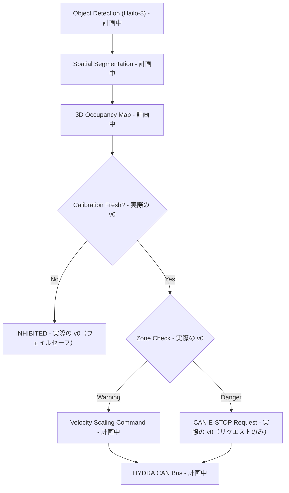

<p align="center">
  
</p>

# 🛡️ HYDRA-UMC-SAFETY-ZONES

<p align="center"><a href="README.md">🇺🇸 English</a> | <a href="README_spa.md">🇪🇸 Español</a> | <a href="README_fra.md">🇫🇷 Français</a> | <a href="README_ita.md">🇮🇹 Italiano</a> | <a href="README_deu.md">🇩🇪 Deutsch</a> | <a href="README_zho.md">🇨🇳 简体中文</a> | 🇯🇵 <b>日本語</b></p>

### 🚨 リアルタイム 3D 侵入検知と E-STOP オーケストレーター

<p align="left">
  
  
  
  
</p>

---

## 1. 🛠️ 技術概要

**HYDRA-UMC-SAFETY-ZONES** は、Vision AI Node ファミリーの重要な安全サブ
システムとなることを目指しています。その役割は、ロボットの周囲に仮想的な
3D バウンディングボリュームを投影し、Hailo-8 NPU による高速な空間セグメン
テーションを用いて、定義された「警告」および「危険」ゾーン内での人の侵入
や異物の侵入を検知することです。

これは、ファミリーの統合親プロジェクトである **[HYDRA-UMC-VISION-NODE](https://github.com/JuanenRac/HYDRA-UMC-VISION-NODE)** の 4 つの子プロジェクトの 1 つであり、その知覚入力は兄弟プロジェクトである
**[HYDRA-UMC-DETECTION-HEF](https://github.com/JuanenRac/HYDRA-UMC-DETECTION-HEF)** がコンパイルしたモデル上に構築されています。

### 要点

* 🚦 **多段階ゾーン（v0）：** 軸に沿った 3D ボリューム上の実際の `Zone`/`ZoneLevel`（警告/危険）定義、およびゾーン集合と検知対象位置集合の間の実際の越境チェック（`check_breaches`）。
* 🛑 **E-STOP リクエスト（v0、実行はしない）：** 最悪の越境が危険レベルであるすべての対象について、実際の `EStopRequest` が生成され、`EStopRequester` に渡されます——ここで物理的な停止を自ら実行するものが一切ない理由については、下記の設計上の境界を参照してください。
* 🔒 **キャリブレーション鮮度の強制（v0）：** すべてのゾーン集合はオプションの `calibration`（バージョン、ソース、キャリブレーション日、最大許容日数）を持ちます。`evaluate_safety()` は越境ロジックを実行する**前に**それをチェックします——キャリブレーションが全く無いゾーン集合、自身の宣言した `max_age_days` より古いもの、あるいは未来の日付のものは、常に `INHIBITED` に解決され、検知対象がどのゾーンにも近づいていないという理由だけで黙って `READY` に流れ込むことは決してありません。
* 🧮 **有限座標フェイルセーフ(v0):** `config.py` はゾーンまたは検知ファイル内の `NaN`/`Infinity`/`-Infinity` の `x`/`y`/`z` を、`evaluate_safety()` が実行される前に拒否し、実在の点を表せない座標で境界評価を行う代わりに直接 `INHIBITED`(終了コード `3`)に解決します。
* 🌐 **JSON/HTTP API(v0.0.5):** `serve` サブコマンドは `check` とまったく同じロジック(`evaluate_safety()`/`check_breaches()`/`request_estop_for()`)を、stdlib の `http.server`(`POST /check`、`GET /stats`)経由でCLI以外の呼び出し元にも公開します。デフォルトはループバックのみで、`systemd/hydra-umc-safety-zones.service` ユニットと同じです。すべての実コマンド・フラグ・終了コードは [`docs/CLI_REFERENCE.md`](docs/CLI_REFERENCE.md) を参照してください。
* 📐 **動的オクルージョン（計画中）：** ロボット自身の構造を安全トリガーから自動的にマスクし、ロボットが「自分自身」を侵入として検知しないようにします。
* 🔍 **異物検知（計画中）：** 作業スペースに残された工具や破片を識別します。
* 🎥 **Hailo-8 による実際の 3D 占有マッピング（計画中）：** v0 の `check` サブコマンドが検知対象位置を JSON ファイルから取得するのは、まさにそれらを実際に生成する Hailo-8 空間セグメンテーションパイプラインがこの環境にまだ存在しないためです——詳細は下記「正直な現状確認」を参照してください。
* 🧩 **独立したプロジェクトとして存在する理由：** 安全ロジックは他の知覚処理とは異なる検証基準を持ちます——独自のサービスとして切り離すことで、ファミリー内の他のカメラパイプラインやモデルコンパイルの変更とは独立して、テスト、監査、そして最終的な認証（上記の ISO 13849-1 バッジ参照、現段階では目標に過ぎません）が可能になります。

**既に決定され、今やコード上でも実施されている重要な設計上の境界：** 本プロジェクトは常に E-STOP を
**検知しリクエストするだけ**であり——物理的な停止信号を自ら発することは
決してありません。`estop.py` の唯一の実際のリクエスト実装である
`NullEStopRequester` は、送信するはずだった内容を記録するだけで、どこにも
何も送信しません——本リポジトリには意図的に、まだ実際の CAN 伝送手段が
存在しません。CAN 経由で実際にモーター電源を切断するのは
[HYDRA-UMC](https://github.com/JuanenRac/HYDRA-UMC)（ファームウェア）の責任であり、その役割のために構築されたハード
ウェア上で行われます。この境界を維持することで、本 Python サービス内の
バグが停止を*リクエストできない*結果になることはあっても、ファームウェア
が独立して停止を実行することを*妨げる*ことは決してありません。

**正直な現状確認 —— 今日実際に動くもの：** 実際のエントリポイント
（`src/hydra_umc_safety_zones/main.py`）は、引数なしで呼び出された場合は
これまで通り識別情報・バージョン・役割を表示しますが、今では実際の
`check --zones パス --detections パス` サブコマンドも備えています：
JSON からゾーン集合（ゾーン + オプションのキャリブレーションメタデータ）
と検知対象位置を読み込み、まずキャリブレーションの鮮度をチェックしてから、
実際の越境チェックを実行し、危険レベルの越境ごとに E-STOP をリクエストし、
結果に応じて 0（Ready）/ 1（Warning）/ 2（Danger、E-STOP をリクエスト済み）
/ 3（Inhibited——キャリブレーションが欠落または期限切れ）で終了します。
本当にまだ実際には存在しないもの：実際のハードウェア上
でこれらの検知対象位置を生成する Hailo-8 セグメンテーション、自己遮蔽
マスキング、そして E-STOP リクエストのための実際の CAN 伝送手段です。
実際に出荷済みの内容は
[`CHANGELOG.md`](CHANGELOG.md) を、まだ残っている作業は下記の「現在の
状況と次のステップ」セクションを参照してください。

---

## 2. 🔄 目標安全ロジックフロー

下図は、本プロジェクトが構築を目指している目標データフローです。JSON
ファイルから読み込んだ検知対象位置を起点として、図中の `CAL`（キャリブ
レーションチェック）、`ZONE`（ゾーンチェック）とそれに続く警告/危険の
分岐は、`evaluate_safety()`（`check_breaches()`/`request_estop_for()` を
ラップ）によって駆動され、今日すでに実際に動作しています。
`CAL`/`ZONE` より前（実際の Hailo-8 パイプライン）と `STOP` より後（実際の CAN
伝送手段）はすべて、まだ今後の課題です。



---

## 3. 🧠 高度な技術情報

### 検知と執行の境界、そしてなぜここで特に重要なのか

本 README のすべての内容の中で、これは単なる実装の詳細ではない唯一の設計
決定です。本サービスは停止が必要であると*判断*し、CAN 経由でそれを
*リクエスト*することを意図していますが、実際の物理的なモーター電源切断は
[HYDRA-UMC](https://github.com/JuanenRac/HYDRA-UMC) 内部の、その役割の
ために構築・認証されたハードウェア上で発生します。これは意図的な多層防御
の選択です——ここでのソフトウェアのバグ（クラッシュ、ハング、不正な
フレーム）は「新しい停止リクエストが送信されなくなる」という結果に留まり、
「ロボットの既存の安全ハードウェアが機能しなくなる」という結果には
なりません。

### なぜ `hardware/`、`firmware/`、`os/`、`models/` がここに存在しないのか

CM5 + Hailo-8 は市販のハードウェアであり、独自に設計する基板はありません。
そのため——Vision AI Node ファミリーの他のプロジェクトと同様に——ここに
`hardware/`/`firmware/` フォルダは存在しません。`os/`（共有 HydraOS
イメージ）と `models/`（実際に NPU に配信される、コンパイル済みの `.hef`
ファイル）は、CM5 ホストイメージと Hailo-8 デバイスハンドルを保持する
統合親プロジェクト [HYDRA-UMC-VISION-NODE](https://github.com/JuanenRac/HYDRA-UMC-VISION-NODE) にのみ存在します。

### 既に行われた設計上の決定

* **バージョンはハードコードではなく、インストール済みパッケージのメタデータから読み取られます** —— `main.py` は 2 つ目の `__version__` 文字列の代わりに `importlib.metadata.version("hydra-umc-safety-zones")` を呼び出すため、`bump_version.py` が編集すべき箇所は常に 1 か所です。
* **オドメーター式のインクリメントは自動的に `PATCH`/`MINOR` にのみ触れます** —— `bump_version.py` は `PATCH` が 9 を超えると `MINOR` に、`MINOR` が 9 を超えると `MAJOR` に繰り上がりますが、`MAJOR` 自体を自動で増加させることは決してありません。`HYDRA-UMC-EDITOR-URDF/bump_version.py` および `HYDRA-UMC-SUITE/bump_version.py` と同じ慣例です。
* **メッシュや凸包ではなく AABB ゾーン** —— `check_breaches()` を正確かつ高速に保てる、最もシンプルなボリューム表現です。現実の境界は実際には箱に近い形であることが非常に多く、より豊かな形状は同じ `Zone`/`AABB.contains()` インターフェースの背後に、`breach.py` や `estop.py` に触れることなく後から追加できます。
* **ゾーン境界の判定は排他的ではなく包含的です** —— `AABB.contains()` は境界線上ちょうどの点を内側として扱います。安全境界にとっては、これが誤りの許される保守的な方向です：越境報告が早まることはあっても、見逃すことは決してありません。
* **`NullEStopRequester` は本リポジトリ内で唯一のリクエスト実装です** —— 気軽に差し替えられるプレースホルダーではなく、検知と執行の境界そのものを誠実に体現するものです：ここには実際の CAN 伝送手段は存在せず、今後も不用意に追加すべきではありません（上記「既に決定された重要な設計上の境界」および `estop.py` モジュール自身のドキュメントを参照してください）。
* **ゾーンと検知データは YAML ではなく単純な JSON です** —— `pyproject.toml` の依存関係リストは依然として `[]` です。`json` は標準ライブラリの一部であり、`pyyaml` はシリアライズする価値のある実際のゾーン作成ツールが登場した時点での、実際の今後の課題です。
* **キャリブレーションは越境ロジックより前にチェックされ、後には決してチェックされません** —— `evaluate_safety()` は、`check_breaches()` を呼び出す前に、キャリブレーションが欠落または期限切れになった瞬間に `INHIBITED` を返します。これは意図的です：キャリブレーションが古いということは、ゾーンジオメトリ自体が信頼できないことを意味するため、それに対して越境チェックを実行した結果もどのみち無意味です——キャリブレーションを先にチェックすることは、期限切れのキャリブレーションが、本物の危険越境のように見えるものより常に優先されることも意味します。その逆ではありません。
* **`"calibration"` キーが欠落していても正常に読み込まれ、単に `INHIBITED` になるだけです** —— `load_zone_set()` は、ゾーンファイルがこの機能より前のものであったり、キャリブレーションメタデータなしで手書きされたりしたという理由だけではエラーを送出しません。読み込み時ではなく、評価時に安全に失敗するよう設計されています。

---

## 📂 リポジトリ構成

```text
HYDRA-UMC-SAFETY-ZONES/
├── src/hydra_umc_safety_zones/
│   ├── geometry.py       # 実際の Point3D/AABB プリミティブ
│   ├── zones.py          # 実際の ZoneLevel/Zone/ZoneSet 定義
│   ├── breach.py         # 実際のゾーン越境チェック
│   ├── calibration.py    # 実際のキャリブレーション鮮度追跡
│   ├── safety_state.py   # 実際のフェイルセーフ判定：READY/WARNING/DANGER/INHIBITED
│   ├── estop.py          # 実際の E-STOP リクエスト（実行は決してしない）
│   ├── config.py         # ゾーン/検知データの実際の JSON 読み込み
│   ├── api.py             # シンプルなJSON/HTTPサーフェス(stdlibのhttp.server)。実際の`check`ロジックを橋渡し
│   └── main.py            # エントリポイント + 実際の `check` サブコマンド
├── tests/                # 実際のテスト：幾何、越境、キャリブレーション、safety_state、estop、設定、api、CLI
├── docs/                # ドキュメントと安全基準
├── build/               # ビルド出力（ローカルの .venv もここに存在）
├── images/              # メディアと図表
├── systemd/
│   └── hydra-umc-safety-zones.service # ローカルCM5ゾーン越境チェックAPIのsystemdユニット
├── pyproject.toml       # パッケージメタデータ、依存関係、オドメーターバージョン
├── bump_version.py      # ネイティブバージョンのオドメーター式インクリメント（build.sh/.bat が実行）
├── bump_manifest_version.py # hydra-umc.project.json のバージョンをネイティブ版と同期(--sync)
├── build.sh / build.bat # venv + editable インストール（dev エクストラ付き） + コンパイルチェック + テスト
├── build-test.sh / .bat # バージョン管理しないビルドチェック（version や CHANGELOG には触れません）
├── tools/
│   ├── build_test.py    # 両方の build-test ランチャーが委譲する共通エンジン
│   └── ci_validate.py   # CI が使用するマニフェスト/CHANGELOG/ドキュメント検証
├── run.sh / run.bat     # ローカル venv からエントリポイントを実行（引数を転送）
└── CHANGELOG.md         # バージョンごとの履歴（オドメーター方式、日付なし）
```

`hardware/`、`firmware/`、`os/`、`models/` フォルダは存在しません——理由は
上記「高度な技術情報」を参照してください。`os/` と `models/` は統合親
プロジェクトである [HYDRA-UMC-VISION-NODE](https://github.com/JuanenRac/HYDRA-UMC-VISION-NODE) にのみ存在します。

---

## 🏗️ ビルドと実行

### 前提条件

* `PATH` 上に **Python 3.10 以降**があること（スクリプトは先に `python3` を試し、次に `python` にフォールバックします）。
* 安全/視覚のランタイム依存関係は現時点では不要です——この段階では**サードパーティのランタイム依存関係が一切ありません**（`pyproject.toml` の `dependencies = []`）。`pytest` は開発専用のエクストラであり、実際のテストスイートのためだけに使用されます。
* ローカル仮想環境（`.venv/` 下）には数十 MB のディスク容量が必要です。

### ステップバイステップ

```bash
# Linux / macOS
./build.sh
```

1. **オドメーター式バージョンインクリメント** — `bump_version.py` を実行し、ビルドのたびに `pyproject.toml` 内の `PATCH` を増加させ（上記の規則に従って `MINOR`/`MAJOR` に繰り上がります）、続けて `hydra-umc.project.json` を同期します。
2. **仮想環境** — `.venv/` が存在しない場合は作成し、存在する場合は再利用します。
3. **Editable インストール（dev エクストラ付き）** — `pip install -e ".[dev]"` により `src/` 下の変更が即座に反映され、`pytest` がインストールされ、`hydra-umc-safety-zones` コンソールエントリポイントが登録されます。
4. **コンパイルチェック** — `python -m compileall -q src` が `src/` 下の各ファイルをバイトコンパイルし、エコシステム全体にわたる構文エラーを検出します。
5. **実際のテストスイート** — `pytest tests/` が全 57 件のテストを実行します。

`set -euo pipefail` は最初に失敗したステップでスクリプトを停止させます。
ダブルクリックで起動された場合（既に開いているターミナルからではなく）は、
ウィンドウは開いたままになります（`Press Enter to close...`）。

```bash
./run.sh
```

`.venv` 内のインタープリタを特定し（POSIX と Windows 両方の `.venv`
ディレクトリ構造を処理）、`python -m hydra_umc_safety_zones.main` を実行
し、あらゆる引数を転送します。

引数なしで呼び出すと名前・バージョン・役割を表示します：

```text
HYDRA-UMC-SAFETY-ZONES v0.0.5
Real-time 3D intrusion detection and E-STOP orchestration for robotic safe-working areas.
```

実際の `check` サブコマンドには、ゾーンファイルと検知ファイルの両方が
必要で、どちらも単純な JSON です。`calibration` はゾーンファイル内でオプション
です——それが無い場合に何が起きるかは以下を参照してください：

```json
// zones.json
{
  "calibration": {"version": "cal-1", "source": "manual", "calibrated_at": "2024-01-15", "max_age_days": 30},
  "zones": [
    {"id": "warn1", "level": "warning", "min": {"x": 0, "y": 0, "z": 0}, "max": {"x": 5, "y": 5, "z": 5}},
    {"id": "danger1", "level": "danger", "min": {"x": 0, "y": 0, "z": 0}, "max": {"x": 1, "y": 1, "z": 1}}
  ]
}
```

```json
// detections.json
{"objects": [{"id": "op1", "position": {"x": 0.5, "y": 0.5, "z": 0.5}}]}
```

```bash
./run.sh check --zones zones.json --detections detections.json
```

```text
SAFETY STATE: DANGER - object(s) ['op1'] breached a danger zone
BREACH: object 'op1' inside warning zone 'warn1'
BREACH: object 'op1' inside danger zone 'danger1'
E-STOP REQUESTED: object 'op1' breached danger zone 'danger1' (not asserted - see estop.py)
```

終了コードは `2`（危険、E-STOP をリクエスト済み）、`1`（警告レベルの
越境のみ）、`0`（越境なし、キャリブレーション有効）、または `3`
（**Inhibited**——キャリブレーションが欠落または期限切れ、越境ロジックより
前にチェック）です。以下はフェイルセーフパスの実際の例です——上記と同じ
`detections.json` を使い、`zones.json` には `"calibration"` キーが全く
ありません：

```bash
./run.sh check --zones zones_no_calibration.json --detections detections.json
```

```text
SAFETY STATE: INHIBITED - no calibration metadata present - zone geometry cannot be trusted
```

終了コードは `3` です——`op1` が両方のゾーン内にあるにもかかわらず、
`BREACH`/`E-STOP` の出力が全く無いことに注目してください：信頼できない
ゾーン集合は、越境チェックのステップに決して到達しません。

```bat
:: Windows - 手順は同じ、バッチ構文
build.bat
run.bat
run.bat check --zones zones.json --detections detections.json
```

同じ `check` ロジックは、CLI以外の呼び出し元向けにHTTP経由でも利用できます—`zones`/`detections` はファイルパスではなくJSONボディで渡されます:

```bash
./run.sh serve --addr 127.0.0.1 --port 8108
# 別のターミナルで:
curl -s -X POST http://127.0.0.1:8108/check -d '{"zones": {...}, "detections": {...}}'
```

実際のコマンド・フラグ・終了コードの完全なリファレンス(実際の実行から採取した `READY`/`WARNING`/`DANGER`/`INHIBITED` の各状態を含む)は [`docs/CLI_REFERENCE.md`](docs/CLI_REFERENCE.md) を参照してください。

### トラブルシューティング

* **`python`/`python3` が見つからない** —— Python 3.10+ をインストールし `PATH` に含まれていることを確認してください。
* **`compileall` が失敗する** —— `src/` 下に実際の構文エラーが導入されたことを意味します。ビルドは意図的にインストールに触れることなく停止します。
* **`run.sh`/`run.bat` が「`.venv` が見つかりません」と表示する** —— 先に少なくとも 1 回 `build.sh`/`build.bat` を実行してください。
* **editable インストールが古いままになる** —— `.venv/` を削除して再構築してください。これが必要になることはまれです。
* **`check` が非ゼロの終了コードで終わる** —— これは実際の正しい動作であり、失敗ではありません：`1` は警告レベルの越境のみが見つかったことを、`2` は危険レベルの越境が E-STOP をリクエストしたことを、`3` はゾーン集合のキャリブレーションが欠落または期限切れであること（フェイルセーフ、越境ロジックが実行される前にチェック）を意味します。Python のトレースバックや不正な JSON によるエラーだけが、実際のバグです。

---

## 🚀 現在の状況と次のステップ

**今日実現していること：** 実際の警告/危険ゾーン定義と実際の越境チェック
（`geometry.py`/`zones.py`/`breach.py`）、越境ロジックより前に安全に
`INHIBITED` にフェイルする実際のキャリブレーション鮮度強制
（`calibration.py`/`safety_state.py`）、構造上検知と執行の境界を守る
実際の E-STOP *リクエスト*パイプライン（`estop.py`）、ゾーン/検知 JSON
ファイルに対する実際の CLI サブコマンド `check`、そして通過した 57 件の
テスト——完全な実際のビルド/実行出力は
[`CHANGELOG.md`](CHANGELOG.md) を参照してください。

**まだ残っている作業（順不同、確定した期限なし）：**

* Hailo-8 の空間セグメンテーションに基づく実際の 3D 占有マッピング。これに
  より `check` が現在 JSON 入力として想定している検知対象位置を、実際に
  生成できるようになります。
* ロボット自身の構造の動的な自己遮蔽マスキング。
* [HYDRA-UMC](https://github.com/JuanenRac/HYDRA-UMC) への `EStopRequester`
  を実装した実際の CAN 伝送手段 —— `estop.py` は、実際の実装が満たすべき
  インターフェースをすでに定義しています。
* 実際の安全認証作業（上記の ISO 13849-1 バッジは目標を示すものであり、完了した認証ではありません）。

---

## 🔗 関連プロジェクト

本プロジェクトは、同じ作者(JuanenRac / Electro Hobby 3D)による HYDRA-UMC ロボティクスエコシステムの一部です。リクエストが実はこの中のどれかについてのものである可能性があるため、知っておく価値があります。

**親プロジェクト**
- **[HYDRA-UMC-VISION-NODE](https://github.com/JuanenRac/HYDRA-UMC-VISION-NODE)** — Hailo-8 ビジョンパイプラインの統合ハブ、段階ごとの実際のハードウェア準備状況チェック付き。本リポジトリは、その自身の知覚パイプライン内における特定の段階・消費者として、この親の一部を成す。

**兄弟プロジェクト** —— HYDRA-UMC-VISION-NODE 自身の Hailo-8 知覚パイプラインにおける他の段階・消費者
- **[HYDRA-UMC-VISION-STREAMER](https://github.com/JuanenRac/HYDRA-UMC-VISION-STREAMER)** — 実際の HailoRT 統合境界を持つ、実際の GStreamer パイプライン + MediaMTX 設定生成器。
- **[HYDRA-UMC-DETECTION-HEF](https://github.com/JuanenRac/HYDRA-UMC-DETECTION-HEF)** — Hailo アーキテクチャ/チェックサムによる安全読み込み検証を備えた、実際のコンパイル済みモデルレジストリ。
- **[HYDRA-UMC-VISUAL-SERVOING-API](https://github.com/JuanenRac/HYDRA-UMC-VISUAL-SERVOING-API)** — 上流のゾーン状態に応じて安全ゲート制御される、実際の Position-Based Visual Servoing 補正則。

**直接関連**
- **[HYDRA-UMC](https://github.com/JuanenRac/HYDRA-UMC)** — 実際のロボットアームのマザーボード——CM5 ホスト + デュアルコア STM32H745、CAN-OTA/SPI-OTA 経由で最大 8 本のツールアームを統括。本プロジェクトはこのファームウェアの E-STOP を要求し、実際にそれを実行するのはファームウェア自身である。

**エコシステムの他のプロジェクト**

*コアハードウェア&プラットフォーム*
- **[HYDRA-UMC-OS](https://github.com/JuanenRac/HYDRA-UMC-OS)** — CM5 向けの再現可能な Raspberry Pi OS プロダクト層——読み取り専用エージェント、検証済み設定/プロファイル、WiFi 初回接続プロビジョニング。
- **[HYDRA-UMC-SDK](https://github.com/JuanenRac/HYDRA-UMC-SDK)** — すべてのブリッジが自身のコマンドを検証する共有 JSON-Schema 契約と安全ゲートの境界。

*コアバックエンド&クライアント*
- **[HYDRA-UMC-SERVER](https://github.com/JuanenRac/HYDRA-UMC-SERVER)** — すべての制御クライアントが実際に通信する、本物のヘッドレスバックエンド(REST/WebSocket)。
- **[HYDRA-UMC-STUDIO](https://github.com/JuanenRac/HYDRA-UMC-STUDIO)** — リアルタイムのマルチロボット 3D 可視化を備えたウェブ制御ダッシュボード。
- **[HYDRA-UMC-SUITE](https://github.com/JuanenRac/HYDRA-UMC-SUITE)** — 複数のサーバーを同時に扱えるデスクトップ(PySide6)スウォームコマンドセンター、スタンドアロン実行ファイルとしてパッケージ化。
- **[HYDRA-UMC-ANDROID-CONTROL](https://github.com/JuanenRac/HYDRA-UMC-ANDROID-CONTROL)** — 生体認証ログインとペアリングされた Wear OS コンパニオンを備えたネイティブ Android 制御アプリ。
- **[HYDRA-UMC-IOS-CONTROL](https://github.com/JuanenRac/HYDRA-UMC-IOS-CONTROL)** — リアルタイム WebSocket 同期を備えた iOS/iPadOS 制御アプリ(Flutter)。
- **[HYDRA-UMC-DSI](https://github.com/JuanenRac/HYDRA-UMC-DSI)** — 本体搭載の 7 インチ DSI タッチスクリーン向けネイティブタッチ UI、CM5 自体に組み込み。
- **[HYDRA-UMC-EDITOR-URDF](https://github.com/JuanenRac/HYDRA-UMC-EDITOR-URDF)** — 完成したモデルを STUDIO 自身のカタログへ送信するデスクトップ用グラフィカル URDF 作成/編集ツール。
- **[HYDRA-UMC-BRIDGE-AMR](https://github.com/JuanenRac/HYDRA-UMC-BRIDGE-AMR)** — 実際の VDA 5050 MQTT パブリッシャーによる AGV/AMR フリートの調整境界。
- **[HYDRA-UMC-BRIDGE-CNC](https://github.com/JuanenRac/HYDRA-UMC-BRIDGE-CNC)** — 実際の GRBL ステータス/制御バイトへのアクセスを持つ、CNC セルの高レベルコーディネーター。
- **[HYDRA-UMC-BRIDGE-DROIDS](https://github.com/JuanenRac/HYDRA-UMC-BRIDGE-DROIDS)** — 実際の Boston Dynamics Spot コマンド送信機能を持つ、脚型/ヒューマノイドドロイドの調整境界。
- **[HYDRA-UMC-BRIDGE-LASER](https://github.com/JuanenRac/HYDRA-UMC-BRIDGE-LASER)** — 実際のキー/筐体/インターロック GPIO セーフガード 3 系統を読み取る、レーザーセルの安全コーディネーター。
- **[HYDRA-UMC-BRIDGE-OPENPNP](https://github.com/JuanenRac/HYDRA-UMC-BRIDGE-OPENPNP)** — OpenPnP ピックアンドプレースの基板フローを安全に統括する高レベルコーディネーター。
- **[HYDRA-UMC-BRIDGE-PRINTER3D](https://github.com/JuanenRac/HYDRA-UMC-BRIDGE-PRINTER3D)** — 実際にゲート制御されたジョブコマンドを持つ、Moonraker/Klipper 3D プリンター向けの安全な調整境界。
- **[HYDRA-UMC-BRIDGE-ROS2](https://github.com/JuanenRac/HYDRA-UMC-BRIDGE-ROS2)** — 実際の遅延インポート rclpy ROS 2 トランスポートを持つ安全コーディネーター。
- **[HYDRA-UMC-BRIDGE-UAV](https://github.com/JuanenRac/HYDRA-UMC-BRIDGE-UAV)** — 実際の MAVLink コマンド送信機能を持つ、カメラ搭載 UAV の調整境界。

*URTC ツールプラットフォーム*
- **[URTC](https://github.com/JuanenRac/URTC)** — 物理的な Universal Robot Tool Controller 基板向けファームウェア、CAN バス経由の 25 以上のツールプロファイル。
- **[URTC-FLASHER](https://github.com/JuanenRac/URTC-FLASHER)** — URTC 基板用のデスクトップ GUI 書き込みツール、CAN-OTA およびフルチップ SWD/JTAG。
- **[URTC-TESTER](https://github.com/JuanenRac/URTC-TESTER)** — URTC 基板向けのデスクトップ CAN バスライブ診断ツール、ツールプロファイルごとに 1 パネル。
- **[URTC-WEB-STUDIO](https://github.com/JuanenRac/URTC-WEB-STUDIO)** — Web Serial API を使ったブラウザベースの URTC-TESTER の代替、ローカルインストール不要。

*コグニティブ AI ノード(Hailo-10)*
- **[HYDRA-UMC-COGNITIVE-NODE](https://github.com/JuanenRac/HYDRA-UMC-COGNITIVE-NODE)** — Hailo-10 コグニティブパイプライン(LLM/VLA/音声オーケストレーション)の統合ハブ。
- **[HYDRA-UMC-VLA-ENGINE](https://github.com/JuanenRac/HYDRA-UMC-VLA-ENGINE)** — Vision-Language-Action モデル向けの、実際のアクショントークンのエンコード/デコードと軌道生成。
- **[HYDRA-UMC-VOICE-UI](https://github.com/JuanenRac/HYDRA-UMC-VOICE-UI)** — 確認ゲート付きの限定的な Watch リレーを備えた、実際の音声フロントエンド(VAD + 意図解析)。
- **[HYDRA-UMC-SEMANTIC-PLANNER](https://github.com/JuanenRac/HYDRA-UMC-SEMANTIC-PLANNER)** — MCU エラーコードに対する、実際のルールベースのタスク分解と意味的エラー復旧。
- **[HYDRA-UMC-DOCS-QA](https://github.com/JuanenRac/HYDRA-UMC-DOCS-QA)** — このエコシステム自身の Markdown ドキュメントに対する、標準ライブラリのみの実際の TF-IDF 文書検索。

*オーケストレーション&スウォーム*
- **[HYDRA-UMC-ORCHESTRATOR](https://github.com/JuanenRac/HYDRA-UMC-ORCHESTRATOR)** — 実際の gRPC/Protobuf ヘルスレポート契約とミッションステートマシンを持つ統合ハブ。
- **[HYDRA-UMC-JOB-DISPATCHER](https://github.com/JuanenRac/HYDRA-UMC-JOB-DISPATCHER)** — 実際の HTTP API 上に構築された、優先度ベースの実際のジョブキュー(重複排除付き)。
- **[HYDRA-UMC-NODE-HEALING](https://github.com/JuanenRac/HYDRA-UMC-NODE-HEALING)** — リトライ/バックオフとアイデンティティ不一致検出を備えた、実際の gRPC ベースのフリートヘルスウォッチドッグ。
- **[HYDRA-UMC-PATH-PLANNER-3D](https://github.com/JuanenRac/HYDRA-UMC-PATH-PLANNER-3D)** — 実際の障害物/ワークスペース衝突検証を備えた、実際の RRT ベースの 3D 経路プランナー。
- **[HYDRA-UMC-SWARM-SYNC](https://github.com/JuanenRac/HYDRA-UMC-SWARM-SYNC)** — 複数セルの収束についてプロパティテストされた、実際の CRDT LWW-Element-Map 状態同期。

*デジタルツイン&シミュレーション*
- **[HYDRA-UMC-TWIN](https://github.com/JuanenRac/HYDRA-UMC-TWIN)** — 実際のバージョン互換性同期契約を持つ、デジタルツインエンジンの統合ハブ。
- **[HYDRA-UMC-HIL-BRIDGE](https://github.com/JuanenRac/HYDRA-UMC-HIL-BRIDGE)** — シミュレーションと実際のハードウェアの間でコマンドをルーティングする、実際のハードウェア・イン・ザ・ループ安全インターロック。
- **[HYDRA-UMC-PHYSICS-REPLICA](https://github.com/JuanenRac/HYDRA-UMC-PHYSICS-REPLICA)** — 実際の URDF サブセットに対する、実際の順運動学と関節限界検証。
- **[HYDRA-UMC-SYNTHETIC-DATA-GEN](https://github.com/JuanenRac/HYDRA-UMC-SYNTHETIC-DATA-GEN)** — YOLO/COCO アノテーションのエクスポート機能を持つ、実際のプロシージャル 2D シーンジェネレーター。

*データ&分析*
- **[HYDRA-UMC-DATALAKE](https://github.com/JuanenRac/HYDRA-UMC-DATALAKE)** — 実際の取り込み/クエリ HTTP API を備えた、実際の sqlite3 ベースの時系列ストア。
- **[HYDRA-UMC-ANOMALY-DETECTOR](https://github.com/JuanenRac/HYDRA-UMC-ANOMALY-DETECTOR)** — ドリフト監視を備えた、実際の FFT + 統計ベースラインによる異常検知器。
- **[HYDRA-UMC-PRODUCTION-REPORTS](https://github.com/JuanenRac/HYDRA-UMC-PRODUCTION-REPORTS)** — DATALAKE の履歴に対する実際の OEE/稼働率計算、再現可能な CSV エクスポート付き。
- **[HYDRA-UMC-TELEMETRY-COLLECTOR](https://github.com/JuanenRac/HYDRA-UMC-TELEMETRY-COLLECTOR)** — シーケンス重複排除機能を備えた、DATALAKE への実際の CAN/WebSocket 取り込みパイプライン。

*産業用ゲートウェイ*
- **[HYDRA-UMC-GATEWAY-INDUSTRIAL](https://github.com/JuanenRac/HYDRA-UMC-GATEWAY-INDUSTRIAL)** — 実際のコマンド許可リスト/バックプレッシャー層を持つ、産業用プロトコルへ中継する統合ハブ。
- **[HYDRA-UMC-OPCUA-SERVER](https://github.com/JuanenRac/HYDRA-UMC-OPCUA-SERVER)** — 実際のバイナリプロトコルクライアントセッションで検証された、実際の OPC-UA アドレス空間。
- **[HYDRA-UMC-MQTT-BROKER](https://github.com/JuanenRac/HYDRA-UMC-MQTT-BROKER)** — クライアント単位のオプション認証とトピック ACL を備えた、実際の MQTT ブローカー。
- **[HYDRA-UMC-MTCONNECT-ADAPTER](https://github.com/JuanenRac/HYDRA-UMC-MTCONNECT-ADAPTER)** — 縮退モード出力を備えた、実際の MTConnect `/probe` および `/current` XML エンドポイント。

*補完ツール&エコシステム運用*
- **[HYDRA-UMC-DASHBOARD-AI](https://github.com/JuanenRac/HYDRA-UMC-DASHBOARD-AI)** — 誠実な統計フォールバックを備えた、DATALAKE/ANOMALY-DETECTOR 上のスマートサマリーと異常ハイライトパネル。
- **[HYDRA-UMC-TOOL-CLI](https://github.com/JuanenRac/HYDRA-UMC-TOOL-CLI)** — 実際の安定した終了コード契約を持つフリート CLI、HYDRA-UMC-SERVER 自身の API の本物のライブクライアント。
- **[HYDRA-UMC-WATCH](https://github.com/JuanenRac/HYDRA-UMC-WATCH)** — 実際の触覚アラートとペアリングされたスマートフォンへの音声リレーを備えた WearOS コンパニオンアプリ。
- **[URTC-SMART-RACK](https://github.com/JuanenRac/URTC-SMART-RACK)** — 実際の工具 ID デコードと Smart Idle 予熱ロジックを備えた、基板搭載ラック用ファームウェア。
- **[URTC-VISION-TOOL](https://github.com/JuanenRac/URTC-VISION-TOOL)** — サーマル/RGB 検査ツールヘッド向けの、ファームウェアと実際の Python ビジョンコンパニオン。
- **[HYDRA-UMC-UPDATER](https://github.com/JuanenRac/HYDRA-UMC-UPDATER)** — このエコシステム内のすべてのリポジトリを検出・クローン・更新する、管理用デスクトップツール。
- **[HYDRA-UMC-OS-REBUILDER](https://github.com/JuanenRac/HYDRA-UMC-OS-REBUILDER)** — エコシステムの最新バージョンをプリロードした、書き込み可能なCM5イメージを構築するWindows/Linuxデスクトップツール。Raspberry Pi Imager方式の初回起動Wi-Fi/ユーザー/SSH設定を備える。

---

## 📚 ドキュメント & コミュニティ

- **[CONTRIBUTING.md](CONTRIBUTING.md)** —— プルリクエストのための技術スタックとコーディング指針。
- **[CODE_OF_CONDUCT.md](CODE_OF_CONDUCT.md)** —— このコミュニティで期待される行動規範。
- **[SECURITY.md](SECURITY.md)** —— 脆弱性の報告方法と、このプロジェクトの実際のセキュリティ重点領域。
- **[SUPPORT.md](SUPPORT.md)** —— 質問の投稿先とバグの報告先。
- **[LICENSE.md](LICENSE.md)** —— このプロジェクト自身のライセンス。

## 👤 作者
**JuanenRac** (Electro Hobby 3D)
📧 electrohobby3d@gmail.com
📺 [youtube.com/@electrohobby3d](https://youtube.com/@electrohobby3d)

## 📜 ライセンス
GPL-3.0 —— 詳細は LICENSE を参照してください。
