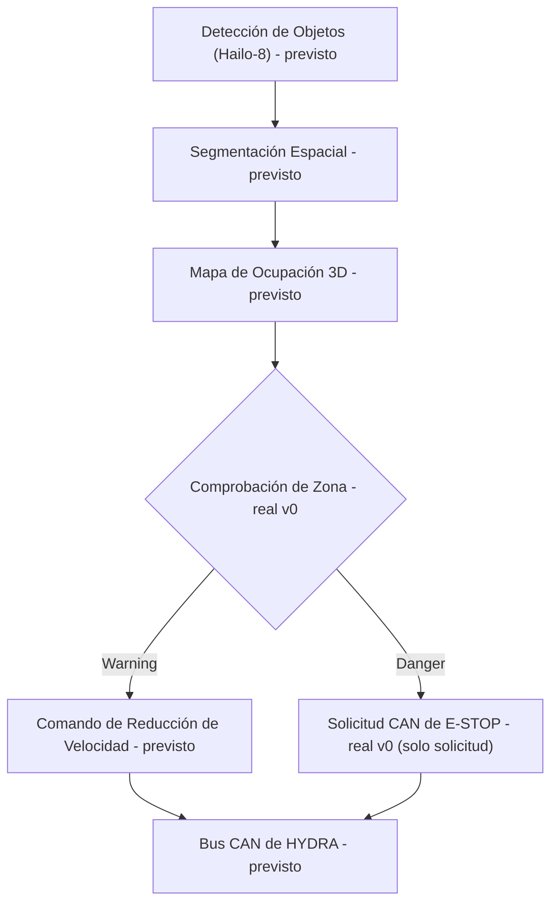

<p align="center">
  
</p>

# 🛡️ HYDRA-UMC-SAFETY-ZONES

<p align="center"><a href="README.md">🇺🇸 English</a> | 🇪🇸 <b>Español</b> | <a href="README_fra.md">🇫🇷 Français</a> | <a href="README_ita.md">🇮🇹 Italiano</a> | <a href="README_deu.md">🇩🇪 Deutsch</a> | <a href="README_zho.md">🇨🇳 简体中文</a> | <a href="README_jpn.md">🇯🇵 日本語</a></p>

### 🚨 Detección de Intrusión 3D en Tiempo Real y Orquestador de E-STOP

<p align="left">
  
  
  
  
</p>

---

## 1. 🛠️ VISIÓN GENERAL TÉCNICA

**HYDRA-UMC-SAFETY-ZONES** está pensado para ser el subsistema de seguridad crítico de la familia Vision AI Node. Su trabajo es proyectar volúmenes 3D virtuales alrededor de los robots y monitorizar el espacio de trabajo en busca de intrusiones humanas u objetos extraños, usando segmentación espacial de alta velocidad de la NPU Hailo-8 para detectar brechas en zonas "Warning" y "Danger" definidas.

Este es uno de los 4 hijos de **[HYDRA-UMC-VISION-NODE](https://github.com/JuanenRac/HYDRA-UMC-VISION-NODE)**, el padre de integración de la familia, y su entrada de percepción se construye sobre modelos compilados por su hermano **[HYDRA-UMC-DETECTION-HEF](https://github.com/JuanenRac/HYDRA-UMC-DETECTION-HEF)**.

### Puntos Clave

* 🚦 **Zonas Multinivel (v0):** definiciones reales de `Zone`/`ZoneLevel` (Warning/Danger) sobre volúmenes 3D alineados con los ejes, y comprobación real de brechas (`check_breaches`) entre un conjunto de zonas y un conjunto de posiciones de objetos detectados.
* 🛑 **Solicitud de E-STOP (v0, no lo dispara):** todo objeto cuya peor brecha sea Danger produce un `EStopRequest` real, entregado a un `EStopRequester` - ver el límite de diseño abajo para el porqué de que nada aquí dispare jamás la parada física por sí mismo.
* 📐 **Oclusión Dinámica (previsto):** enmascarar automáticamente la propia estructura del robot de los disparos de seguridad, para que el robot no se "detecte a sí mismo" como intrusión.
* 🔍 **Detección de Objetos Extraños (previsto):** identificar herramientas o residuos dejados en el espacio de trabajo.
* 🎥 **Mapeo real de ocupación 3D desde Hailo-8 (previsto):** el subcomando `check` de v0 toma posiciones de objetos detectados desde un fichero JSON precisamente porque el pipeline real de segmentación espacial de Hailo-8 que las produciría todavía no existe en este entorno - ver "Comprobación de honestidad" abajo.
* 🧩 **Por qué existe como proyecto separado:** la lógica de seguridad tiene una barra de verificación distinta al resto de la percepción - aislarla en su propio servicio permite probarla, auditarla y eventualmente certificarla (ver el badge ISO 13849-1 arriba, aspiracional en esta etapa) de forma independiente de cambios en el pipeline de cámara o la compilación de modelos en otras partes de la familia.

**Un límite de diseño crítico, ya decidido y ahora reforzado en código:** este proyecto solo **detecta y solicita** un E-STOP - nunca dispara la señal física de parada él mismo. El único requester real de `estop.py`, `NullEStopRequester`, registra lo que habría enviado sin transmitir nada a ningún sitio - no hay ningún transporte CAN real en este repositorio todavía, a propósito. Cortar la energía real del motor por CAN es responsabilidad de [HYDRA-UMC](https://github.com/JuanenRac/HYDRA-UMC) (el firmware), en hardware construido para ese rol. Mantener el límite ahí significa que un fallo en este servicio Python puede fallar en *solicitar* una parada, pero nunca puede *impedir* que el firmware la aplique de forma independiente.

**Comprobación de honestidad - qué funciona hoy de verdad:** el entry point real (`src/hydra_umc_safety_zones/main.py`) sigue imprimiendo identidad/versión/rol en una llamada sin argumentos, pero ahora también tiene un subcomando real `check --zones RUTA --detections RUTA`: carga zonas y posiciones de objetos detectados desde JSON, ejecuta comprobación real de brechas, solicita E-STOPs para cada brecha Danger, y sale con 0/1/2 según el peor resultado encontrado. Lo que de verdad todavía no es real: la segmentación espacial de Hailo-8 que produciría esas posiciones de objetos detectados en hardware real, el enmascarado de auto-oclusión, y cualquier transporte CAN real para la solicitud de E-STOP. Ver [`CHANGELOG.md`](CHANGELOG.md) para lo entregado exactamente hasta ahora, y "Estado Actual y Próximos Pasos" más abajo para lo que sigue abierto.

---

## 2. 🔄 FLUJO DE LÓGICA DE SEGURIDAD PREVISTO

El diagrama de abajo es el flujo de datos objetivo hacia el que se construye este proyecto. `ZONE` (Comprobación de Zona) y el reparto Warning/Danger que sigue son reales hoy, impulsados por `check_breaches()`/`request_estop_for()`, dadas posiciones de objetos detectados desde un fichero JSON. Todo lo anterior a `ZONE` (el pipeline real de Hailo-8) y posterior a `STOP` (el transporte CAN real) sigue siendo trabajo futuro.



---

## 3. 🧠 INFORMACIÓN TÉCNICA AVANZADA

### El límite detectar-vs-aplicar, y por qué importa aquí especialmente

De todo lo que hay en este README, esta es la única decisión de diseño que no es solo un detalle de implementación: este servicio está pensado para *decidir* que hace falta una parada y *solicitarla* por CAN, pero el corte físico y real de energía del motor ocurre en hardware dentro de [HYDRA-UMC](https://github.com/JuanenRac/HYDRA-UMC) construido y certificado para ese rol. Es una decisión deliberada de defensa en profundidad - un fallo de software aquí (un crash, un cuelgue, un fotograma malo) degrada a "no se envían nuevas solicitudes de parada", no a "el hardware de seguridad existente del robot deja de funcionar".

### Por qué no hay `hardware/`, `firmware/`, `os/` ni `models/` aquí

CM5 + Hailo-8 es hardware ya existente sin placa propia que diseñar, así que - como el resto de la familia Vision AI Node - no existe carpeta `hardware/`/`firmware/` aquí. `os/` (la imagen HydraOS compartida) y `models/` (los `.hef` compilados realmente servidos a la NPU) viven solo en el padre de integración, [HYDRA-UMC-VISION-NODE](https://github.com/JuanenRac/HYDRA-UMC-VISION-NODE), porque es el que posee la imagen del host CM5 y el handle del dispositivo Hailo-8.

### Decisiones de diseño ya tomadas

* **La versión se lee de los metadatos del paquete instalado, no está fija en el código** - `main.py` llama a `importlib.metadata.version("hydra-umc-safety-zones")` en vez de una segunda cadena `__version__`, así `bump_version.py` solo tiene un lugar que editar.
* **El bump cuentakilómetros solo toca `PATCH`/`MINOR` automáticamente** - `bump_version.py` acarrea `PATCH` a `MINOR` al pasar de 9 y `MINOR` a `MAJOR` al pasar de 9, pero nunca incrementa `MAJOR` por sí mismo; misma convención que `HYDRA-UMC-EDITOR-URDF/bump_version.py` y `HYDRA-UMC-SUITE/bump_version.py`.
* **Zonas AABB, no mallas ni envolventes convexas** - el volumen más simple que aún permite que `check_breaches()` sea exacto y rápido; un perímetro real muy a menudo se parece a una caja en la práctica, y una forma más rica se puede añadir más adelante detrás de la misma interfaz `Zone`/`AABB.contains()` sin tocar `breach.py` ni `estop.py`.
* **El contenedor de la frontera de zona es inclusivo, no exclusivo** - `AABB.contains()` trata un punto exactamente en el borde como dentro. Para un perímetro de seguridad, esa es la dirección conservadora en la que equivocarse: solo puede causar un reporte de brecha más temprano, nunca uno perdido.
* **`NullEStopRequester` es el único requester en este repositorio** - no un placeholder esperando a ser sustituido a la ligera, sino la encarnación honesta del propio límite detectar-vs-aplicar: no hay transporte CAN real aquí, y tampoco debería añadirse uno de forma descuidada más adelante (ver "Un límite de diseño crítico" arriba y el propio docstring del módulo `estop.py`).
* **Zonas y detecciones son JSON plano, no YAML** - la lista de dependencias de `pyproject.toml` sigue siendo `[]`; `json` es de la librería estándar, `pyyaml` es trabajo futuro real una vez exista una herramienta de autoría de zonas que merezca la pena serializar.

---

## 📂 ESTRUCTURA DE DIRECTORIOS

```text
HYDRA-UMC-SAFETY-ZONES/
├── src/hydra_umc_safety_zones/
│   ├── geometry.py       # Primitivas reales Point3D/AABB
│   ├── zones.py          # Definiciones reales ZoneLevel/Zone
│   ├── breach.py         # Comprobación real de brechas de zona
│   ├── estop.py          # Solicitud real de E-STOP (nunca lo dispara)
│   ├── config.py         # Carga real de JSON para zonas/detecciones
│   └── main.py            # Entry point + subcomando real `check`
├── tests/                # Tests reales: geometría, brechas, E-STOP, config, CLI
├── docs/                # Documentación y estándares de seguridad
├── build/               # Salida de build (aquí vive también el .venv local)
├── images/              # Medios y diagramas
├── scripts/             # Scripts de utilidad
├── pyproject.toml       # Metadatos del paquete, dependencias, versión cuentakilómetros
├── bump_version.py      # Bump de versión tipo cuentakilómetros (build.sh/.bat)
├── build.sh / build.bat # venv + instalación editable (extras dev) + compile-check + tests
├── run.sh / run.bat     # Ejecuta el entry point desde el venv local (reenvía argumentos)
└── CHANGELOG.md         # Historial versión a versión (esquema cuentakilómetros, sin fechas)
```

Sin carpeta `hardware/`, `firmware/`, `os/` ni `models/` - ver "Información Técnica Avanzada" arriba para el porqué. `os/` y `models/` viven solo en el padre de integración, [HYDRA-UMC-VISION-NODE](https://github.com/JuanenRac/HYDRA-UMC-VISION-NODE).

---

## 🏗️ BUILD Y RUN

### Requisitos previos

* **Python 3.10 o superior** en el `PATH` (los scripts prueban `python3` y luego `python`).
* No hace falta todavía ninguna dependencia de runtime de seguridad/visión - **cero dependencias de terceros en tiempo de ejecución** en esta etapa (`dependencies = []` en `pyproject.toml`); `pytest` es un extra solo de desarrollo usado exclusivamente para la suite de tests real.
* Unas pocas decenas de MB de espacio en disco para un entorno virtual local en `.venv/`.

### Paso a paso

```bash
# Linux / macOS
./build.sh
```

1. **Bump de versión cuentakilómetros** - ejecuta `bump_version.py`, incrementando `PATCH` en `pyproject.toml` en cada build, y luego sincroniza `hydra-umc.project.json` para que coincida.
2. **Entorno virtual** - crea `.venv/` si falta; lo reutiliza si ya existe.
3. **Instalación editable (con extras dev)** - `pip install -e ".[dev]"` para que los cambios en `src/` tengan efecto inmediato, instala `pytest`, y registra el entry point de consola `hydra-umc-safety-zones`.
4. **Compile-check** - `python -m compileall -q src` compila a bytecode cada archivo bajo `src/`.
5. **Suite de tests real** - `pytest tests/` ejecuta los 21 tests.

`set -euo pipefail` detiene el script en el primer paso que falle; la ventana se queda abierta (`Press Enter to close...`) si se ejecutó con doble clic en vez de desde una terminal ya abierta.

```bash
./run.sh
```

Localiza el intérprete dentro de `.venv` y ejecuta `python -m hydra_umc_safety_zones.main`, reenviando cualquier argumento.

La invocación sin argumentos imprime nombre + versión + rol:

```text
HYDRA-UMC-SAFETY-ZONES v0.0.3
Real-time 3D intrusion detection and E-STOP orchestration for robotic safe-working areas.
```

El subcomando real `check` necesita un fichero de zonas y uno de detecciones, ambos JSON plano:

```json
// zones.json
{"zones": [
  {"id": "warn1", "level": "warning", "min": {"x": 0, "y": 0, "z": 0}, "max": {"x": 5, "y": 5, "z": 5}},
  {"id": "danger1", "level": "danger", "min": {"x": 0, "y": 0, "z": 0}, "max": {"x": 1, "y": 1, "z": 1}}
]}
```

```json
// detections.json
{"objects": [{"id": "op1", "position": {"x": 0.5, "y": 0.5, "z": 0.5}}]}
```

```bash
./run.sh check --zones zones.json --detections detections.json
```

```text
BREACH: object 'op1' inside warning zone 'warn1'
BREACH: object 'op1' inside danger zone 'danger1'
E-STOP REQUESTED: object 'op1' breached danger zone 'danger1' (not asserted - see estop.py)
```

Sale con `2` (Danger, E-STOP solicitado), `1` (brecha solo Warning), o `0` (sin brecha).

```bat
:: Windows - mismos pasos, sintaxis batch
build.bat
run.bat
run.bat check --zones zones.json --detections detections.json
```

### Solución de problemas

* **No se encuentra `python`/`python3`** - instala Python 3.10+ y asegúrate de que está en el `PATH`.
* **`compileall` falla** - se introdujo un error de sintaxis real bajo `src/`; el build se detiene sin tocar la instalación, a propósito.
* **"No `.venv` found" en `run.sh`/`run.bat`** - ejecuta `build.sh`/`build.bat` al menos una vez antes.
* **Instalación editable desactualizada** - borra `.venv/` y reconstruye; rara vez hace falta.
* **`check` sale con código distinto de cero** - eso es comportamiento real y correcto, no un fallo: `1` significa que se encontró una brecha solo Warning, `2` significa que una brecha Danger solicitó un E-STOP. Solo un traceback de Python o un error de JSON malformado es un fallo de verdad.

---

## 🚀 Estado Actual y Próximos Pasos

**Qué funciona hoy:** definiciones reales de zonas Warning/Danger y comprobación de brechas (`geometry.py`/`zones.py`/`breach.py`), un pipeline real de *solicitud* de E-STOP que respeta el límite detectar-vs-aplicar por construcción (`estop.py`), un subcomando CLI real `check` sobre ficheros JSON de zonas/detecciones, y 21 tests pasando - ver [`CHANGELOG.md`](CHANGELOG.md) para la salida completa real de build/run.

**Qué sigue abierto, sin orden particular y sin calendario comprometido:**

* Mapeo real de ocupación 3D a partir de la segmentación espacial de Hailo-8, para producir de verdad las posiciones de objetos detectados que `check` hoy espera como entrada JSON.
* Enmascarado dinámico de auto-oclusión de la propia estructura del robot.
* Un transporte CAN real que implemente `EStopRequester` hacia [HYDRA-UMC](https://github.com/JuanenRac/HYDRA-UMC) - `estop.py` ya define la interfaz que una implementación real necesitaría cumplir.
* Cualquier trabajo real de certificación de seguridad (el badge ISO 13849-1 de arriba expresa una aspiración, no una certificación completada).

---

## 🔗 Proyectos Relacionados

Este proyecto forma parte de un ecosistema de robótica más amplio del mismo autor (JuanenRac / Electro Hobby 3D), que abarca firmware, software de control, nodos de IA y herramientas de flota. Vale la pena conocerlo, ya que una petición podría en realidad ser sobre uno de estos proyectos en vez de sobre este repositorio.

### Familia

**Padre:** **[HYDRA-UMC-VISION-NODE](https://github.com/JuanenRac/HYDRA-UMC-VISION-NODE)** — el padre de integración que protege esta capa de seguridad.

**Hermanos:**
- **[HYDRA-UMC-VISION-STREAMER](https://github.com/JuanenRac/HYDRA-UMC-VISION-STREAMER)** — captura y pre-procesa los flujos de cámara que consume el padre.
- **[HYDRA-UMC-DETECTION-HEF](https://github.com/JuanenRac/HYDRA-UMC-DETECTION-HEF)** — compila los modelos `.hef` sobre los que se construye la detección de este proyecto.
- **[HYDRA-UMC-VISUAL-SERVOING-API](https://github.com/JuanenRac/HYDRA-UMC-VISUAL-SERVOING-API)** — convierte la percepción del padre en correcciones cinemáticas de pose.

### Relación Directa (fuera de la familia)

- **[HYDRA-UMC](https://github.com/JuanenRac/HYDRA-UMC)** — este proyecto solicita el E-STOP de este firmware; el firmware es quien realmente lo aplica.

### Resto del Ecosistema

**Plataforma HYDRA-UMC** — la célula de micro-fábrica multi-robot
- **[HYDRA-UMC-SERVER](https://github.com/JuanenRac/HYDRA-UMC-SERVER)** — el backend Express/WebSocket con el que habla cada cliente de control.
- **[HYDRA-UMC-STUDIO](https://github.com/JuanenRac/HYDRA-UMC-STUDIO)** — panel de control web, visualización 3D multi-robot.
- **[HYDRA-UMC-ANDROID-CONTROL](https://github.com/JuanenRac/HYDRA-UMC-ANDROID-CONTROL)** — app de control Android por Wi-Fi/Bluetooth.
- **[HYDRA-UMC-IOS-CONTROL](https://github.com/JuanenRac/HYDRA-UMC-IOS-CONTROL)** — app de control iOS/iPadOS construida en Flutter.
- **[HYDRA-UMC-SUITE](https://github.com/JuanenRac/HYDRA-UMC-SUITE)** — centro de mando de enjambre de escritorio (Python/PySide6).
- **[HYDRA-UMC-EDITOR-URDF](https://github.com/JuanenRac/HYDRA-UMC-EDITOR-URDF)** — editor de modelos URDF de escritorio para el catálogo de robots.
- **[HYDRA-UMC-DSI](https://github.com/JuanenRac/HYDRA-UMC-DSI)** — interfaz táctil nativa para la pantalla DSI integrada.

**Plataforma URTC** — el controlador de cabezal de herramienta que lleva cada brazo HYDRA-UMC
- **[URTC](https://github.com/JuanenRac/URTC)** — controlador de cabezal de herramienta CAN, 25 perfiles de herramienta.
- **[URTC-FLASHER](https://github.com/JuanenRac/URTC-FLASHER)** — herramienta de escritorio de flasheo CAN-OTA + SWD/JTAG.
- **[URTC-TESTER](https://github.com/JuanenRac/URTC-TESTER)** — herramienta de escritorio de diagnóstico CAN en vivo.
- **[URTC-WEB-STUDIO](https://github.com/JuanenRac/URTC-WEB-STUDIO)** — alternativa basada en navegador vía Web Serial API.

**🧠 Cognitive AI Node (Hailo-10)**
- [HYDRA-UMC-COGNITIVE-NODE](https://github.com/JuanenRac/HYDRA-UMC-COGNITIVE-NODE)
- [HYDRA-UMC-VLA-ENGINE](https://github.com/JuanenRac/HYDRA-UMC-VLA-ENGINE)
- [HYDRA-UMC-VOICE-UI](https://github.com/JuanenRac/HYDRA-UMC-VOICE-UI)
- [HYDRA-UMC-SEMANTIC-PLANNER](https://github.com/JuanenRac/HYDRA-UMC-SEMANTIC-PLANNER)
- [HYDRA-UMC-DOCS-QA](https://github.com/JuanenRac/HYDRA-UMC-DOCS-QA)

**🐝 Orchestration & Swarm**
- [HYDRA-UMC-ORCHESTRATOR](https://github.com/JuanenRac/HYDRA-UMC-ORCHESTRATOR)
- [HYDRA-UMC-SWARM-SYNC](https://github.com/JuanenRac/HYDRA-UMC-SWARM-SYNC)
- [HYDRA-UMC-PATH-PLANNER-3D](https://github.com/JuanenRac/HYDRA-UMC-PATH-PLANNER-3D)
- [HYDRA-UMC-JOB-DISPATCHER](https://github.com/JuanenRac/HYDRA-UMC-JOB-DISPATCHER)
- [HYDRA-UMC-NODE-HEALING](https://github.com/JuanenRac/HYDRA-UMC-NODE-HEALING)

**🎮 Digital Twin & Simulation**
- [HYDRA-UMC-TWIN](https://github.com/JuanenRac/HYDRA-UMC-TWIN)
- [HYDRA-UMC-PHYSICS-REPLICA](https://github.com/JuanenRac/HYDRA-UMC-PHYSICS-REPLICA)
- [HYDRA-UMC-HIL-BRIDGE](https://github.com/JuanenRac/HYDRA-UMC-HIL-BRIDGE)
- [HYDRA-UMC-SYNTHETIC-DATA-GEN](https://github.com/JuanenRac/HYDRA-UMC-SYNTHETIC-DATA-GEN)

**📊 Data & Analytics**
- [HYDRA-UMC-DATALAKE](https://github.com/JuanenRac/HYDRA-UMC-DATALAKE)
- [HYDRA-UMC-TELEMETRY-COLLECTOR](https://github.com/JuanenRac/HYDRA-UMC-TELEMETRY-COLLECTOR)
- [HYDRA-UMC-ANOMALY-DETECTOR](https://github.com/JuanenRac/HYDRA-UMC-ANOMALY-DETECTOR)
- [HYDRA-UMC-PRODUCTION-REPORTS](https://github.com/JuanenRac/HYDRA-UMC-PRODUCTION-REPORTS)

**🏭 Industrial Gateway**
- [HYDRA-UMC-GATEWAY-INDUSTRIAL](https://github.com/JuanenRac/HYDRA-UMC-GATEWAY-INDUSTRIAL)
- [HYDRA-UMC-OPCUA-SERVER](https://github.com/JuanenRac/HYDRA-UMC-OPCUA-SERVER)
- [HYDRA-UMC-MQTT-BROKER](https://github.com/JuanenRac/HYDRA-UMC-MQTT-BROKER)
- [HYDRA-UMC-MTCONNECT-ADAPTER](https://github.com/JuanenRac/HYDRA-UMC-MTCONNECT-ADAPTER)

**🛠️ Complementary Tools**
- [URTC-SMART-RACK](https://github.com/JuanenRac/URTC-SMART-RACK)
- [URTC-VISION-TOOL](https://github.com/JuanenRac/URTC-VISION-TOOL)
- [HYDRA-UMC-WATCH](https://github.com/JuanenRac/HYDRA-UMC-WATCH)
- [HYDRA-UMC-TOOL-CLI](https://github.com/JuanenRac/HYDRA-UMC-TOOL-CLI)
- [HYDRA-UMC-DASHBOARD-AI](https://github.com/JuanenRac/HYDRA-UMC-DASHBOARD-AI)

---

## 👤 AUTOR
**JuanenRac** (Electro Hobby 3D)
📧 electrohobby3d@gmail.com

## 📜 LICENCIA
GPL-3.0 - Ver archivo LICENSE para más detalles.

## Proyectos relacionados

> Canonical public ecosystem relationship map.

**Direct integrations:**
[HYDRA-UMC-OS](https://github.com/JuanenRac/HYDRA-UMC-OS) · [HYDRA-UMC-SDK](https://github.com/JuanenRac/HYDRA-UMC-SDK) · [HYDRA-UMC-SERVER](https://github.com/JuanenRac/HYDRA-UMC-SERVER) · [URTC](https://github.com/JuanenRac/URTC) · [HYDRA-UMC-VISION-NODE](https://github.com/JuanenRac/HYDRA-UMC-VISION-NODE) · [HYDRA-UMC-VISION-STREAMER](https://github.com/JuanenRac/HYDRA-UMC-VISION-STREAMER) · [HYDRA-UMC-DETECTION-HEF](https://github.com/JuanenRac/HYDRA-UMC-DETECTION-HEF)

**Platform and contracts:**
[HYDRA-UMC-OS](https://github.com/JuanenRac/HYDRA-UMC-OS) · [HYDRA-UMC-SDK](https://github.com/JuanenRac/HYDRA-UMC-SDK)

**Rest of the ecosystem:**
All remaining public repositories are grouped by the seven ecosystem layers in the [JuanenRac ecosystem dashboard](https://juanenrac.github.io/JuanenRac/).
