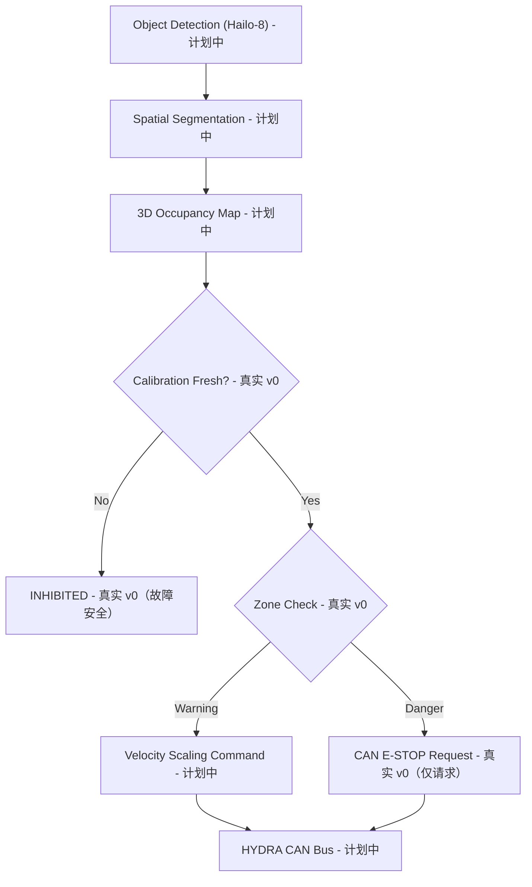

<p align="center">
  
</p>

# 🛡️ HYDRA-UMC-SAFETY-ZONES

<p align="center"><a href="README.md">🇺🇸 English</a> | <a href="README_spa.md">🇪🇸 Español</a> | <a href="README_fra.md">🇫🇷 Français</a> | <a href="README_ita.md">🇮🇹 Italiano</a> | <a href="README_deu.md">🇩🇪 Deutsch</a> | 🇨🇳 <b>简体中文</b> | <a href="README_jpn.md">🇯🇵 日本語</a></p>

### 🚨 实时 3D 入侵检测与 E-STOP 编排器

<p align="left">
  
  
  
  
</p>

---

## 1. 🛠️ 技术概述

**HYDRA-UMC-SAFETY-ZONES** 旨在成为 Vision AI Node 系列的关键安全子系统。
其任务是在机器人周围投射虚拟 3D 边界体积，并利用 Hailo-8 NPU 提供的高速
空间分割能力监控工作空间，检测在预设的"警告"和"危险"区域内是否发生人员
或异物入侵。

这是集成父项目 **[HYDRA-UMC-VISION-NODE](https://github.com/JuanenRac/HYDRA-UMC-VISION-NODE)** 4 个子项目之一，其感知输入建立在同族兄弟项目
**[HYDRA-UMC-DETECTION-HEF](https://github.com/JuanenRac/HYDRA-UMC-DETECTION-HEF)** 所编译的模型之上。

### 关键要点

* 🚦 **多级区域（v0）：** 真实的 `Zone`/`ZoneLevel`（警告/危险）定义，作用于轴对齐的 3D 体积，以及区域集合与检测对象位置集合之间的真实越界检查（`check_breaches`）。
* 🛑 **E-STOP 请求（v0，不执行）：** 任何最严重越界为"危险"级别的对象都会生成一个真实的 `EStopRequest`，交给 `EStopRequester`——具体为何本项目中的任何部分都从不自行执行物理停止，见下方的设计边界。
* 🔒 **校准新鲜度强制检查（v0）：** 每个区域集合都携带一个可选的 `calibration`（版本、来源、校准日期、最大有效天数）。`evaluate_safety()` 会在执行任何越界逻辑**之前**先检查它——完全没有校准信息的区域集合、比自身声明的 `max_age_days` 更旧的校准、或日期在未来的校准，始终会解析为 `INHIBITED`，绝不会仅因为没有检测对象靠近某个区域就悄悄退回到 `READY`。
* 📐 **动态遮挡（计划中）：** 自动将机器人自身结构从安全触发中屏蔽，使机器人不会将"自身"检测为入侵。
* 🔍 **异物检测（计划中）：** 识别遗留在工作空间中的工具或碎屑。
* 🎥 **基于 Hailo-8 的真实 3D 占用地图（计划中）：** v0 的 `check` 子命令从 JSON 文件读取检测对象位置，正是因为真正会产生这些位置的 Hailo-8 空间分割流水线在本环境中尚不存在——详见下方"诚实说明"。
* 🧩 **为何作为独立项目存在：** 安全逻辑相较于感知系统的其他部分有着不同的验证标准——将其隔离为独立服务，意味着可以独立于系列内其他摄像头流水线或模型编译方面的变更，对其进行测试、审计并最终认证（见上方 ISO 13849-1 徽章，目前仅为目标，尚未实现）。

**一项已确定、且现已在代码中落实的关键设计边界：** 本项目**仅负责检测和请求** E-STOP——它自身
从不发出物理停止信号。`estop.py` 中唯一真实的请求者 `NullEStopRequester`
只会记录本应发送的内容，而不会向任何地方发送任何东西——本仓库目前故意
没有任何真实的 CAN 传输实现。真正通过 CAN 切断电机电源是 [HYDRA-UMC](https://github.com/JuanenRac/HYDRA-UMC)（固件）的职责，运行在为此角色专门构建的硬件上。将边界保持在此处意味着，本
Python 服务中的一个漏洞可能导致*未能请求*停止，但绝不可能*阻止*固件独立
执行停止。

**诚实说明——今天实际运行的内容：** 无参数调用时，真正的入口点
（`src/hydra_umc_safety_zones/main.py`）仍会打印项目名称、已安装的版本号
及角色说明，但现在还新增了一个真实的 `check --zones 路径 --detections 路径`
子命令：从 JSON 加载区域集合（区域 + 可选的校准元数据）与检测对象位置，
先检查校准新鲜度，再执行真实的越界检查，为每个"危险"越界请求 E-STOP，
并根据结果以 0（Ready）/ 1（Warning）/ 2（Danger，已请求 E-STOP）/
3（Inhibited——校准缺失或已过期）退出。真正尚未实现的内容：
在真实硬件上产生这些检测对象位置的 Hailo-8 空间分割、自身遮挡屏蔽，以及
用于 E-STOP 请求的任何真实 CAN 传输。具体已交付内容请
参见 [`CHANGELOG.md`](CHANGELOG.md)，尚待完成的内容请参见下方"当前状态
与后续步骤"章节。

---

## 2. 🔄 目标安全逻辑流程

下图是本项目正朝其构建的目标数据流。给定从 JSON 文件读取的检测对象位置，
图中的 `CAL`（校准检查）、`ZONE`（区域检查）及其后的警告/危险分流，由
`evaluate_safety()`（包装了 `check_breaches()`/`request_estop_for()`）驱动，
今天已是真实的。`CAL`/`ZONE` 之前的一切（真实的 Hailo-8 流水线）和 `STOP`
之后的一切（真实的 CAN 传输）仍是未来工作。



---

## 3. 🧠 高级技术信息

### 检测与执行的边界，以及为何在此尤为重要

在本 README 的所有内容中，这是唯一不仅仅是实现细节的设计决策：本服务的
职责是*判断*是否需要停止并通过 CAN *请求*停止，而真正的、物理层面的电机
断电发生在 [HYDRA-UMC](https://github.com/JuanenRac/HYDRA-UMC) 内部专为该
角色构建并认证的硬件上。这是一项深思熟虑的纵深防御选择——本服务中的软件
缺陷（崩溃、挂起、损坏的帧）最坏情况下退化为"不再发送新的停止请求"，而
不会退化为"机器人现有的安全硬件停止工作"。

### 为何这里没有 `hardware/`、`firmware/`、`os/` 或 `models/`

CM5 + Hailo-8 是现成硬件，没有需要自行设计的板卡，因此——与 Vision AI
Node 系列的其他项目一样——这里不存在 `hardware/`/`firmware/` 文件夹。
`os/`（共享的 HydraOS 镜像）和 `models/`（实际提供给 NPU 的已编译 `.hef`
文件）仅存在于集成父项目 [HYDRA-UMC-VISION-NODE](https://github.com/JuanenRac/HYDRA-UMC-VISION-NODE) 中，因为它持有 CM5 主机镜像和 Hailo-8 设备句柄。

### 已做出的设计决策

* **版本从已安装的包元数据读取，而非硬编码** —— `main.py` 调用 `importlib.metadata.version("hydra-umc-safety-zones")`，而非第二个 `__version__` 字符串，因此 `bump_version.py` 永远只有一处需要修改。
* **里程表式递增只自动触及 `PATCH`/`MINOR`** —— `bump_version.py` 在 `PATCH` 超过 9 时进位到 `MINOR`，`MINOR` 超过 9 时进位到 `MAJOR`，但从不自行递增 `MAJOR`；与 `HYDRA-UMC-EDITOR-URDF/bump_version.py` 和 `HYDRA-UMC-SUITE/bump_version.py` 的惯例相同。
* **使用 AABB 区域，而非网格或凸包** —— 这是仍能让 `check_breaches()` 保持精确且快速的最简单体积；现实中的真实边界很多时候就近似于一个盒子，更丰富的形状可以在以后添加到相同的 `Zone`/`AABB.contains()` 接口之后，而无需改动 `breach.py` 或 `estop.py`。
* **区域边界的包含判定是包含式而非排除式的** —— `AABB.contains()` 将恰好位于边界上的点视为区域内部。对于安全边界而言，这是应当出错的保守方向：它只会导致越界报告更早出现，而绝不会漏报。
* **`NullEStopRequester` 是本仓库中唯一的请求者** —— 它不是一个等待被随意替换的占位实现，而是检测与执行边界本身的诚实体现：这里没有真实的 CAN 传输，将来也不应该草率地加入一个（详见上方"一项已确定的关键设计边界"以及 `estop.py` 模块自身的文档说明）。
* **区域与检测数据使用纯 JSON，而非 YAML** —— `pyproject.toml` 的依赖列表仍为 `[]`；`json` 属于标准库，`pyyaml` 是真正的未来工作，等到出现值得为其序列化的真实区域编辑工具时再引入。
* **校准检查在任何越界逻辑之前执行，绝不在之后** —— `evaluate_safety()` 会在校准缺失或过期的那一刻立即返回 `INHIBITED`，甚至在调用 `check_breaches()` 之前。这是刻意为之：过期的校准意味着区域几何本身已不可信，因此针对它运行越界检查的结果同样毫无意义——先检查校准也意味着过期的校准始终会胜过看起来像真实"危险"越界的结果，而不是反过来。
* **缺少 `"calibration"` 键仍可成功加载，只是意味着 `INHIBITED`** —— `load_zone_set()` 绝不会仅因为某个区域文件早于此功能存在、或是手写而没有校准元数据就抛出错误；它按设计在评估阶段安全失败，而不是在加载阶段失败。

---

## 📂 目录结构

```text
HYDRA-UMC-SAFETY-ZONES/
├── src/hydra_umc_safety_zones/
│   ├── geometry.py       # 真实的 Point3D/AABB 基础类型
│   ├── zones.py          # 真实的 ZoneLevel/Zone/ZoneSet 定义
│   ├── breach.py         # 真实的区域越界检查
│   ├── calibration.py    # 真实的校准新鲜度跟踪
│   ├── safety_state.py   # 真实的故障安全决策：READY/WARNING/DANGER/INHIBITED
│   ├── estop.py          # 真实的 E-STOP 请求（从不执行）
│   ├── config.py         # 真实的区域/检测 JSON 加载
│   └── main.py            # 入口点 + 真实的 `check` 子命令
├── tests/                # 真实测试：几何、越界、E-STOP、配置、CLI
├── docs/                # 文档与安全标准
├── build/               # 构建输出（本地 .venv 也存放于此）
├── images/              # 媒体与图表
├── scripts/             # 实用脚本
├── pyproject.toml       # 包元数据、依赖项、里程表版本号
├── bump_version.py      # 里程表式版本递增（由 build.sh/.bat 运行）
├── build.sh / build.bat # venv + 可编辑安装（含 dev 附加依赖） + 编译检查 + 测试
├── build-test.sh / .bat # 不涉及版本递增的构建检查（从不修改 version 或 CHANGELOG）
├── tools/build_test.py  # 两个 build-test 启动脚本共同委托的引擎
├── run.sh / run.bat     # 从本地 venv 运行入口点（转发参数）
└── CHANGELOG.md         # 逐版本历史（里程表方案，无日期）
```

没有 `hardware/`、`firmware/`、`os/` 或 `models/` 文件夹——原因见上方
"高级技术信息"。`os/` 和 `models/` 仅存在于集成父项目
[HYDRA-UMC-VISION-NODE](https://github.com/JuanenRac/HYDRA-UMC-VISION-NODE) 中。

---

## 🏗️ 构建与运行

### 前提条件

* `PATH` 中存在 **Python 3.10 或更新版本**（脚本先尝试 `python3`，再回退到 `python`）。
* 目前不需要任何安全/视觉运行时依赖——此阶段**没有任何第三方运行时依赖**（`pyproject.toml` 中 `dependencies = []`）；`pytest` 只是一个开发附加依赖，仅用于真实的测试套件。
* 本地虚拟环境（`.venv/` 下）需要数十 MB 磁盘空间。

### 逐步说明

```bash
# Linux / macOS
./build.sh
```

1. **里程表式版本递增** —— 运行 `bump_version.py`，每次构建时在 `pyproject.toml` 中递增 `PATCH`（按上述规则进位到 `MINOR`/`MAJOR`），随后同步 `hydra-umc.project.json` 以保持一致。
2. **虚拟环境** —— 若 `.venv/` 不存在则创建；否则复用。
3. **可编辑安装（含 dev 附加依赖）** —— `pip install -e ".[dev]"`，使 `src/` 下的修改立即生效，安装 `pytest`，并注册 `hydra-umc-safety-zones` 控制台入口点。
4. **编译检查** —— `python -m compileall -q src` 对 `src/` 下每个文件进行字节码编译，在整个生态系统范围内捕获语法错误。
5. **真实测试套件** —— `pytest tests/` 运行全部 21 个测试。

`set -euo pipefail` 会在第一个失败步骤处停止脚本；如果是通过双击而非从已
打开的终端运行的，窗口会保持打开（`Press Enter to close...`）。

```bash
./run.sh
```

在 `.venv` 内定位解释器（同时处理 POSIX 和 Windows 的 `.venv` 目录结构），
运行 `python -m hydra_umc_safety_zones.main`，并转发任何参数。

无参数调用会打印名称 + 版本 + 角色：

```text
HYDRA-UMC-SAFETY-ZONES v0.0.4
Real-time 3D intrusion detection and E-STOP orchestration for robotic safe-working areas.
```

真实的 `check` 子命令需要一个区域文件和一个检测文件，均为纯 JSON。`calibration`
在区域文件中是可选的——没有它会发生什么见下文：

```json
// zones.json
{
  "calibration": {"version": "cal-1", "source": "manual", "calibrated_at": "2026-08-27", "max_age_days": 30},
  "zones": [
    {"id": "warn1", "level": "warning", "min": {"x": 0, "y": 0, "z": 0}, "max": {"x": 5, "y": 5, "z": 5}},
    {"id": "danger1", "level": "danger", "min": {"x": 0, "y": 0, "z": 0}, "max": {"x": 1, "y": 1, "z": 1}}
  ]
}
```

```json
// detections.json
{"objects": [{"id": "op1", "position": {"x": 0.5, "y": 0.5, "z": 0.5}}]}
```

```bash
./run.sh check --zones zones.json --detections detections.json
```

```text
SAFETY STATE: DANGER - object(s) ['op1'] breached a danger zone
BREACH: object 'op1' inside warning zone 'warn1'
BREACH: object 'op1' inside danger zone 'danger1'
E-STOP REQUESTED: object 'op1' breached danger zone 'danger1' (not asserted - see estop.py)
```

退出码为 `2`（危险，已请求 E-STOP）、`1`（仅警告级越界）、`0`（无越界，校准
有效）或 `3`（**Inhibited**——校准缺失或已过期，在任何越界逻辑之前检查）。
以下是故障安全路径的真实示例——使用上面同样的 `detections.json`，但
`zones.json` 完全没有 `"calibration"` 键：

```bash
./run.sh check --zones zones_no_calibration.json --detections detections.json
```

```text
SAFETY STATE: INHIBITED - no calibration metadata present - zone geometry cannot be trusted
```

退出码为 `3`——注意完全没有 `BREACH`/`E-STOP` 输出，即使 `op1` 同时位于两个
区域内：不可信的区域集合永远不会到达越界检查这一步。

```bat
:: Windows - 步骤相同，批处理语法
build.bat
run.bat
run.bat check --zones zones.json --detections detections.json
```

### 故障排查

* **找不到 `python`/`python3`** —— 安装 Python 3.10+ 并确保其在 `PATH` 中。
* **`compileall` 失败** —— 意味着 `src/` 下确实引入了语法错误；构建会故意在不触及安装的情况下停止。
* **`run.sh`/`run.bat` 提示"未找到 `.venv`"** —— 先至少运行一次 `build.sh`/`build.bat`。
* **可编辑安装过期** —— 删除 `.venv/` 并重新构建；很少需要这样做。
* **`check` 以非零退出码结束** —— 这是真实且正确的行为，而非失败：`1` 表示发现了仅警告级越界，`2` 表示发现了危险级越界并已请求 E-STOP，`3` 表示区域集合的校准缺失或已过期（故障安全，在任何越界逻辑执行之前检查）。只有 Python 回溯或 JSON 格式错误才是真正的 bug。

---

## 🚀 当前状态与后续步骤

**今天已实现的内容：** 真实的警告/危险区域定义与真实的越界检查
（`geometry.py`/`zones.py`/`breach.py`）、在任何越界逻辑之前就安全故障切换
到 `INHIBITED` 的真实校准新鲜度强制检查（`calibration.py`/`safety_state.py`）、
一个在设计上就恪守检测与执行边界的真实 E-STOP*请求*流水线（`estop.py`）、
一个基于区域/检测 JSON 文件的真实 `check` CLI 子命令，以及 44 个通过的
测试——完整的真实构建/运行输出见 [`CHANGELOG.md`](CHANGELOG.md)。

**仍待完成的内容（顺序不分先后，无既定时间表）：**

* 基于 Hailo-8 空间分割的真实 3D 占用地图，用于真正产生 `check` 目前作为
  JSON 输入所期望的检测对象位置。
* 机器人自身结构的动态自遮挡屏蔽。
* 面向 [HYDRA-UMC](https://github.com/JuanenRac/HYDRA-UMC) 的、实现
  `EStopRequester` 的真实 CAN 传输——`estop.py` 已经定义了真实实现需要满足
  的接口。
* 任何真正的安全认证工作（上方 ISO 13849-1 徽章表达的是目标，而非已完成的认证）。

---

## 🔗 相关项目

本项目是同一作者（JuanenRac / Electro Hobby 3D）打造的更大规模机器人生态
系统的一部分，涵盖固件、控制软件、AI 节点和车队工具。值得了解，因为某个
需求实际上可能是关于这些项目之一，而非本仓库。

### 项目族

**父项目：** **[HYDRA-UMC-VISION-NODE](https://github.com/JuanenRac/HYDRA-UMC-VISION-NODE)** —— 本安全层所保护的集成父项目。

**同族项目：**
- **[HYDRA-UMC-VISION-STREAMER](https://github.com/JuanenRac/HYDRA-UMC-VISION-STREAMER)** —— 捕获并预处理父项目所消费的摄像头画面。
- **[HYDRA-UMC-DETECTION-HEF](https://github.com/JuanenRac/HYDRA-UMC-DETECTION-HEF)** —— 编译本项目检测能力所依赖的 `.hef` 模型。
- **[HYDRA-UMC-VISUAL-SERVOING-API](https://github.com/JuanenRac/HYDRA-UMC-VISUAL-SERVOING-API)** —— 将父项目的感知结果转化为运动学位姿修正。

### 直接相关（项目族之外）

- **[HYDRA-UMC](https://github.com/JuanenRac/HYDRA-UMC)** —— 本项目向该固件请求 E-STOP；固件才是真正执行停止的一方。

### 生态系统的其余部分

**HYDRA-UMC 平台** —— 多机器人微工厂单元
- **[HYDRA-UMC-SERVER](https://github.com/JuanenRac/HYDRA-UMC-SERVER)** —— 每个控制客户端所对接的 Express/WebSocket 后端。
- **[HYDRA-UMC-STUDIO](https://github.com/JuanenRac/HYDRA-UMC-STUDIO)** —— 基于 Web 的控制仪表盘，多机器人 3D 可视化。
- **[HYDRA-UMC-ANDROID-CONTROL](https://github.com/JuanenRac/HYDRA-UMC-ANDROID-CONTROL)** —— 通过 Wi-Fi/蓝牙的 Android 控制应用。
- **[HYDRA-UMC-IOS-CONTROL](https://github.com/JuanenRac/HYDRA-UMC-IOS-CONTROL)** —— 基于 Flutter 构建的 iOS/iPadOS 控制应用。
- **[HYDRA-UMC-SUITE](https://github.com/JuanenRac/HYDRA-UMC-SUITE)** —— 桌面端集群指挥中心（Python/PySide6）。
- **[HYDRA-UMC-EDITOR-URDF](https://github.com/JuanenRac/HYDRA-UMC-EDITOR-URDF)** —— 用于机器人目录的桌面端 URDF 模型编辑器。
- **[HYDRA-UMC-DSI](https://github.com/JuanenRac/HYDRA-UMC-DSI)** —— 机载 DSI 触摸屏的原生触控 UI。

**URTC 平台** —— 每台 HYDRA-UMC 机械臂搭载的工具头控制器
- **[URTC](https://github.com/JuanenRac/URTC)** —— CAN 总线工具头控制器，25 种工具配置。
- **[URTC-FLASHER](https://github.com/JuanenRac/URTC-FLASHER)** —— 桌面端 CAN-OTA + SWD/JTAG 刷写工具。
- **[URTC-TESTER](https://github.com/JuanenRac/URTC-TESTER)** —— 桌面端实时 CAN 总线诊断工具。
- **[URTC-WEB-STUDIO](https://github.com/JuanenRac/URTC-WEB-STUDIO)** —— 通过 Web Serial API 的浏览器端替代方案。

**🧠 认知 AI 节点（Hailo-10）**
- [HYDRA-UMC-COGNITIVE-NODE](https://github.com/JuanenRac/HYDRA-UMC-COGNITIVE-NODE)
- [HYDRA-UMC-VLA-ENGINE](https://github.com/JuanenRac/HYDRA-UMC-VLA-ENGINE)
- [HYDRA-UMC-VOICE-UI](https://github.com/JuanenRac/HYDRA-UMC-VOICE-UI)
- [HYDRA-UMC-SEMANTIC-PLANNER](https://github.com/JuanenRac/HYDRA-UMC-SEMANTIC-PLANNER)
- [HYDRA-UMC-DOCS-QA](https://github.com/JuanenRac/HYDRA-UMC-DOCS-QA)

**🐝 编排与集群**
- [HYDRA-UMC-ORCHESTRATOR](https://github.com/JuanenRac/HYDRA-UMC-ORCHESTRATOR)
- [HYDRA-UMC-SWARM-SYNC](https://github.com/JuanenRac/HYDRA-UMC-SWARM-SYNC)
- [HYDRA-UMC-PATH-PLANNER-3D](https://github.com/JuanenRac/HYDRA-UMC-PATH-PLANNER-3D)
- [HYDRA-UMC-JOB-DISPATCHER](https://github.com/JuanenRac/HYDRA-UMC-JOB-DISPATCHER)
- [HYDRA-UMC-NODE-HEALING](https://github.com/JuanenRac/HYDRA-UMC-NODE-HEALING)

**🎮 数字孪生与仿真**
- [HYDRA-UMC-TWIN](https://github.com/JuanenRac/HYDRA-UMC-TWIN)
- [HYDRA-UMC-PHYSICS-REPLICA](https://github.com/JuanenRac/HYDRA-UMC-PHYSICS-REPLICA)
- [HYDRA-UMC-HIL-BRIDGE](https://github.com/JuanenRac/HYDRA-UMC-HIL-BRIDGE)
- [HYDRA-UMC-SYNTHETIC-DATA-GEN](https://github.com/JuanenRac/HYDRA-UMC-SYNTHETIC-DATA-GEN)

**📊 数据与分析**
- [HYDRA-UMC-DATALAKE](https://github.com/JuanenRac/HYDRA-UMC-DATALAKE)
- [HYDRA-UMC-TELEMETRY-COLLECTOR](https://github.com/JuanenRac/HYDRA-UMC-TELEMETRY-COLLECTOR)
- [HYDRA-UMC-ANOMALY-DETECTOR](https://github.com/JuanenRac/HYDRA-UMC-ANOMALY-DETECTOR)
- [HYDRA-UMC-PRODUCTION-REPORTS](https://github.com/JuanenRac/HYDRA-UMC-PRODUCTION-REPORTS)

**🏭 工业网关**
- [HYDRA-UMC-GATEWAY-INDUSTRIAL](https://github.com/JuanenRac/HYDRA-UMC-GATEWAY-INDUSTRIAL)
- [HYDRA-UMC-OPCUA-SERVER](https://github.com/JuanenRac/HYDRA-UMC-OPCUA-SERVER)
- [HYDRA-UMC-MQTT-BROKER](https://github.com/JuanenRac/HYDRA-UMC-MQTT-BROKER)
- [HYDRA-UMC-MTCONNECT-ADAPTER](https://github.com/JuanenRac/HYDRA-UMC-MTCONNECT-ADAPTER)

**🛠️ 配套工具**
- [URTC-SMART-RACK](https://github.com/JuanenRac/URTC-SMART-RACK)
- [URTC-VISION-TOOL](https://github.com/JuanenRac/URTC-VISION-TOOL)
- [HYDRA-UMC-WATCH](https://github.com/JuanenRac/HYDRA-UMC-WATCH)
- [HYDRA-UMC-TOOL-CLI](https://github.com/JuanenRac/HYDRA-UMC-TOOL-CLI)
- [HYDRA-UMC-DASHBOARD-AI](https://github.com/JuanenRac/HYDRA-UMC-DASHBOARD-AI)

---

## 👤 作者
**JuanenRac**（Electro Hobby 3D）
📧 electrohobby3d@gmail.com

## 📜 许可证
GPL-3.0 —— 详见 LICENSE。

## 🛠️ BUILD & RUN

请在发布构建前使用不改动版本的构建检查：

| 操作 | Windows | Linux / macOS |
|---|---|---|
| 构建检查（不修改版本或 CHANGELOG） | `build-test.bat` | `./build-test.sh` |
| 运行 / 开发（如提供） | `run*.bat` 或 `dev*.bat` | `./run*.sh` 或 `./dev*.sh` |

`build-test.bat` 和 `build-test.sh` 会编译或验证项目技术栈，但不会递增 `hydra-umc.project.json`，也不会修改 `CHANGELOG.md`。它们仅可能生成正常的编译器输出。现有的 `build*.bat`、`build*.sh`、`run*` 和 `dev*` 脚本保留各自的版本化或运行时行为；需要该行为时请使用它们。